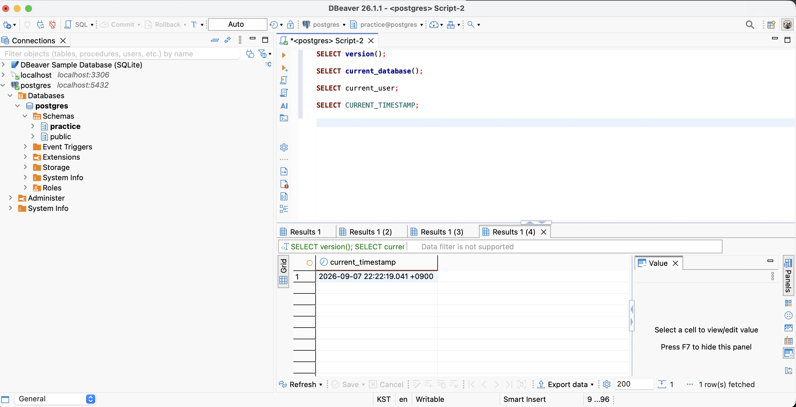
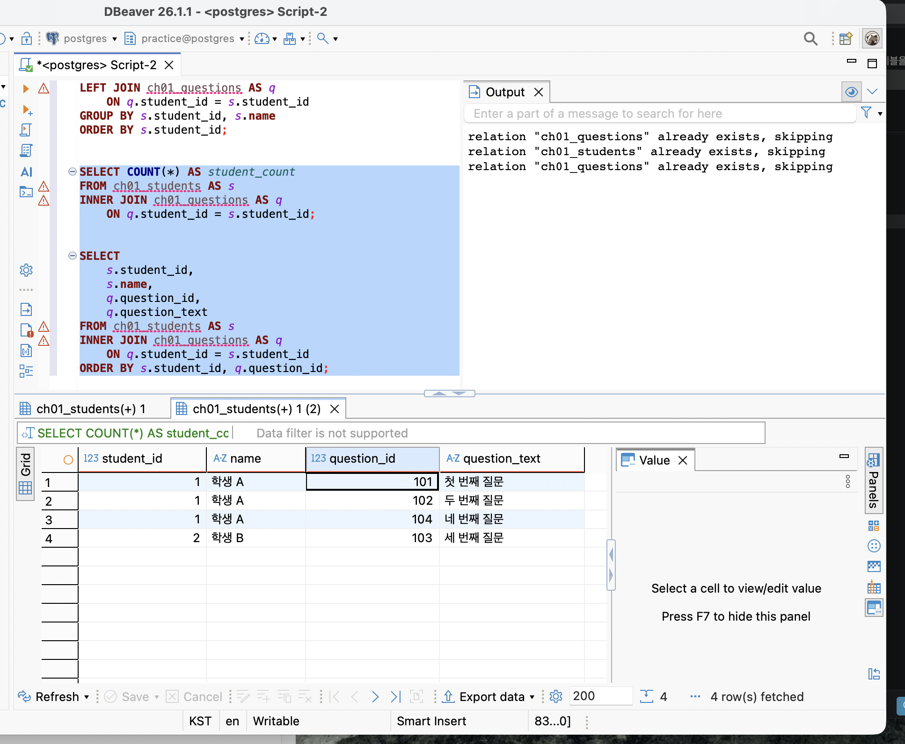
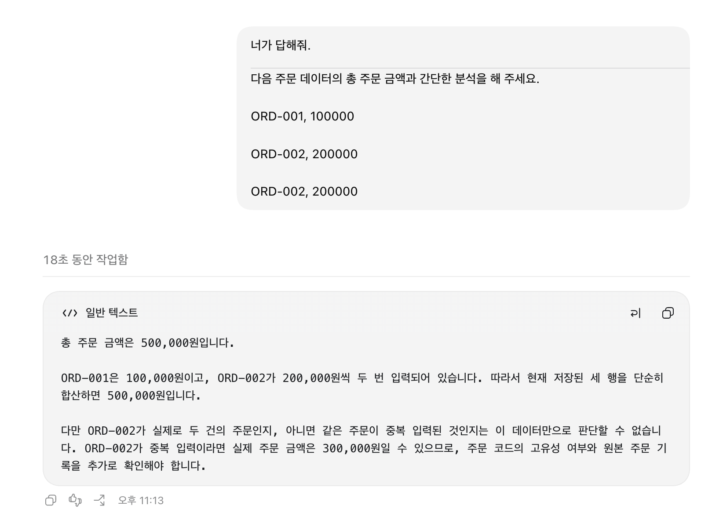
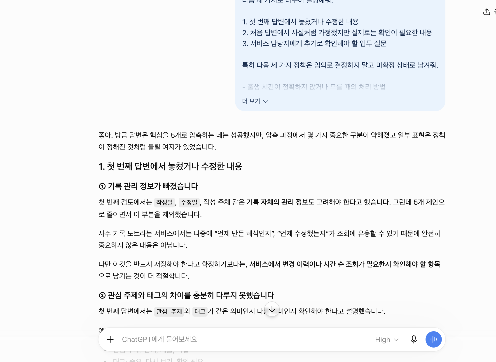

# Chapter 01 확장 실습 답안 템플릿

> **과제:** AI 시대에 데이터베이스를 왜 배워야 하는가  
> **사용 방법:** 이 파일을 내려받아 **본인의 GitHub 저장소**에 `chapter01_answer.md`라는 이름으로 저장한 뒤 답안을 작성합니다.  
> **제출 방법:** LMS에는 파일을 업로드하지 않고, **본인 GitHub 저장소의 `chapter01_answer.md` 파일 URL**을 제출합니다.

---

## 0. 학생 정보

| 항목 | 작성 내용 |
| --- | --- |
| 학번 | 2021-12762 |
| 이름 | 신소희 |
| GitHub 계정 |ssossocoder |
| 과제 작성일 | 2026-09-07  |
| 사용한 AI 도구 | ChatGPT (Codex) |

> 실제 비밀번호, API Key, 전체 DB 접속 URL, 개인정보는 이 파일이나 캡처 화면에 기록하지 않습니다.

---

# 1. PostgreSQL 실행 환경 확인

## 1-1. 실행한 SQL

```sql
SELECT version();
SELECT current_database();
SELECT current_user; 
SELECT CURRENT_TIMESTAMP;
```

## 1-2. 실행 결과 기록

```text
PostgreSQL 버전: PostgreSQL 18.6 on aarch64-apple-darwin24.6.0, compiled by Apple clang version 17.0.0 (clang-1700.0.13.5), 64-bit
현재 데이터베이스: postgres
현재 사용자: postgres
현재 시각: 2026-09-07 22:18:45.301 +0900
```

## 1-3. 내가 확인한 내용

1. SQL을 작성하는 프로그램과 PostgreSQL은 같은 프로그램인가요?

```text
나의 답: DBeaver는 SQL을 작성하고 실행하는 프로그램이고, PostgreSQL은 데이터를 저장하고 SQL을 처리하는 데이터베이스 시스템이므로 서로 다릅니다.
```

2. `current_database()` 결과는 무엇을 의미하나요?

```text
나의 답: 현재 연결된 데이터베이스 이름을 의미하며, 이번 실습에서는 postgres입니다.
```

3. SQL이 실행되었다는 사실만으로 데이터 내용도 올바르다고 할 수 있나요?

```text
나의 답: 아닙니다. SQL 실행 성공은 문법과 연결이 정상이라는 뜻일 뿐, 데이터나 결과가 올바르다는 보장은 아닙니다.
```

## 1-4. 증거 화면

아래 경로에 캡처 이미지를 저장하는 것을 권장합니다.

```
assignments/chapter01/images/step01_environment.png
```

이미지를 저장했다면 아래 링크의 파일명을 실제 파일명에 맞게 수정합니다.

```markdown

```

**이미지 삽입 위치:**

<!-- 아래 줄의 주석을 지우고 실제 이미지 Markdown을 넣어도 됩니다. -->


---

# 2. Chapter 01 핵심 내용 복습

교재 문장을 그대로 복사하지 말고 자신의 말로 작성합니다.

| 본문의 핵심 | 나의 설명 |
| --- | --- |
| AI가 SQL을 만들어도 DB를 배워야 한다 | AI가 만든 SQL이어도 이가 질문에 맞게 정말 잘 실행되었는지 확인하려면 DB지식이 필요하다 |
| 데이터 구조가 중요하다 | 각 데이터가 무엇을 의미하는지 알아야지 중복, 누락 등을 줄일 수 있다. |
| SQL 결과를 검증해야 한다 | SQL이 오류 없이 실행되어도 원하는 값과 원하는 방향이 맞는지 확인해야 한다. |
| 데이터 품질이 AI 답변 품질에 영향을 준다 | 데이터가 잘못되거나 중복되면 AI도 잘못된 답변을 생성할 수 있다. |
| 저장 방식은 데이터 양만 보고 선택하지 않는다 | 데이터 양뿐만 아니라, 여러 사람의 수정, 관계, 권한, 백업도 함께 고려해야한다.|

## 가장 중요하다고 생각한 한 문장

```text
AI가 SQL을 만들어도 DB를 배워야 한다

```

---

# 3. 실행 성공과 결과 정확성의 차이

## 3-1. SQL 실행 전 예상

학생 A는 질문 2개, 학생 B는 질문 1개, 학생 C는 질문이 없습니다.

```text
전체 학생 수: 3명
전체 질문 수: 3개
질문이 있는 학생 수: 2명
질문이 없는 학생 수: 1명
```

## 3-2. 임시 테이블 생성 및 데이터 입력 완료 확인

- [ ] `ch01_students` 생성
- [ ] `ch01_questions` 생성
- [ ] 학생 3명 입력
- [ ] 질문 3건 입력
- [ ] 두 테이블의 데이터를 직접 조회

## 3-3. 잘못된 학생 수 SQL 실행 결과

실행한 SQL:

```sql
SELECT COUNT(*) AS student_count
FROM ch01_students AS s
INNER JOIN ch01_questions AS q
    ON q.student_id = s.student_id;
```

실행 결과: 

```text
3

```

## 3-4. JOIN 상세 결과 관찰

```text
학생 A가 나타난 행 수: 2
학생 B가 나타난 행 수: 1
학생 C가 나타난 행 수: 0
```

다음 질문에 답합니다.

### Q1. 학생 C가 왜 결과에서 사라졌나요?

``` text
질문 데이터가 없어서 INNER JOIN 결과에서 제외되었다.

```

### Q2. 학생 A가 왜 여러 행으로 나타났나요?

```text
질문이 2개이므로 2개의 행

```

### Q3. 위 `COUNT(*)`가 실제로 세고 있었던 것은 무엇인가요?

```text
학생 수가 아니라, JOIN으로 만들어진 결과 행 수

```

### Q4. 결과 숫자가 우연히 실제 학생 수와 같아도 바로 믿으면 안 되는 이유는 무엇인가요?

```text
우연히 같은것이며, 데이터가 바뀌면 달라질 수 있다.

```

## 3-5. 질문 한 건을 추가한 뒤 다시 실행

추가한 데이터:

```text
(104, 1, '네 번째 질문')

```

다시 실행한 결과:

```text
AI SQL 결과:4
실제 학생 수:3
```

### 결과 해석

```text
데이터가 바뀐 뒤 무엇이 달라졌는지: JOIN 결과 행 수가 3개에서 4개로 늘어났다.

실제 학생 수는 왜 그대로인지:학생 테이블에 학생을 추가하지 않았기 때문이다. 

이 실험을 통해 알게 된 점: SQL이 실행되었다고 해서 실제 학생 수를 정확히 세는 것은 아니므로, SQL이 무엇을 세는지 결과를 확인해야 한다.
```

## 3-6. 학생 테이블을 직접 센 결과

```sql
SELECT COUNT(*) AS student_count
FROM ch01_students;
```

결과:

```text
3

```

### 두 SQL의 차이를 내 말로 설명

```text
첫 번째 SQL은 학생과 질문을 JOIN한 뒤 만들어진 결과 행을 세고 있었다.

두 번째 SQL은 ch01_students 테이블의 행(실제 학생 수)을 세고 있었다.

따라서 SQL을 검토할 때는 문법보다 먼저
SQL이 실제로 세는 대상을 확인해야 한다.
```

## 3-7. 증거 화면

권장 경로:

```text
assignments/chapter01/images/step03_join_result.png
```



---

# 4. 잘못된 데이터가 결과를 바꾸는 과정

## 4-1. 주문 데이터 확인

다음 데이터를 입력한 뒤 실제 결과를 확인합니다.

```text
ORD-001, 100000
ORD-002, 200000
ORD-002, 200000
```

## 4-2. 실행 전 예상

업무적으로 주문이 `ORD-001`, `ORD-002` 두 건이고 `order_code`가 주문을 고유하게 구분한다고 **가정할 경우** 예상 합계:

```text
300,000 원
```

> 위 가정 자체가 실제 업무 규칙인지 확인해야 한다는 점도 기억합니다.

## 4-3. SQL 합계

```sql
SELECT SUM(amount) AS total_amount
FROM ch01_orders;
```

실제 결과:

```text
500,000 원
```

## 4-4. 결과 해석

### `SUM` 문법 자체가 잘못된 것인가요?

```text

아니요

```

### 결과 차이의 원인은 무엇인가요?

```text

ORD-002가 두 번 저장되어 SQL이 세 행의 금액을 모두 더했기 때문입니다.

```


### SQL이 정확하게 실행되어도 업무 숫자가 잘못될 수 있는 이유를 설명하세요.

```text

SQL은 저장된 데이터를 기준으로 정확하게 계산하지만, 데이터가 중복되었는지 또는 실제 업무 규칙에 맞는지는 자동으로 판단하지 못하기 때문입니다.


```
## 4-5. AI에게 같은 데이터를 분석시킨 결과

AI가 계산한 합계:

```text

500000원

```

AI가 중복 가능성을 언급했나요?

```text

네. ORD-002가 두 번 나타나므로 중복 가능성을 확인해야 한다고 언급했습니다.


```

AI가 `ORD-002` 두 행이 실제 두 주문인지 중복 입력인지 스스로 확정할 수 있나요? 이유도 적으세요.


```text

아니요. 같은 주문 코드가 두 번 있다는 사실만으로는 실제 두 주문인지 중복 입력인지 확정할 수 없습니다.


```

추가로 확인해야 할 업무 규칙:

```text
1. order_code는 주문을 고유하게 구분해야 하는가?
2. ORD-002 두 건이 실제 별도 주문인지 중복 입력인지 어떻게 확인하는가?
3. 취소·환불된 주문을 합계에 포함하는가?
```

내가 최종적으로 내린 판단:

```text

SUM 문법은 맞지만 데이터 중복 여부가 확인되지 않았으므로 500000원을 최종 업무 금액으로 바로 믿으면 안 된다. ORD-002가 중복 입력이라면 실제 합계는 300000원이고, 실제 두 주문이라면 500000원이 될 수 있으므로 원본 데이터와 업무 규칙을 확인해야 한다.


```
## 4-6. 증거 화면

권장 경로:

```text
assignments/chapter01/images/step04_duplicate_result.png
```



---

# 5. 파일·스프레드시트·DBMS 선택 연습

각 사례에 대해 **AI에게 묻기 전에 먼저 본인의 판단을 작성**합니다.

## 사례 A. 개인 독서 기록

```text
나의 선택: 파일
선택 이유: 나 혼자 개인 기록용이다.
어떤 조건이 추가되면 다른 방식으로 바꿀 것인지: 조금 더 쓰는 항목이 많아지고 공유자가 생기면 스프레드시트, DBMS사용할 것 같다.
```

## 사례 B. 동아리 행사 신청 명단

```text
나의 선택: 스프레드시트
선택 이유: 운영진이 함께 수정해야하기 때문이다. 
어떤 조건이 추가되면 다른 방식으로 바꿀 것인지: 더 많은 인원이 관리하면 DBMS로 바꿀 것 같다.
```

## 사례 C. 온라인 강의 서비스

```text
나의 선택:DBMS
선택 이유: 상태가 계속 변화하는데 변경에 용이하다
어떤 조건이 추가되면 다른 방식으로 바꿀 것인지:권한과 복구 중요성이 줄어들면 스프레드시트로 바꿀 것 같다.
```

## 판단 기준 체크

- [ ] 데이터 증가
- [ ] 여러 사용자의 동시 수정
- [ ] 데이터 사이의 관계
- [ ] 반복 조회와 집계
- [ ] 정확성·일관성
- [ ] 변경 이력
- [ ] 권한 구분
- [ ] 백업·복구
- [ ] 웹·앱에서 지속 사용

### 데이터가 적으면 무조건 스프레드시트를 사용해야 하나요?

```text
나의 답:아니요 데이터가 적더라도 공유자가 많거나 권한자를 분명히 하려면 DBMS가 더 맞을 것 같다.
```

---

# 6. 나만의 서비스 데이터 구조 초안

> 이 내용은 이후 Chapter에서 계속 확장할 수 있으므로 신중하게 작성합니다.

## 6-1. 서비스 정의

```text
서비스 이름: 사주 기록 노트

서비스 목적:
대상자의 출생 정보와 사주 계산 결과, 해석 기록을 한곳에 저장하고 나중에 다시 조회하기 위한 서비스이다.
```

## 6-2. 관리할 데이터 후보

```text
- 대상자
- 출생 정보
- 사주 계산 결과
- 해석 기록
- 관심 주제와 태그
- 계산 기준과 버전
```

## 6-3. 한 행의 의미

| 데이터 | 한 행의 의미 |
|---|---|
| 대상자 | 사주 기록 대상자 한 명 |
| 출생 정보 | 한 대상자의 출생일시와 달력 기준을 기록한 한 건 |
| 사주 계산 결과 | 특정 계산 기준으로 계산된 사주 결과 한 건 |
| 해석 기록 | 특정 대상자의 특정 주제에 대해 작성한 해석 한 건 |

## 6-4. 관계를 자연어로 설명

```text
한 대상자는 하나의 기본 출생 정보를 가질 수 있다.

하나의 출생 정보는 계산 기준에 따라 하나의 사주 계산 결과를 만들 수 있다.

한 대상자에게는 여러 개의 해석 기록을 작성할 수 있다.

하나의 해석 기록에는 여러 개의 관심 주제나 태그를 연결할 수 있다.
```

## 6-5. 아직 결정하지 않은 정책

```text

1. 출생 시간이 정확하지 않거나 모를 때 어떻게 기록하고 사주를 계산할 것인가?

2. 양력·음력·윤달과 출생 지역의 시간대가 다른 경우 어떤 기준으로 계산할 것인가?

3. 출생 정보나 계산 기준이 변경될 때 기존 사주 결과와 AI 해석을 덮어쓸 것인가, 이전 결과를 보관할 것인가?


```

---

# 7. AI를 검토자로 활용하기

## 7-1. 내가 AI에게 전달한 핵심 프롬프트

개인정보나 비밀번호 등 민감한 내용은 제거한 뒤 기록합니다.

```text

나는 데이터베이스를 처음 배우는 학생입니다.

아직 ERD나 정규화를 배우기 전입니다.

내가 생각한 서비스는 다음과 같습니다.

서비스: 사주 기록 노트

목적: 가상의 대상자 출생 정보와 사주 계산 결과, 해석 기록을 저장하고 나중에 다시 조회하기 위한 개인 기록 서비스입니다.

관리할 데이터 후보:

- 대상자 정보
- 출생 정보
- 사주 계산 결과
- 계산 기준과 버전
- 해석 기록
- 관심 주제와 태그

내가 생각한 관계:

- 한 대상자의 출생 정보를 바탕으로 사주 계산 결과를 만들 수 있습니다.
- 하나의 대상자에게 여러 개의 해석 기록을 작성할 수 있습니다.
- 하나의 해석 기록에는 여러 관심 주제나 태그를 연결할 수 있습니다.

아직 결정하지 못한 정책:

- 출생 시간이 정확하지 않거나 모를 때 어떻게 기록하고 사주를 계산할 것인가?
- 양력·음력·윤달과 출생 지역의 시간대가 다른 경우 어떤 기준으로 계산할 것인가?
- 출생 정보나 계산 기준이 변경될 때 기존 사주 결과와 AI 해석을 덮어쓸 것인가, 이전 결과를 보관할 것인가?

지금 단계에서는 완성된 SQL이나 ERD를 만들지 말고,

1. 내가 놓친 데이터가 있는지,
2. 서로 다른 의미의 데이터를 한 항목으로 섞은 것은 없는지,
3. 추가로 확인해야 할 업무 질문은 무엇인지,
4. 파일·스프레드시트·관계형 DBMS 중 무엇이 적합해 보이는지

초보자가 이해할 수 있게 검토해 주세요.

확정되지 않은 정책은 임의로 정답처럼 결정하지 말고, 추가로 확인해야 할 질문으로 남겨 주세요.


```

## 7-2. AI의 주요 제안과 나의 판단

최소 5개를 작성합니다.

| AI의 제안 | 수용 / 수정 / 거절 | 나의 판단 근거 |
|---|---|---|
| 원본 출생 정보와 사주 계산 결과를 분리한다. | 수용 | 출생 정보가 바뀌면 계산 결과를 다시 계산해야 하기 때문이다. |
| 출생 시간의 정확도와 양력·음력·윤달 여부를 함께 기록한다. | 수용 | 계산에 사용된 조건을 나중에 확인할 수 있어야 하기 때문이다. |
| 출생 지역과 시간대를 계산 조건으로 기록한다. | 수용 | 시간대가 다르면 계산 결과가 달라질 수 있기 때문이다. |
| 출생 정보가 바뀌어도 기존 결과를 삭제하지 않고 이력을 보관한다. | 수정 | 방향은 수용하지만, 실제로 이전 결과를 얼마나 보관할지는 아직 결정하지 않았다. |
| AI 해석과 사람이 직접 작성한 해석을 구분한다. | 수용 | AI의 해석을 확정된 사실로 오해하지 않도록 해야 하기 때문이다. |

## 7-3. AI에게 자기 답변을 다시 비판하도록 요청한 결과

첫 번째 답변과 달라진 점:

```text

처음에는 출생 시간과 계산 기준을 정하면 하나의 결과만 저장하면 된다고 생각했다. 하지만 출생 정보나 계산 기준이 변경될 수 있으므로 여러 계산 결과와 변경 이력을 보관할 필요가 있다는 점을 알게 되었다.

```

AI가 처음에 임의로 가정했던 내용:

```text


모든 출생 시간이 정확하고, 모든 사용자가 같은 달력 기준과 시간대를 사용한다고 가정한 부분이 있었다. 또한 기존 결과를 언제까지 보관할지에 대한 정책도 정해져 있다고 가정했다.

```

추가로 업무 담당자에게 확인해야 한다고 판단한 내용:

```text

출생 시간이 모호하거나 없는 경우의 처리 방법, 양력·음력·윤달 계산 기준, 출생 지역과 시간대의 적용 방법, 정보가 수정되었을 때 과거 결과를 보관하는 기간을 확인해야 한다.

```

## 7-4. AI 활용에 대한 나의 평가

```text

가장 유용했던 부분:

기준 데이터와 계산으로 만들어지는 파생 데이터를 구분해야 한다는 점을 알게 되었다. 또한 계산 기준과 버전을 함께 저장해야 결과를 다시 검증할 수 있다는 점도 유용했다.

수정하거나 거절한 부분:

AI가 제안한 내용을 모두 확정하지 않고, 출생 시간이 불확실한 경우와 결과 보관 방법은 아직 결정하지 않은 질문으로 남겨두었다.

그렇게 판단한 근거:

실제 서비스의 운영 규칙과 계산 기준에 따라 달라질 수 있는 부분이므로 임의로 정하면 안 된다고 판단했다.

AI가 없었다면 놓쳤을 가능성이 있는 질문:

출생 시간의 정확도, 윤달 여부, 출생 지역의 시간대, 계산 기준 버전, 과거 결과 보관 여부를 놓쳤을 가능성이 있다.
```

## 7-5. AI 활용 증거 화면

권장 경로:

```text
assignments/chapter01/images/step07_ai_review.png
```

AI 대화 전체를 캡처할 필요는 없습니다. 핵심 요청과 검토 과정이 보이는 화면 1장 정도면 충분합니다.



---

# 8. 기준 데이터·파생 데이터·AI 생성 결과 구분

내 서비스에 맞게 작성합니다.

| 구분 | 내 서비스의 예 | 판단 이유 |
|---|---|---|
| 기준 데이터 | 대상자 ID, 닉네임, 원본 출생일시, 양력·음력·윤달 여부, 출생 지역과 시간대 | 사용자가 직접 입력하거나 확인하는 원본 정보이기 때문이다. |
| 파생 데이터 | 사주 계산 결과, 사주팔자, 오행 분포, 계산 시간과 계산 버전 | 기준 데이터와 계산 규칙을 이용해 만들어지는 결과이기 때문이다. |
| AI 생성 결과 | 사주 해석 문장, 요약, 관심 주제별 설명과 키워드 | AI가 계산 결과를 바탕으로 생성한 해석이기 때문이다. |

### 기준 데이터가 변경되면 파생 데이터는 어떻게 해야 하나요?

```text

기준 데이터가 변경되면 파생 데이터는 다시 계산해야 한다. 기존 결과를 바로 삭제하지 않고 당시의 출생 정보와 계산 기준, 버전을 함께 보관하면 이전 결과와 새로운 결과를 비교할 수 있다. 다만 과거 결과를 얼마나 오래 보관할지는 아직 결정하지 않았다.

```

### AI 결과만 있고 원본 데이터가 없다면 결과를 충분히 검증할 수 있나요?

```text

검증하기 어렵다. 원본 출생 정보와 계산 기준이 없으면 사주 계산 결과가 어떻게 만들어졌는지 확인할 수 없기 때문이다. 따라서 원본 데이터, 계산 기준과 버전, AI에게 전달한 내용과 생성된 해석을 함께 보관해야 한다.

```

---

# 9. 최종 성찰

아래 세 문장은 반드시 **본인의 말**로 작성합니다.

```text
1. SQL이 실행되어도 결과를 바로 믿으면 안 되는 이유는
  AI는 입력하는 사람에 따라 값이 달라지므로, 완벽하게 답이라고 할 수는 없기 때문이다.

2. AI를 데이터베이스 학습에 활용할 때 가장 중요한 것은
   AI가 100% 신뢰하는 도구라기보다는 보조하는 수단으로 생각이다.

3. 이번 실습 이후 내가 더 확인하고 싶은 것은
   프롬프트에 따라 AI와 DBeaver 답변의 차이 정도이다.
```

## 이번 Chapter에서 새롭게 알게 된 점 3가지

```text
1. AI는 중복값을 반영한다
2. SQL에서는 중복값은 다르게 저장해야한다.
3. AI 제안이 무조건 좋은 건 아니다.
```

## 아직 이해가 명확하지 않은 부분

```text
1. SQL에서 중복값 제거하는 방법
2. SQL 실행시 오류값을 우회하는 방법
```

---

# 10. 제출 전 자기 점검

- [ ] PostgreSQL 실행 화면을 확인했다.
- [ ] SQL 실행 전에 예상 결과를 먼저 작성했다.
- [ ] `INNER JOIN` 예제에서 누락과 반복을 설명할 수 있다.
- [ ] 숫자가 우연히 같아도 의미가 다를 수 있음을 설명했다.
- [ ] 중복 데이터가 집계 결과에 미치는 영향을 확인했다.
- [ ] 저장 방식을 데이터 양만으로 판단하지 않았다.
- [ ] 개인 서비스 주제를 하나 정했다.
- [ ] 데이터 후보와 한 행의 의미를 작성했다.
- [ ] 미확정 정책을 최소 3개 작성했다.
- [ ] AI 제안을 수용·수정·거절로 구분했다.
- [ ] AI 제안에 대한 판단 근거를 작성했다.
- [ ] 기준 데이터·파생 데이터·AI 결과를 구분했다.
- [ ] 핵심 증거 이미지가 Markdown에서 정상적으로 보인다.
- [ ] 비밀번호·API Key·개인정보가 노출되지 않았다.

---

# 11. LMS 제출 정보

## 내 GitHub 답안 파일 URL

아래에는 **교수자 템플릿 URL이 아니라 본인이 작성한 답안 파일의 GitHub URL**을 기록합니다.

```text
https://github.com/<본인-GitHub-ID>/<본인-저장소>/blob/main/assignments/chapter01/chapter01_answer.md
```

내 실제 제출 URL:

```text

https://github.com/ssossocoder/ai-database-study/blob/main/assignments/chapter01/chapter01_answer.md

```

> LMS에는 위 **본인 저장소의 `chapter01_answer.md` 파일 URL 하나**를 제출합니다.

---

## 권장 학생 저장소 구조

```text
<본인-저장소>/
└── assignments/
    └── chapter01/
        ├── chapter01_answer.md
        └── images/
            ├── step01_environment.png
            ├── step03_join_result.png
            ├── step04_duplicate_result.png
            └── step07_ai_review.png
```

이 구조를 사용하면 이후 Chapter 02, Chapter 03도 같은 방식으로 계속 추가할 수 있습니다.
