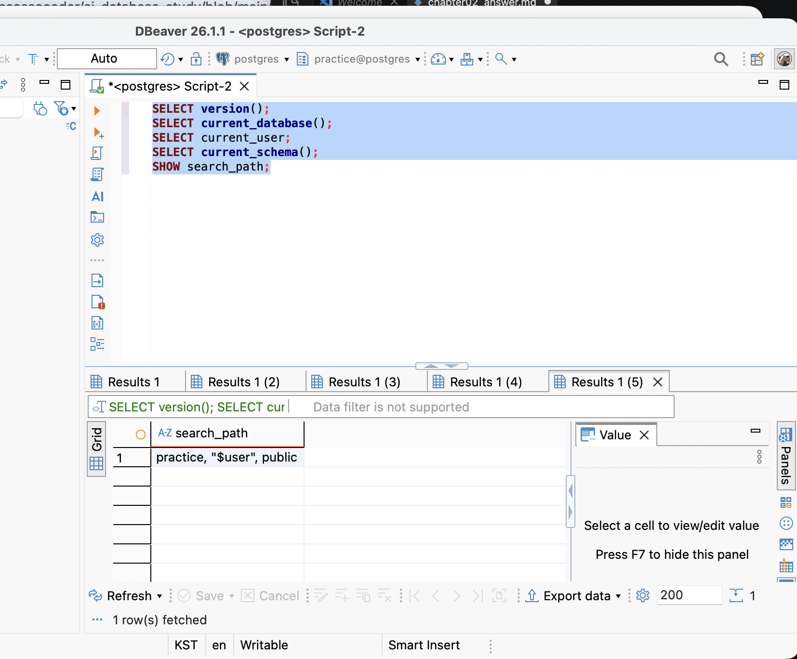

# Chapter 02 확장 실습 답안

> 과제: 데이터와 DBMS의 기본 개념
>
> 이번 답안의 SQL은 PostgreSQL 18.6 임시 로컬 클러스터에 psql로 실행했다. psql은 DBeaver와 마찬가지로 PostgreSQL에 SQL을 전달하고 결과를 보여 주는 클라이언트이다.

## 제출 전 개인정보 주의

| 항목 | 작성 내용 |
| --- | --- |
| GitHub 계정 또는 별칭 | ssossocoder |
| 과제 작성일 | 2026-09-09 |
| 사용한 AI 도구 | ChatGPT (Codex) |

실제 비밀번호, API Key, 전체 DB 접속 URL과 개인정보는 기록하지 않았다.

## 1. PostgreSQL에서 현재 위치 확인

### 1-1. 실행한 SQL

~~~sql
SELECT version();
SELECT current_database();
SELECT current_user;
SELECT current_schema();
SHOW search_path;
~~~

### 1-2. 실행 결과 기록

~~~text
PostgreSQL 버전:
PostgreSQL 18.6 on aarch64-apple-darwin24.6.0, compiled by Apple clang
version 17.0.0 (clang-1700.0.13.5), 64-bit

현재 데이터베이스: postgres
현재 사용자: postgres
현재 스키마: practice
search_path: practice, "$user", public
~~~

### 1-3. 구조를 내 말로 설명

- PostgreSQL은 데이터를 저장하고 SQL을 실행하며 제약조건을 적용하는 DBMS이다.
- 현재 접속한 postgres는 PostgreSQL 서버가 관리하는 하나의 데이터베이스이다.
- 스키마는 데이터베이스 안에서 테이블 같은 객체를 이름으로 구분하는 공간이다.
- DBeaver 또는 psql은 PostgreSQL에 SQL을 보내고 결과를 확인하는 클라이언트 도구이다.
- DBeaver를 종료해도 PostgreSQL 서버와 데이터베이스가 정상적으로 실행 중이면 데이터는 사라지지 않는다.

### 1-4. 계층 구조 완성

사용자
→ DBeaver 또는 psql 같은 클라이언트
→ PostgreSQL DBMS
→ 데이터베이스
→ 스키마
→ 테이블
→ 행 / 열

### 1-5. 증거 화면

## 2. 데이터베이스 안의 스키마와 테이블 관찰

### 2-1. 스키마 조회 결과

~~~sql
SELECT schema_name
FROM information_schema.schemata
ORDER BY schema_name;
~~~

실제로 확인한 스키마는 다음 일곱개였다.

1.information_schema
2.pg_catalog
3.pg_temp_2
4.pg_toast
5.pg_toast_temp_2
6.practice
7.public

public은 무엇인가요?

> public은 PostgreSQL 제품 이름이나 데이터베이스 이름이 아니라, 현재 데이터베이스 안에 기본으로 존재하는 스키마이다. 스키마 이름을 생략한 테이블은 search_path에 따라 public에서 찾을 수 있다.

데이터베이스와 스키마는 같은 것인가요?

> 아니다. 데이터베이스는 관련 데이터를 분리해 관리하는 논리적 공간이고, 스키마는 그 데이터베이스 안에서 테이블 같은 객체를 이름으로 구분하는 공간이다. PostgreSQL의 한 데이터베이스 안에는 여러 스키마가 있을 수 있다.

### 2-2. 현재 보이는 테이블 조회

~~~sql
SELECT table_schema, table_name
FROM information_schema.tables
WHERE table_type = 'BASE TABLE'
  AND table_schema NOT IN ('pg_catalog', 'information_schema')
ORDER BY table_schema, table_name;
~~~

실행 결과는 0행이었다.

아직 테이블이 거의 없어도 괜찮은 이유:
PostgreSQL 설치와 사용자 테이블 생성은 별개의 작업이기 때문이다.
실습용 테이블은 이후 단계에서 직접 생성한다.

### 2-3. 관찰 정리

PostgreSQL 서버 안에는 여러 데이터베이스가 있을 수 있다.

한 데이터베이스 안에는 여러 스키마가 있을 수 있다.

스키마 안에는 테이블과 같은 데이터베이스 객체가 존재한다.

## 3. TEMP TABLE로 테이블·행·열·키 직접 확인

실습 중에는 같은 psql 연결 세션을 유지했다. TEMP TABLE은 현재 세션에서만 사용되며 세션이 끝나면 사라진다.

### 3-1. 임시 테이블 생성과 입력

~~~sql
CREATE TEMP TABLE ch02_students (
    id INTEGER PRIMARY KEY,
    student_number TEXT UNIQUE NOT NULL,
    name TEXT NOT NULL,
    major TEXT
);

CREATE TEMP TABLE ch02_courses (
    id INTEGER PRIMARY KEY,
    course_code TEXT UNIQUE NOT NULL,
    title TEXT NOT NULL
);

CREATE TEMP TABLE ch02_enrollments (
    id INTEGER PRIMARY KEY,
    student_id INTEGER NOT NULL REFERENCES ch02_students(id),
    course_id INTEGER NOT NULL REFERENCES ch02_courses(id),
    status TEXT NOT NULL
);

INSERT INTO ch02_students (id, student_number, name, major)
VALUES
    (1, '00123456', '김민지', '컴퓨터공학'),
    (2, '20260002', '이준호', '데이터사이언스'),
    (3, '20260003', '박서연', '컴퓨터공학');

INSERT INTO ch02_courses (id, course_code, title)
VALUES
    (10, 'DB101', '데이터베이스 입문'),
    (20, 'PY101', '파이썬 기초');

INSERT INTO ch02_enrollments (id, student_id, course_id, status)
VALUES
    (1001, 1, 10, '신청'),
    (1002, 1, 20, '수강중'),
    (1003, 2, 10, '완료');
~~~

이후 FK의 반복을 확인하기 위해 다음 행을 하나 더 추가했다.

~~~sql
INSERT INTO ch02_enrollments (id, student_id, course_id, status)
VALUES (1004, 2, 20, '신청');
~~~

생성된 세 테이블의 한 행은 다음을 의미한다.

| 테이블 | 한 행의 의미 |
| --- | --- |
| ch02_students | 학생 한 명 |
| ch02_courses | 강의 한 개 |
| ch02_enrollments | 특정 학생이 특정 강의를 신청한 사건 한 건 |

### 3-2. 열의 의미 확인

| 테이블 | 열 | 값의 의미 | 역할 |
| --- | --- | --- | --- |
| ch02_students | id | DB 내부에서 학생 행을 구분하는 값 | PK, 내부 식별자 후보 |
| ch02_students | student_number | 학교 업무에서 사용하는 학번 | UNIQUE 업무 식별자 후보 |
| ch02_students | name | 학생 이름 | 일반 속성 |
| ch02_students | major | 학생의 전공 | 일반 속성 |
| ch02_courses | id | DB 내부에서 강의 행을 구분하는 값 | PK, 내부 식별자 |
| ch02_courses | course_code | 업무에서 사용하는 강의 코드 | UNIQUE 업무 식별자 후보 |
| ch02_courses | title | 강의 제목 | 일반 속성 |
| ch02_enrollments | id | 수강신청 사건을 구분하는 값 | PK |
| ch02_enrollments | student_id | 학생 테이블의 id 참조 | FK |
| ch02_enrollments | course_id | 강의 테이블의 id 참조 | FK |
| ch02_enrollments | status | 신청 상태 | 일반 속성 |

### 3-3. 입력된 행 수와 실제 조회

~~~sql
SELECT * FROM ch02_students ORDER BY id;
SELECT * FROM ch02_courses ORDER BY id;
SELECT * FROM ch02_enrollments ORDER BY id;
~~~

| 테이블 | 예상 행 수 | 실제 행 수 |
| --- | ---: | ---: |
| ch02_students | 3 | 3 |
| ch02_courses | 2 | 2 |
| ch02_enrollments | 3 initially | 4 after adding 1004 |

학생 조회 결과:

| id | student_number | name | major |
| ---: | --- | --- | --- |
| 1 | 00123456 | 김민지 | 컴퓨터공학 |
| 2 | 20260002 | 이준호 | 데이터사이언스 |
| 3 | 20260003 | 박서연 | 컴퓨터공학 |

강의 조회 결과:

| id | course_code | title |
| ---: | --- | --- |
| 10 | DB101 | 데이터베이스 입문 |
| 20 | PY101 | 파이썬 기초 |

수강신청 조회 결과:

| id | student_id | course_id | status |
| ---: | ---: | ---: | --- |
| 1001 | 1 | 10 | 신청 |
| 1002 | 1 | 20 | 수강중 |
| 1003 | 2 | 10 | 완료 |

### 3-4. 내부 식별자와 업무 식별자

- students.id가 필요한 이유: 이름이나 학번 형식이 바뀌어도 DB 내부에서 학생 행을 안정적으로 구분하기 위해서이다.
- student_number가 필요한 이유: 학교 업무에서 학생을 식별하고 사용자에게 보여 주는 학번이 필요하기 때문이다.
- 둘을 항상 같은 값으로 사용하지 않아도 되는 이유: 내부 식별자는 DB의 안정적인 참조를 위한 값이고, 업무 식별자는 업무 정책에 따라 형식이나 발급 규칙이 바뀔 수 있기 때문이다.

### 3-5. 숫자처럼 보이는 학번을 문자열로 저장한 이유

00123456은 계산할 숫자가 아니라 학생을 표시하고 식별하는 값이다. INTEGER로 저장하면 앞의 00이 사라져 123456으로 바뀔 수 있다. 따라서 앞자리 0을 보존해야 하는 학번은 TEXT가 더 적절하다. 학생 ID와 학번도 같은 역할이 아니다. id는 내부 식별자이고 student_number는 업무 식별자이다.

## 4. 테이블과 조회 결과는 다르다

### 4-1. 원본 테이블 행 수

~~~sql
SELECT COUNT(*) AS total_students
FROM ch02_students;
~~~

결과는 3행이었다. 원본 테이블에는 김민지, 이준호, 박서연 세 명이 계속 존재한다.

### 4-2. 일부 열만 조회

~~~sql
SELECT name, major
FROM ch02_students
ORDER BY id;
~~~

| name | major |
| --- | --- |
| 김민지 | 컴퓨터공학 |
| 이준호 | 데이터사이언스 |
| 박서연 | 컴퓨터공학 |

원본 테이블은 id, student_number, name, major 네 열이지만 SELECT 결과는 name, major 두 열만 보여 준다. 조회 결과에서 id가 보이지 않는다고 원본 테이블의 id가 삭제된 것은 아니다. SELECT가 요청한 열만 결과 집합에 포함되었을 뿐이다.

### 4-3. 조건을 적용한 조회

~~~sql
SELECT id, student_number, name, major
FROM ch02_students
WHERE major = '컴퓨터공학'
ORDER BY id;
~~~

- 원본 테이블 행 수: 3
- 조회 결과 행 수: 2
- 조회 결과: id 1 김민지, id 3 박서연
- 원본 테이블의 데이터가 삭제된 것인가?: 아니다.
- 이유: WHERE 조건에 맞는 행만 결과 집합으로 선택했으며, SELECT는 원본 테이블을 수정하지 않았기 때문이다.

### 4-4. 정렬 결과 비교

~~~sql
SELECT id, name
FROM ch02_students
ORDER BY name ASC;

SELECT id, name
FROM ch02_students
ORDER BY name DESC;
~~~

이 환경에서 확인한 ASC 결과:

| 순서 | id | name |
| ---: | ---: | --- |
| 1 | 1 | 김민지 |
| 2 | 3 | 박서연 |
| 3 | 2 | 이준호 |

DESC 결과:

| 순서 | id | name |
| ---: | ---: | --- |
| 1 | 2 | 이준호 |
| 2 | 3 | 박서연 |
| 3 | 1 | 김민지 |

ASC 결과의 첫 학생은 김민지이고 DESC 결과의 첫 학생은 이준호였다. 원본 데이터가 바뀐 것이 아니라 조회 결과의 정렬 기준만 바뀌었다. ORDER BY가 없으면 DBMS가 반환하는 순서를 업무 순서로 가정할 수 없으므로, 최신순·이름순·ID순처럼 업무적으로 중요한 순서는 반드시 ORDER BY로 명시해야 한다.

## 5. PK와 FK를 실제로 관찰

### 5-1. 정상 데이터의 관계 읽기

~~~sql
SELECT
    e.id AS enrollment_id,
    s.name AS student_name,
    c.title AS course_title,
    e.status
FROM ch02_enrollments AS e
JOIN ch02_students AS s
    ON s.id = e.student_id
JOIN ch02_courses AS c
    ON c.id = e.course_id
ORDER BY e.id;
~~~

| enrollment_id | student_name | course_title | status |
| ---: | --- | --- | --- |
| 1001 | 김민지 | 데이터베이스 입문 | 신청 |
| 1002 | 김민지 | 파이썬 기초 | 수강중 |
| 1003 | 이준호 | 데이터베이스 입문 | 완료 |
| 1004 | 이준호 | 파이썬 기초 | 신청 |

이 결과의 한 행은 학생 한 명과 강의 한 개가 연결된 수강신청 사건 한 건을 의미한다.

student_id = 1이 여러 enrollment 행에서 반복되는 이유는 김민지 한 명이 데이터베이스 입문과 파이썬 기초라는 여러 강의를 신청했기 때문이다. course_id = 10이 반복되는 이유는 데이터베이스 입문 강의를 여러 학생이 신청했기 때문이다. FK는 자동으로 UNIQUE가 되지 않으므로 이런 반복은 정상이다.

### 5-2. 기본키 중복 오류 관찰

실행한 SQL:

~~~sql
INSERT INTO ch02_students (id, student_number, name, major)
VALUES (1, '20269999', '새학생', '경영학');
~~~

실행은 실패했다.

~~~text
ERROR:  duplicate key value violates unique constraint "ch02_students_pkey"
DETAIL:  Key (id)=(1) already exists.
~~~

확인한 핵심 단어는 duplicate key, unique constraint, primary key이다. id = 1은 이미 김민지 행이 사용하고 있으므로 같은 테이블에서 같은 PK 값을 가진 새 행을 저장할 수 없다.

### 5-3. 존재하지 않는 학생을 참조하는 FK 오류 관찰

실행한 SQL:

~~~sql
INSERT INTO ch02_enrollments (id, student_id, course_id, status)
VALUES (1004, 999, 10, '신청');
~~~

실행은 실패했다.

~~~text
ERROR:  insert or update on table "ch02_enrollments" violates foreign key constraint "ch02_enrollments_student_id_fkey"
DETAIL:  Key (student_id)=(999) is not present in table "ch02_students".
~~~

student_id = 999인 학생이 ch02_students에 없기 때문에 FK 제약조건이 잘못된 참조를 막았다. 오류가 난 뒤에는 정상 값인 student_id = 2로 id 1004를 입력했고 정상 처리되었다.

### 5-4. PK와 FK의 차이 정리

PK는 자신의 테이블 안에서 각 행을 고유하게 구분하기 위한 키이다.

FK는 다른 테이블의 참조 대상 키와 연결해 테이블 사이의 관계를 표현하고, 존재하지 않는 대상을 참조하는 입력을 막기 위한 키이다.

FK 값이 여러 행에서 반복될 수 있는 이유는 한 학생이 여러 수강신청을 하고 한 강의도 여러 학생에게 신청될 수 있는 1:N 관계이기 때문이다.

제약조건 조회 결과에서도 ch02_students와 ch02_courses에는 PRIMARY KEY와 UNIQUE가, ch02_enrollments에는 PRIMARY KEY와 student_id/course_id FOREIGN KEY가 실제 제약조건으로 등록된 것을 확인했다. TEMP TABLE의 스키마는 pg_temp_0으로 표시되었다.

## 6. 관계와 카디널리티를 자연어로 설명

- 학생 한 명은 여러 수강신청을 가질 수 있는가?: 그렇다. 실제로 student_id 1과 2가 각각 두 번씩 나타났다.
- 강의 한 개는 여러 수강신청을 가질 수 있는가?: 그렇다. course_id 10과 20이 각각 두 번씩 나타났다.
- 수강신청 한 건은 학생 몇 명을 참조하는가?: NOT NULL인 student_id 하나를 통해 학생 한 명을 참조한다.
- 수강신청 한 건은 강의 몇 개를 참조하는가?: NOT NULL인 course_id 하나를 통해 강의 한 개를 참조한다.

~~~text
students 1 ── N enrollments N ── 1 courses
~~~

학생과 강의만 직접 보면 N:M 관계라고 볼 수 있다. 한 학생이 여러 강의를 신청할 수 있고, 한 강의도 여러 학생이 신청할 수 있기 때문이다. enrollments 연결 테이블은 student_id와 course_id를 한 행에 저장해 이 N:M 관계를 두 개의 1:N 관계로 나눈다.

이번 Chapter에서는 학생이 반드시 한 강의를 신청해야 하는지, 같은 강의를 재신청할 수 있는지, 취소한 신청을 삭제할지 상태로 남길지까지는 결정하지 않았다. 이런 선택성·필수 여부·삭제 정책은 요구사항을 확인한 뒤 정해야 한다.

## 7. AI가 만든 테이블 구조 직접 검토

검토 대상:

~~~sql
CREATE TABLE student_courses (
    student_name VARCHAR(50),
    student_email VARCHAR(100),
    course_title VARCHAR(100),
    instructor_name VARCHAR(50)
);
~~~

### 7-1. AI에게 묻기 전에 내가 먼저 찾은 문제

1. PK가 없어 동일한 내용의 행이나 서로 다른 수강 사건을 안정적으로 구분할 수 없다.
2. 한 행이 학생인지, 강의인지, 수강신청인지 의미가 명확하지 않다.
3. 학생·강의·강사를 이름과 이메일 문자열로만 연결해 실제 테이블 사이의 참조 관계가 표현되지 않는다.
4. 학생의 현재 정보, 강의의 현재 정보, 강사의 현재 정보와 수강신청이라는 사건 정보가 한 테이블에 섞여 있다.
5. 이름·이메일·강의 제목의 중복 허용 여부, 필수 여부, 변경 규칙을 알 수 없다.
6. 수강 상태, 신청일, 신청 당시 금액처럼 수강신청 자체에 필요한 속성이 빠져 있다.

### 7-2. AI 검토 요청 프롬프트

~~~text
나는 PostgreSQL과 데이터베이스를 처음 배우는 학생이다.
아직 정규화와 ERD를 정식으로 배우기 전이다.
다음 테이블 구조를 검토해 달라.

CREATE TABLE student_courses (
    student_name VARCHAR(50),
    student_email VARCHAR(100),
    course_title VARCHAR(100),
    instructor_name VARCHAR(50)
);

완성된 정답 설계를 바로 만들지 말고 다음 질문 중심으로 설명해 달라.
1. 한 행의 의미가 명확한가?
2. PK 후보가 필요한가?
3. 내부 식별자와 업무 식별자를 구분할 필요가 있는가?
4. FK로 표현해야 할 관계 후보는 무엇인가?
5. 중복 저장 위험이 있는가?
6. 현재 요구사항만으로 결정할 수 없는 정책은 무엇인가?
확정되지 않은 업무 규칙은 임의로 결정하지 말라.
~~~

### 7-3. AI 제안과 나의 판단

| AI의 지적 또는 제안 | 판단 | 나의 근거 |
| --- | --- | --- |
| 학생·강의·강사 정보와 수강신청을 분리해서 생각한다. | 동의 | 서로 다른 종류의 데이터를 한 행에 섞으면 한 행의 의미가 흐려진다. |
| 각 테이블에 내부 PK를 둔다. | 동의 | 이름이나 제목이 바뀌어도 행을 안정적으로 참조해야 한다. |
| student_id, course_id 같은 FK 후보를 둔다. | 동의 | 문자열 이름보다 참조 대상 행과의 관계를 명확하게 표현할 수 있다. |
| student_id와 course_id의 조합을 항상 UNIQUE로 만든다. | 보류 | 같은 강의 재신청을 허용하는지 아직 업무 규칙이 정해지지 않았다. |
| student_email 또는 course_title을 무조건 PK로 사용한다. | 수정 | 업무 값은 변경될 수 있고, 현재 요구사항만으로 유일성과 변경 정책을 확정할 수 없다. |

### 7-4. 본문과 대조한 항목

- AI에게 확인한 내용: FK 값은 반드시 한 번만 나타나야 하는가?
- 본문과 실제 PostgreSQL 결과: 아니다. FK는 자동으로 UNIQUE가 아니며 1:N 관계에서는 여러 행에서 반복될 수 있다. 실제 결과에서도 student_id 1과 2, course_id 10과 20이 반복되었다.
- 판정: 일치한다.
- 최종 이해: PK는 자신의 테이블에서 행을 구분하고, FK는 다른 테이블의 참조 대상과 연결한다. FK의 중복 여부와 NULL 허용 여부는 UNIQUE·NOT NULL 같은 별도 규칙으로 결정된다.

AI의 구조 제안은 출발점으로는 유용했지만, 반복 수강 허용 여부와 삭제 정책까지 자동으로 확정해 주지는 않았다. 그래서 실행 결과와 업무 질문을 함께 보고 동의·수정·보류를 나누었다.

## 8. Chapter 01의 개인 서비스 아이디어를 DB 용어로 다시 표현

### 8-1. 서비스 기본 정보

- 서비스 이름: 사주 기록 노트
- 서비스 목적: 대상자의 출생 정보와 사주 계산 결과, 사람 또는 AI의 해석 기록을 저장하고 나중에 다시 조회하는 개인 기록 서비스

### 8-2. PostgreSQL 구조 후보

- 데이터베이스 이름 후보: ai_database_study
- 스키마 이름 후보: saju_note

이번 Chapter에서는 이 후보 데이터베이스와 스키마를 실제로 생성하지 않았다. 실제 SQL 실습은 임시 postgres 데이터베이스에서 진행했다.

### 8-3. 테이블 후보와 한 행 의미

| 테이블 후보 | 한 행의 의미 | 내부 ID 후보 | 업무 식별자 후보 |
| --- | --- | --- | --- |
| subjects | 사주 기록 대상자 한 명 | subject_id | 현재는 없음 또는 별도 확인 필요 |
| birth_info | 한 대상자의 출생 정보 버전 한 건 | birth_info_id | 없음 |
| calculation_results | 특정 birth_info와 계산 규칙으로 만든 결과 한 건 | calculation_id | rule_version은 식별자라기보다 계산 조건 |
| interpretations | 특정 계산 결과에 대해 작성된 해석 한 건 | interpretation_id | 없음 |
| topics | 관심 주제 한 개 | topic_id | topic_name 후보, 고유성은 확인 필요 |
| interpretation_topics | 해석과 주제의 연결 한 건 | 복합키 후보 | 없음 |

### 8-4. FK 후보

1. birth_info.subject_id → subjects.subject_id  
   이유: 한 대상자에게 출생 정보 기록을 연결하기 위해서이다.
2. calculation_results.birth_info_id → birth_info.birth_info_id  
   이유: 어떤 출생 정보로 계산했는지 보존하기 위해서이다.
3. interpretations.calculation_id → calculation_results.calculation_id  
   이유: 해석이 어떤 계산 결과를 근거로 작성되었는지 연결하기 위해서이다.
4. interpretation_topics.interpretation_id → interpretations.interpretation_id  
   이유: 해석과 관심 주제의 연결을 표현하기 위해서이다.
5. interpretation_topics.topic_id → topics.topic_id  
   이유: 하나의 주제가 여러 해석에 연결될 수 있도록 하기 위해서이다.

### 8-5. 자연어 관계 문장

1. 한 대상자는 출생 정보 수정 이력을 포함해 여러 birth_info 행을 가질 수 있다.
2. 하나의 birth_info에 대해 계산 규칙 버전별로 여러 calculation_results를 만들 수 있다.
3. 하나의 calculation_result에 여러 사람이 작성한 해석 또는 AI 해석이 연결될 수 있다.
4. 하나의 해석에는 여러 관심 주제가 연결될 수 있고, 하나의 주제도 여러 해석에 연결될 수 있으므로 interpretation_topics가 N:M 연결 테이블 후보가 된다.

### 8-6. 아직 확정하지 않을 정책

1. 출생 시간이 모호하거나 없을 때 NULL로 저장할지, 정확도나 시간 범위를 별도로 저장할지 결정하지 않았다.
2. 양력·음력·윤달과 출생 지역의 시간대를 어떤 계산 규칙과 라이브러리로 통일할지 결정하지 않았다.
3. 출생 정보가 수정되거나 계산 엔진이 바뀔 때 이전 계산 결과와 AI 해석을 얼마나 오래 보관할지 결정하지 않았다.
4. 같은 대상자와 주제에 여러 해석을 허용할지, 최신 해석 하나만 대표로 보여 줄지 결정하지 않았다.

## 9. AI를 개인 구조의 검토자로 사용

### 9-1. 사용한 프롬프트

~~~text
나는 데이터베이스 초보자이고 Chapter 02까지 학습했다.
서비스 이름은 사주 기록 노트이다.
테이블 후보는 subjects, birth_info, calculation_results,
interpretations, topics, interpretation_topics이다.

각 테이블의 한 행 의미와 PK/FK 후보가 DBMS, database, schema, table의
개념과 충돌하는지 검토해 달라.
기준 데이터, 파생 데이터, AI 생성 결과가 섞인 곳이 있는지 확인해 달라.
N:M 관계에 연결 테이블이 필요한지도 질문해 달라.
출생 시간, 달력·시간대, 변경 이력과 관련해 아직 업무 담당자에게
확인해야 할 질문을 알려 달라.
완성된 SQL을 대신 확정하지 말고, 근거가 부족한 정책은 보류해 달라.
~~~

### 9-2. AI가 질문한 내용 중 유용했던 것

1. birth_info가 단순한 현재 값인지, 수정 이력을 포함한 여러 행인지 확인해야 한다.
2. calculation_results는 결과값뿐 아니라 어떤 계산 규칙과 버전으로 만들어졌는지 보존해야 한다.
3. AI 해석과 사람이 작성한 해석을 같은 테이블에 저장하더라도 author_type과 생성 메타데이터를 구분해야 한다.
4. topics와 interpretations의 N:M 관계에는 interpretation_topics 연결 테이블이 필요하다.

### 9-3. AI가 너무 빨리 결정한 내용 또는 내가 보류한 내용

1. AI가 기존 출생 정보와 계산 결과를 항상 삭제하지 말고 모두 보관하자고 제안한 방향은 타당하지만, 보관 기간과 개인정보 정책은 아직 결정하지 않았다.
2. student-course 실습의 방식만 보고 사주 서비스의 모든 FK를 NOT NULL로 확정할 수는 없다. 출생 시간이 없을 수 있고, 해석이 계산 결과 없이 작성되는지 여부도 요구사항 확인이 필요하다.
3. topics.topic_name을 반드시 UNIQUE로 만들지 여부도 동일한 이름의 주제 관리 정책을 확인한 뒤 정한다.

### 9-4. 검토 후 수정한 구조

| 수정 전 | 수정 후 | 수정 이유 |
| --- | --- | --- |
| subjects에 출생 정보를 함께 저장 | subjects와 birth_info 분리 | 원본 대상자 정보와 변경 가능한 출생 정보의 의미가 다르다. |
| 계산 결과만 저장 | calculation_results에 birth_info_id와 rule_version을 함께 기록 | 결과를 재현하고 버전별로 비교하기 위해서이다. |
| 해석과 AI 실행 정보를 한 덩어리로 저장 | interpretations와 ai_generation_meta 후보를 분리 | 사람 해석에는 AI 모델·프롬프트가 필요하지 않기 때문이다. |
| 해석에 topic 이름을 문자열로 반복 저장 | topics와 interpretation_topics 후보를 둠 | 여러 해석과 여러 주제의 N:M 관계를 표현하기 위해서이다. |

이 구조도 아직 완성된 설계가 아니라 Chapter 02에서 만든 검토용 초안이다. 실제 제약조건과 삭제 정책은 요구사항을 더 확인한 뒤 정해야 한다.

## 10. 최종 개념 정리

PostgreSQL은 데이터를 저장하고 SQL을 실행하는 DBMS이다.

DBeaver 또는 psql은 DBMS에 SQL을 보내고 결과를 보여 주는 클라이언트이다.

데이터베이스와 스키마의 차이는 데이터베이스가 더 큰 논리적 저장 공간이고 스키마는 그 안의 객체를 이름으로 구분하는 공간이라는 점이다.

테이블 한 행은 그 테이블이 정한 하나의 업무 기록이다. 이번 실습에서 students의 한 행은 학생 한 명이고 enrollments의 한 행은 수강신청 한 건이었다.

조회 결과가 원본 테이블과 다른 이유는 SELECT가 조건·열 선택·JOIN·계산에 따라 새로운 결과 집합을 만들기 때문이다.

내부 식별자와 업무 식별자의 차이는 내부 식별자가 DB에서 행을 안정적으로 구분하는 값이고 업무 식별자는 실제 업무에서 사람이나 대상을 식별하는 값이라는 점이다.

PK는 자신의 테이블에서 각 행을 고유하게 구분한다.

FK는 다른 테이블의 참조 대상 키와 연결하고, FK 제약조건으로 존재하지 않는 참조를 막는다.

## 11. 이번 Chapter에서 새롭게 알게 된 점

1. PostgreSQL 서버, 데이터베이스, 스키마, 테이블은 서로 다른 계층이며 public은 그중 스키마이다.
2. TEMP TABLE도 실제 스키마 객체로 확인할 수 있지만 pg_temp_0처럼 세션 전용 임시 스키마에 만들어진다.
3. 학번처럼 숫자 모양인 값도 계산 대상이 아니고 앞자리 0을 보존해야 하면 문자열이 될 수 있다.
4. 테이블과 SELECT 결과는 다르며, SELECT 결과에서 열이나 행이 줄어도 원본 테이블이 수정된 것은 아니다.
5. FK는 자동으로 UNIQUE가 아니므로 1:N 관계에서는 같은 FK 값이 여러 행에서 반복된다.
6. N:M 관계를 직접 한 열에 저장하는 대신 연결 테이블을 통해 두 개의 1:N 관계로 읽을 수 있다.

### 아직 헷갈리는 내용

1. 실제 서비스에서 한 대상자의 birth_info를 여러 버전으로 남길 때 현재 버전과 과거 버전을 어떤 제약조건으로 관리할지 더 학습해야 한다.
2. 외래키의 ON DELETE 정책과 복합키 설계는 Chapter 05~06의 요구사항·제약조건 학습 후 다시 확인해야 한다.

### AI에게 다시 질문하고 싶은 내용

사주 계산 결과와 AI 해석의 변경 이력을 실제 PostgreSQL 제약조건과 트랜잭션으로 어떻게 안전하게 보존할 수 있는지, 그리고 개인정보 삭제 요청과 이력 보존을 함께 처리하는 방법을 질문하고 싶다.

## 12. 제출 전 자기 점검

- [] PostgreSQL에서 현재 database / schema / search_path를 확인했다.
- [] DBMS, database, schema, table을 구분해서 설명했다.
- [] TEMP TABLE 3개를 생성하고 직접 데이터를 조회했다.
- [] 각 테이블의 한 행 의미를 작성했다.
- [] 테이블과 조회 결과가 다르다는 것을 실제 SQL로 확인했다.
- [] ORDER BY를 사용하지 않으면 업무 순서를 가정하면 안 된다는 점을 이해했다.
- [] 내부 식별자와 업무 식별자의 차이를 설명했다.
- [] PK 중복 입력 실패를 직접 확인했다.
- [] 존재하지 않는 FK 참조 실패를 직접 확인했다.
- [] FK 값이 반복될 수 있는 이유를 설명했다.
- [] AI가 만든 테이블을 내가 먼저 검토했다.
- [] AI 설명 중 하나를 본문과 실제 PostgreSQL 결과에 대조했다.
- [] 개인 서비스의 테이블 후보를 3개 이상 작성했다.
- [] 개인 서비스의 FK 후보와 미확정 정책을 기록했다.
- [] 실제 비밀번호·API Key·민감한 접속 정보를 포함하지 않았다.
- [ ] GUI 증거 화면 3~4장을 삽입했다. 이번 답안에는 psql의 실행 SQL과 결과를 직접 기록했다.

## 13. GitHub 제출 정보

답안 파일 경로:

~~~text
assignments/chapter02/chapter02_answer.md
~~~

LMS 제출 URL:

https://github.com/ssossocoder/ai-database-study/blob/main/assignments/chapter02/chapter02_answer.md

Push 후 위 URL에서 Markdown이 정상적으로 보이고, 빈칸과 민감한 정보가 없는지 마지막으로 확인한다.
