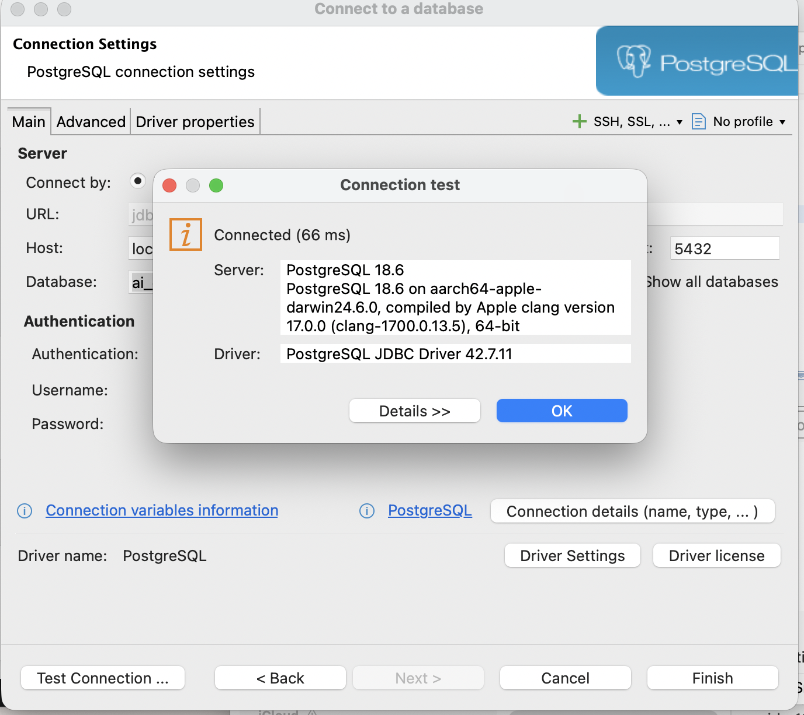
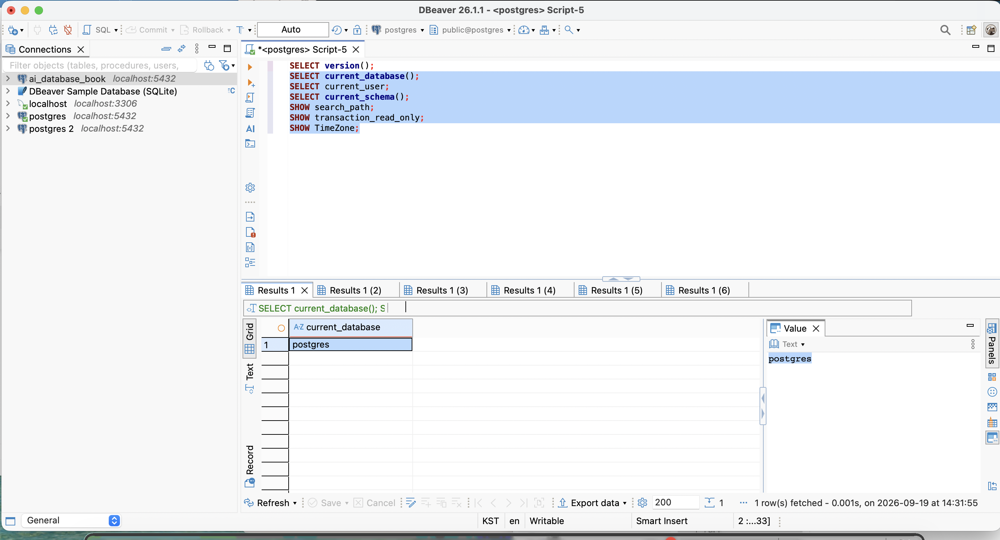
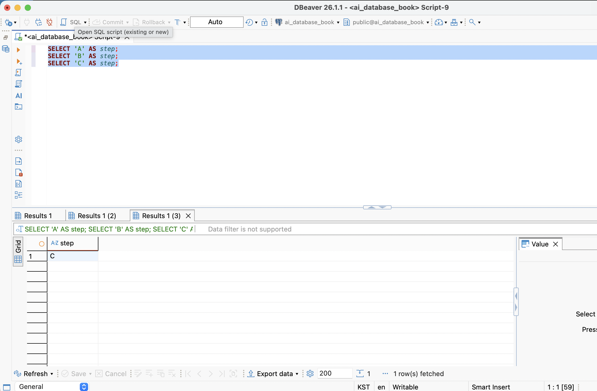

# Chapter 03 확장 실습 답안

> 과제: PostgreSQL과 DBeaver로 실습 환경 검증하기
>
> 이 답안은 이전 Chapter 01~02에서 사용한 로컬 PostgreSQL 환경을 기준으로 작성했다. 실제 연결 결과와 화면은 DBeaver에서 다시 확인해 기록한다.

실행할 SQL의 순서는 [chapter03_runbook.sql](./chapter03_runbook.sql)에 정리했다. 각 블록은 필요한 부분만 따로 실행한다.

## 제출 전 보안 주의

| 항목 | 작성 내용 |
| --- | --- |
| GitHub 계정 또는 별칭 | ssossocoder |
| 과제 작성일 | 2026-09-19 |
| 사용한 AI 도구 | ChatGPT (Codex) |

실제 PostgreSQL 비밀번호, 전체 접속 URL, API Key와 개인정보는 이 파일이나 캡처 화면에 기록하지 않는다.

---

# 1. PostgreSQL과 DBeaver 환경 확인

## 1-1. 내 환경

| 항목 | 작성 내용 |
| --- | --- |
| 운영체제 | macOS 26.2 |
| PostgreSQL 버전 | PostgreSQL 18.6 on aarch64-apple-darwin24.6.0, compiled by Apple clang version 17.0.0 (clang-1700.0.13.5), 64-bit |
| DBeaver 버전 | DBeaver 26.1.1 |
| Host | localhost |
| Port | 5432 |
| Database | ai_database_book |
| Username | postgres |

> 비밀번호는 기록하지 않는다.

## 1-2. PostgreSQL과 DBeaver 역할 설명

~~~text
PostgreSQL은 데이터를 저장하고, SQL을 실행하며, 권한과 제약조건을 적용하는 데이터베이스 관리 시스템(DBMS)이다.

DBeaver는 PostgreSQL 같은 DBMS에 연결해 SQL을 작성·실행하고 결과를 화면으로 확인하는 클라이언트 프로그램이다.

두 프로그램의 차이는 PostgreSQL이 데이터를 실제로 관리하는 서버이고, DBeaver는 서버에 요청을 보내 결과를 보여 주는 도구라는 점이다. 따라서 DBeaver를 닫아도 PostgreSQL 서버가 실행 중이면 데이터베이스는 계속 존재한다.
~~~

---

# 2. 연결 테스트와 첫 SQL

## 2-1. DBeaver 연결 결과

<!-- 아래 항목은 ai_database_book 연결을 만든 뒤 직접 확인하고 체크한다. -->

- [0] PostgreSQL 연결 유형 선택
- [0] Host 확인
- [0] Port 확인
- [0] Database 확인
- [0] Username 확인
- [0] Test Connection 성공

### 연결 성공 화면

## 2-2. 첫 SQL 실행

~~~sql
SELECT 1 + 1 AS result;
~~~

실행 전 예상:

~~~text
2
~~~

실제 결과:

~~~text
2
~~~

이 결과가 의미하는 것:

~~~text
SQL Editor가 현재 연결에 SELECT 문을 보내고 결과를 받을 수 있음을 확인하는 가장 간단한 테스트이다. 다만 이 결과만으로 현재 데이터베이스나 테이블 생성 권한까지 모두 확인할 수 있는 것은 아니다.
~~~

---

# 3. 현재 연결 위치를 SQL로 검증

다음 SQL은 처음 사용한 postgres 연결의 SQL Editor에서 실행해 현재 위치를 확인했다. 이후 4번에서 ai_database_book 연결로 전환했다.

~~~sql
SELECT version();
SELECT current_database();
SELECT current_user;
SELECT current_schema();
SHOW search_path;
SHOW transaction_read_only;
SHOW TimeZone;
~~~

## 3-1. 결과 기록

| 확인 항목 | 실제 결과 | 내가 이해한 의미 |
| --- | --- | --- |
| version() | PostgreSQL 18.6 on aarch64-apple-darwin24.6.0, compiled by Apple clang version 17.0.0 (clang-1700.0.13.5), 64-bit | 현재 SQL을 처리하는 PostgreSQL 서버의 버전과 빌드 정보이다. |
| current_database() | postgres| 현재 세션이 실제로 연결한 데이터베이스 이름이다. |
| current_user | postgres | 현재 세션에서 권한을 판단할 때 사용하는 PostgreSQL 사용자이다. |
| current_schema() | public| search_path에 따라 이름을 생략했을 때 우선 사용하는 스키마다. |
| search_path | "$user", public | 스키마를 생략한 객체 이름을 찾는 순서다. |
| transaction_read_only | off| 현재 트랜잭션이 읽기 전용인지 여부다. |
| TimeZone | Asia/Seoul| 날짜와 시간을 해석·표시할 때 현재 세션이 사용하는 시간대다. |

## 3-2. 반드시 설명할 것

### DBeaver 연결 이름과 current_database()는 왜 같은 개념이 아닌가요?

~~~text
DBeaver 연결 이름은 사용자가 구분하기 위해 붙이는 화면상의 별칭이다. 반면 current_database()는 현재 SQL 세션이 서버에 실제로 연결한 데이터베이스 이름을 PostgreSQL에 물어보는 함수다. 연결 이름을 postgres 또는 실습용 연결처럼 임의로 바꿀 수 있으므로, 현재 위치를 판단할 때는 SQL 결과를 확인해야 한다.
~~~

### current_schema()와 search_path는 어떤 관계가 있나요?

~~~text
search_path는 스키마를 생략한 객체 이름을 찾는 후보 스키마의 순서다. current_schema()는 그 검색 경로 중 현재 사용 가능한 첫 번째 스키마를 보여 준다. 따라서 search_path 전체와 current_schema()의 한 결과는 같은 정보가 아니라, 검색 순서와 그 순서에서 실제 선택된 위치라는 관계다.
~~~

### transaction_read_only = off라는 결과만으로 모든 테이블을 만들 권한이 있다고 단정할 수 있나요?

~~~text
아니다. off는 현재 트랜잭션이 읽기 전용이 아니라는 뜻일 뿐이다. 테이블을 만들려면 대상 데이터베이스에 연결할 권한과 대상 스키마의 CREATE 권한도 필요하다. 예를 들어 public 스키마에 만들려면 public의 USAGE와 CREATE 권한을 별도로 확인해야 한다.
~~~

## 3-3. 증거 화면

---

# 4. ai_database_book 데이터베이스 확인

## 4-1. 현재 데이터베이스

~~~sql
SELECT current_database();
~~~

실제 결과:

~~~text
ai_database_book
~~~

- [0] 결과가 ai_database_book이다.
- [0] 다른 DB라면 올바른 연결로 전환했다.

## 4-2. 연결을 바꾼 뒤 다시 검증

~~~text
전환 전 데이터베이스: postgres
전환 후 데이터베이스: ai_database_book
전환 여부를 판단한 근거: current_database()를 다시 실행해 결과가 ai_database_book인지 확인했다.
~~~

### 화면에서 보이는 연결 이름만 믿지 않고 SQL을 다시 실행해야 하는 이유

~~~text
연결 이름은 DBeaver에서 임의로 정하거나 바꿀 수 있고, 같은 연결을 다른 데이터베이스로 설정할 수도 있다. SQL의 current_database() 결과는 실행 중인 세션 자체가 연결한 위치를 보여 주므로 화면 별칭보다 확실한 근거가 된다.
~~~

---

# 5. SQL 실행 범위 실험

SQL Editor에 다음 세 문장을 입력한다.

~~~sql
SELECT 'A' AS step;
SELECT 'B' AS step;
SELECT 'C' AS step;
~~~

## 5-1. 한 문장 실행

~~~text
내가 실행한 문장: SELECT 'A' AS step;
실제 결과: step 열에 A가 1행으로 표시되었다.
~~~

## 5-2. 선택 영역 실행

~~~text
선택한 문장:
SELECT 'B' AS step;
SELECT 'C' AS step;

실제 결과:
B와 C가 각각 실행되어 결과가 표시되었다.
~~~

## 5-3. 전체 스크립트 실행

~~~text
실제 결과: A, B, C가 순서대로 모두 실행되었다.
결과 탭 또는 실행 순서에서 관찰한 점: 각 SELECT 문장의 결과가 실행 순서대로 표시되었다.
~~~

## 5-4. 결과 해석

~~~text
한 문장 실행은 커서가 있는 한 SQL 문장만 실행하는 방식이고, 선택 영역 실행은 선택한 SQL만 실행하는 방식이다. 전체 스크립트 실행은 편집기에 있는 여러 문장을 순서대로 실행한다.

변경 SQL에서 실행 범위를 잘못 선택하면 의도하지 않은 INSERT, UPDATE, DELETE 또는 DDL 문장까지 함께 실행될 수 있다. 따라서 실행 전에 선택 영역과 대상 데이터베이스를 확인해야 한다.
~~~

### 증거 화면

---

# 6. 제공된 환경 확인 SQL 실행

공개 저장소의 아래 파일을 사용한다.

- [setup_check.sql](https://github.com/GilbertMoon/ai-database-book/blob/main/code/chapter03/setup_check.sql)
- [setup_validate_local.sql](https://github.com/GilbertMoon/ai-database-book/blob/main/code/chapter03/setup_validate_local.sql)

## 6-1. setup_check.sql

실행 결과에서 확인한 항목:

~~~text
PostgreSQL 버전: PostgreSQL 18.6 on aarch64-apple-darwin24.6.0, compiled by Apple clang version 17.0.0 (clang-1700.0.13.5), 64-bit
현재 DB: ai_database_book
현재 사용자: postgres
현재 스키마: public
search_path: "$user", public
읽기 전용 여부: off
TimeZone: Asia/Seoul
1 + 1 결과: 2
public 스키마 존재 여부: true
public USAGE 권한: true
public CREATE 권한: true
~~~

### 이 파일을 여러 번 실행해도 비교적 안전한 이유

~~~text
이 파일은 SELECT, SHOW, 권한 확인 함수처럼 현재 환경을 읽는 조회문만 사용한다. 테이블·업무 데이터를 생성, 수정, 삭제하지 않으므로 같은 환경을 다시 확인하는 용도로 여러 번 실행해도 비교적 안전하다.
~~~

## 6-2. setup_validate_local.sql

~~~text
실행 결과: Chapter 03 recommended local environment validation passed

PASS / FAIL: PASS
~~~

실패했다면 실패 항목:

~~~text
없음
~~~

그 실패가 실제 문제인지 환경 차이인지 판단한 근거:

~~~text
이 검증 파일은 PostgreSQL 15 이상, ai_database_book 연결, public 스키마의 USAGE·CREATE 권한, 읽기 전용이 아님을 권장 로컬 환경의 조건으로 확인한다. 오류가 나면 오류 문구와 current_database(), has_schema_privilege() 결과를 함께 확인해 연결 실수인지 관리형 환경의 권한 차이인지 판단한다.
~~~

---

# 7. 안전한 오류 진단 실습

실제 오류가 없으므로 데이터를 변경하지 않는 다음 문법 오류를 사용한다.

~~~sql
SELEC 1;
~~~

오류를 본 뒤에는 올바른 SQL로 다시 확인한다.

~~~sql
SELECT 1;
SELECT current_database();
~~~

## 7-1. 오류 기록

~~~text
오류 메시지 핵심 문장: SQL Error [42601]: ERROR: syntax error at or near "SELEC"
  Position: 1

내가 먼저 생각한 원인 1: SELECT의 철자가 잘못되었을 수 있다.

내가 먼저 생각한 원인 2: 현재 SQL Editor의 연결이나 실행 위치가 예상과 다를 수 있다.

실제로 확인한 방법: 오류가 표시한 위치와 입력한 SELEC 1;을 비교한 뒤 SELECT 1;로 고쳐 다시 실행했다. 이어서 current_database()를 실행해 연결 위치도 확인했다.

실제 원인: SELEC를 SELECT로 잘못 입력한 SQL 문법 오류였다.

수정한 내용: SELEC 1;을 SELECT 1;로 수정했다.
~~~

## 7-2. 수정 후 재검증

~~~text
재검증 결과: 1, ai_database_book
~~~

## 7-3. 오류를 유형으로 분류
- [ ] 서버 실행 문제
- [ ] Host 문제
- [ ] Port 문제
- [ ] Database 문제
- [ ] Username/인증 문제
- [0] SQL 문법 문제
- [ ] 권한 문제
- [ ] 기타

선택 이유:

~~~text
실행한 문장에 SELEC라는 잘못된 키워드가 있었고 SELECT로 고치자 정상 실행되었다. 따라서 이 실습에서 관찰한 오류는 연결이나 권한 오류가 아니라 SQL 문법 오류로 분류한다.
~~~

---

# 8. AI를 오류 분석 보조 도구로 사용

## 8-1. AI에게 전달한 프롬프트

~~~text
PostgreSQL과 DBeaver를 사용하는 초보자입니다.

ai_database_book 연결에서 SELEC 1;을 실행했고, DBeaver에는 다음 오류가 표시되었습니다.
SQL Error [42601]: ERROR: syntax error at or near "SELEC" (Position: 1)

저는 SELECT의 철자 오류 또는 현재 연결 위치 문제를 먼저 의심했습니다.
데이터를 수정·삭제하지 않는 범위에서 원인을 확인하는 순서와, 수정 후 어떤 SQL로 다시 검증하면 좋은지 설명해 주세요.
비밀번호나 전체 접속 URL은 제공하지 않습니다.
~~~

## 8-2. AI 답변 검토

| AI가 제안한 확인 방법 | 실제로 확인했는가? | 결과 | 수용 / 수정 / 거절 |
| --- | --- | --- | --- |
| 오류 위치와 SELEC 키워드의 철자를 비교한다. | 네 | SELEC가 SELECT의 오타임을 확인했다. | 수용 |
| SELECT 1;로 고친 뒤 다시 실행한다. | 네 | 1이 반환되었다. | 수용 |
| current_database()로 현재 연결 위치를 다시 확인한다. | 네 | ai_database_book이 반환되었다. | 수용 |

### AI가 오류 원인을 너무 빨리 단정한 부분이 있었나요?

~~~text
문법 오류가 가장 유력하더라도, 실제 오류 메시지와 수정 뒤 재실행 결과를 확인하기 전에는 연결·권한 문제까지 자동으로 배제할 수 없다. 따라서 AI의 설명은 가설로 보고 실제 DBeaver 결과로 확인한다.
~~~

### 오류 메시지와 실제 환경 중 무엇을 확인해서 최종 판단했나요?

~~~text
오류 메시지의 Position: 1과 입력한 SELEC를 비교해 SELECT의 철자 오류를 확인했다. SELECT 1;을 다시 실행해 1이 반환되는지 확인했고, current_database()가 ai_database_book을 반환해 올바른 연결에서 재검증했음을 확인했다.
~~~

### AI 활용에서 가장 유용했던 점

~~~text
오류를 바로 해결책으로 넘기지 않고, 오류 메시지·입력 SQL·현재 연결 위치를 순서대로 확인하는 점검 목록으로 바꿔 준 점이 유용했다.
~~~

### AI 답변을 그대로 실행하지 않고 확인해야 하는 이유

~~~text
AI는 현재 서버의 실제 연결, 권한, 데이터 상태를 직접 알 수 없다. 특히 변경 SQL을 그대로 실행하면 의도하지 않은 데이터를 바꿀 수 있으므로, 실행 전에는 SQL의 대상과 범위를 확인해야 한다.
~~~

---

# 9. Chapter 01~02 개인 서비스와 연결

~~~text
서비스 이름: 사주 기록 노트

사용할 데이터베이스 이름 후보: ai_database_study

사용할 스키마 이름 후보: saju_note

앞으로 만들고 싶은 테이블 후보 3개:
1. subjects — 사주 기록 대상자 한 명을 저장한다.
2. birth_info — 한 대상자의 출생 정보 버전 한 건을 저장한다.
3. calculation_results — 특정 출생 정보와 계산 규칙으로 만든 결과 한 건을 저장한다.
~~~

### 아직 SQL을 만들지 않고 이름과 역할만 정하는 이유

~~~text
테이블 이름과 한 행의 의미를 먼저 정하면 서로 다른 데이터를 한 테이블에 섞는 일을 줄일 수 있다. 출생 시간의 정확도, 달력·시간대, 계산 결과의 이력 보관 같은 정책은 아직 확정되지 않았으므로 SQL 제약조건을 성급하게 만들지 않는다.
~~~

### Chapter 02에서 정리했던 한 행의 의미 중 수정할 부분이 있나요?

~~~text
수정할 부분은 없다. subjects의 한 행은 대상자 한 명, birth_info의 한 행은 출생 정보 버전 한 건, calculation_results의 한 행은 특정 출생 정보와 계산 규칙으로 만든 결과 한 건이라는 정의를 유지한다. 다만 실제 테이블을 만들기 전에는 출생 정보의 수정 이력과 계산 결과 보관 정책을 다시 확인해야 한다.
~~~

---

# 10. 초보자용 연결 가이드 작성

~~~text
1. PostgreSQL 서버가 실행되는지 확인하는 방법:
   DBeaver에서 PostgreSQL 연결을 선택해 Test Connection을 실행한다. 연결이 실패하면 먼저 PostgreSQL 서버가 실행 중인지와 Host·Port를 확인한다.

2. DBeaver에서 PostgreSQL 연결을 만드는 방법:
   New Database Connection에서 PostgreSQL을 선택하고 Host, Port, Database, Username을 입력한다. 비밀번호는 화면에만 입력하고 GitHub 답안에는 적지 않는다. Test Connection이 성공한 뒤 Finish로 연결을 만든다.

3. Host / Port / Database / Username의 의미:
   Host는 PostgreSQL 서버가 있는 위치, Port는 서버가 SQL 연결을 받는 통신 번호, Database는 서버 안에서 이번에 연결할 데이터베이스 이름, Username은 PostgreSQL이 권한을 판단할 때 쓰는 사용자 이름이다.

4. ai_database_book에 연결되었는지 확인하는 방법:
   DBeaver 화면 이름만 보지 않고 SELECT current_database();를 실행해 결과가 ai_database_book인지 확인한다.

5. 현재 위치를 확인하는 SQL:
   SELECT current_database(); SELECT current_user; SELECT current_schema(); SHOW search_path;

6. 한 문장과 전체 스크립트 실행을 구분해야 하는 이유:
   한 문장 실행은 현재 문장만 실행하지만 전체 스크립트 실행은 여러 문장을 순서대로 실행한다. 변경 SQL에서는 의도하지 않은 문장까지 실행되지 않도록 범위를 확인해야 한다.

7. 비밀번호를 GitHub나 AI 프롬프트에 넣으면 안 되는 이유:
   공개 저장소나 외부 서비스에 비밀번호가 남으면 다른 사람이 데이터베이스에 접근할 수 있다. 오류를 질문할 때도 비밀번호, 전체 접속 URL, API Key는 제거한다.
~~~

---

# 11. 최종 성찰

~~~text
1. DBeaver와 PostgreSQL의 가장 중요한 차이는
  DBeaver는 데이터베이스에 접속하고 SQL을 실행하는 도구이고, PostgreSQL은 실제 데이터를 저장·처리하는 데이터베이스 시스템이다

2. 내가 지금 어느 데이터베이스에 연결되어 있는지 확인할 때
  화면 이름만 보지 않고 SELECT current_database();를 실행해서 실제 연결된 데이터베이스를 확인해야 한다.

3. PostgreSQL 오류가 발생했을 때 가장 먼저 해야 할 일은
  오류 메시지를 정확히 읽고, SQL 문법·철자 등 가장 단순한 원인부터 확인하는 것이다.

4. AI를 오류 해결에 사용할 때 가장 중요한 것은
   비밀번호·접속 URL 같은 민감정보는 제외하고, 오류 메시지와 필요한 상황만 제공해 단계적으로 검증하는 것이다
~~~

---

# 12. 제출 체크리스트

- [0] chapter03_answer.md의 빈 필수 항목을 작성했다.
- [0] PostgreSQL과 DBeaver의 역할 차이를 설명했다.
- [0] current_database/current_user/current_schema/search_path를 실제로 확인했다.
- [0] ai_database_book 연결 여부를 SQL로 검증했다.
- [0] SQL 실행 범위 세 가지를 비교했다.
- [0] setup_check.sql을 실행했다.
- [0] setup_validate_local.sql 결과를 확인했다.
- [0] 오류 원인을 먼저 스스로 추정한 뒤 AI를 사용했다.
- [0] AI 제안을 실제 환경에서 검증했다.
- [0] 핵심 캡처 3~4장만 골라 넣었다.
- [0] 캡처에 비밀번호·개인정보·전체 접속 URL이 없다.
- [0] Markdown 이미지가 GitHub 웹 화면에서 실제로 보인다.
- [0] 최종 답안 파일을 commit/push했다.

---

# 13. LMS 제출 URL

내 제출 URL:

~~~text
https://github.com/ssossocoder/ai-database-study/blob/main/assignments/chapter03/chapter03_answer.md
~~~
