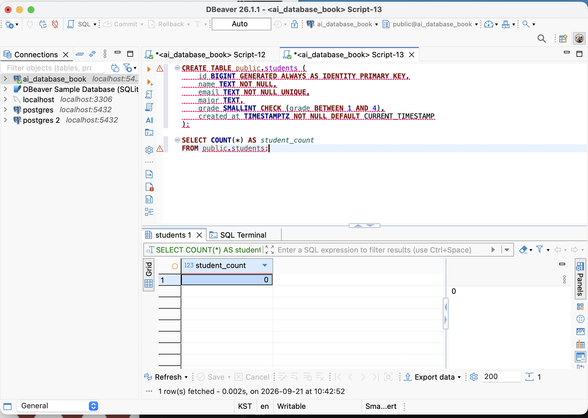
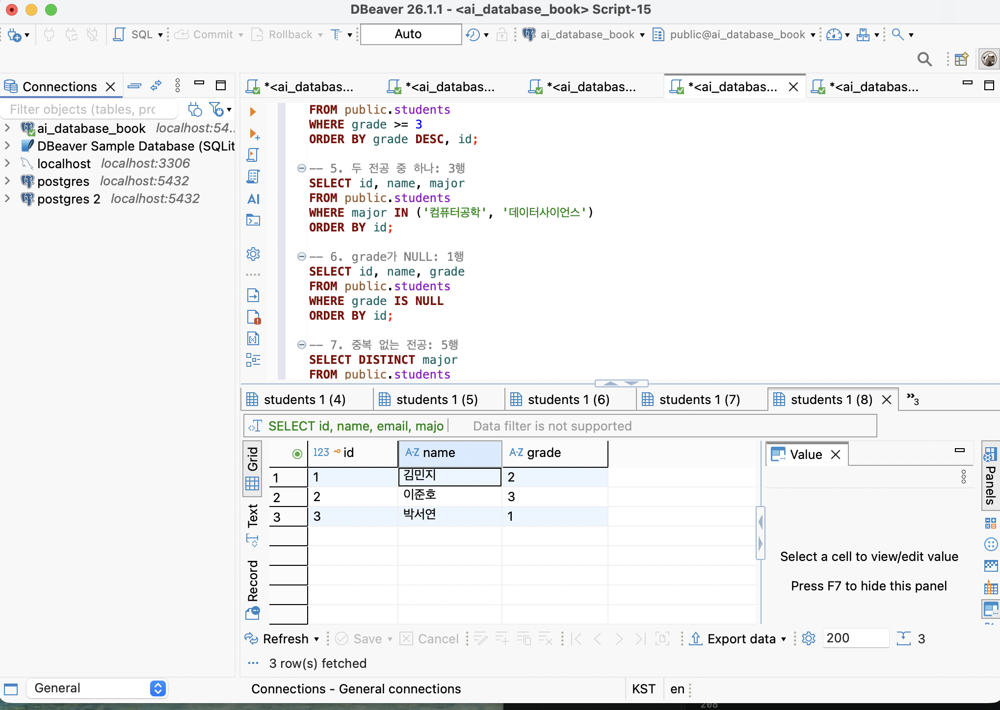
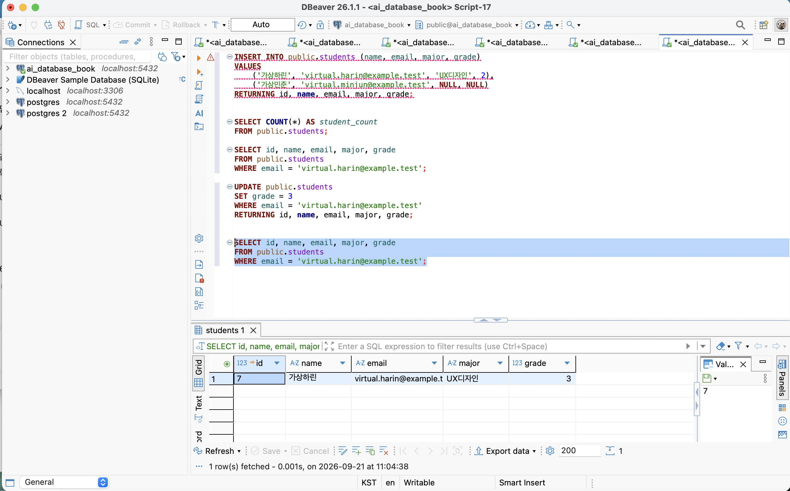
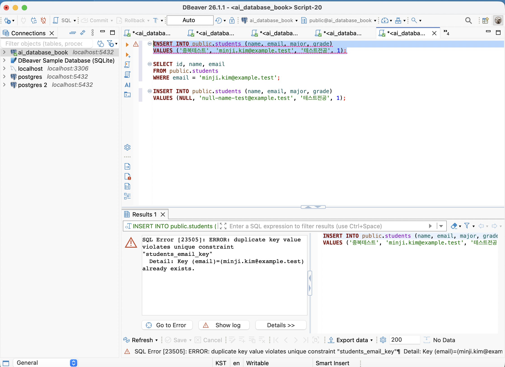

# Chapter 04 확장 실습 답안 초안

> 과제: 관계형 데이터베이스와 SQL 시작하기
>
> 상태: **제출 전 초안**. 이 문서의 `기대값`은 `code/chapter04`의 예시 데이터를 기준으로 계산한 값이고, `[직접 실행 후 기록]`은 DBeaver에서 확인한 실제 결과로 바꿔야 한다.
> 제출은 아직 하지 않는다. 비밀번호, 전체 DB 접속 URL, API Key, 개인정보는 넣지 않는다.

| 항목 | 작성 내용 |
| --- | --- |
| GitHub 계정 또는 별칭 | ssossocoder |
| 과제 작성일 | 2026-09-21 |
| 사용한 AI 도구 | ChatGPT (Codex) — SQL 초안과 검토 보조 |

## 내가 직접 해야 하는 체크리스트

- [ ] `ai_database_book` 연결에서 [`00_preflight.sql`](../../code/chapter04/00_preflight.sql)을 실행했다.
- [ ] 현재 DB, 사용자, 스키마, `search_path`, 읽기 전용 여부의 **실제 결과**를 아래 표에 기록했다.
- [ ] `01_create_students.sql`과 `02_insert_students.sql`을 각각 한 번만 실행하고 결과를 확인했다.
- [ ] 모든 SELECT의 예상 행 수를 먼저 적고 실제 행 수를 비교했다.
- [ ] UPDATE/DELETE 전 대상 SELECT가 정확히 1행인지 확인했다.
- [ ] 실패해야 하는 UNIQUE/NOT NULL 실험을 각각 한 문장씩 실행하고 오류 핵심 문구를 기록했다.
- [ ] 지정된 화면을 `images/`에 저장하고 아래 이미지 링크를 실제 파일명으로 바꿨다.
- [ ] 13절 성찰을 나의 실행 경험과 말로 수정했다.

실행 순서와 상태 주의점은 [`README.md`](./README.md)에 정리했다. SQL 파일은 [`code/chapter04`](../../code/chapter04)에 있다.

---

# 1. 실습 환경과 시작 상태 확인

실행 파일: [`00_preflight.sql`](../../code/chapter04/00_preflight.sql)

| 확인 항목 | 실제 결과 | 의미 |
| --- | --- | --- |
| `current_database()` | `[직접 실행 후 기록: ai_database_book인지 확인]` | 현재 SQL 세션이 실제로 연결된 데이터베이스이다. |
| `current_user` | `[직접 실행 후 기록]` | PostgreSQL이 이 세션의 권한을 판단할 때 쓰는 사용자이다. |
| `current_schema()` | `[직접 실행 후 기록]` | 스키마 이름을 생략했을 때 현재 우선 사용하는 스키마이다. |
| `search_path` | `[직접 실행 후 기록]` | 스키마를 생략한 객체 이름을 찾는 순서이다. |
| `transaction_read_only` | `[직접 실행 후 기록: off인지 확인]` | 현재 트랜잭션이 변경을 허용하는지 나타낸다. |

- [ ] 현재 DB가 `ai_database_book`이다.
- [ ] `transaction_read_only`가 `off`여서 읽기 전용 연결이 아님을 확인했다.
- [ ] 실행할 SQL 블록만 선택했는지 확인했다.
- [ ] DBeaver의 Auto-commit 상태를 화면에서 확인했다.

### 변경 SQL을 실행하기 전에 현재 DB와 실행 범위를 확인해야 하는 이유

```text
SQL 문법이 맞아도 다른 데이터베이스나 다른 테이블에서 실행하면 의도하지 않은 데이터를 바꿀 수 있다. 특히 UPDATE·DELETE는 선택한 범위 전체에 적용될 수 있으므로, current_database() 결과와 실제로 선택한 SQL 문장을 먼저 확인해야 한다.
```

---

# 2. `public.students` 구조 생성

실행 파일: [`01_create_students.sql`](../../code/chapter04/01_create_students.sql)

## 2-1. 실행 전 예상

```text
테이블 이름: public.students
한 행의 의미: 학생 한 명의 기본 정보
예상 행 수: 0행(테이블 생성 직후)
기본키: id
필수 열: id(자동 생성), name, email, created_at(기본값으로 자동 입력)
중복을 막는 열: email
자동 생성 열: id, created_at
```

## 2-2. 실행 후 확인

```text
테이블 생성 성공 여부: [직접 실행 후 기록]
실제 행 수: [직접 실행 후 기록 — 생성 직후 기대값은 0]
DBeaver에서 확인한 위치: ai_database_book → Schemas → public → Tables → students
```

### 각 열의 역할

| 열 | 타입 | NULL 가능? | 역할 |
| --- | --- | --- | --- |
| `id` | `BIGINT` identity | 아니오 | DB 내부에서 학생 행 한 건을 안정적으로 구분하는 기본키이다. |
| `name` | `TEXT` | 아니오 | 학생 이름 또는 표시 이름이다. |
| `email` | `TEXT` | 아니오 | 중복되지 않아야 하는 연락/식별용 이메일이다. |
| `major` | `TEXT` | 예 | 아직 전공을 정하지 않았거나 기록하지 않은 경우를 허용한다. |
| `grade` | `SMALLINT` | 예 | 학년이며, 입력하면 1~4만 허용한다. |
| `created_at` | `TIMESTAMPTZ` | 아니오 | 행이 만들어진 시각을 기본값으로 기록한다. |

### `id`를 학번이나 학생 수로 해석하면 안 되는 이유

```text
id는 데이터베이스가 행을 구분하기 위한 내부 식별자다. 중간 행이 삭제되거나 실패한 INSERT가 있으면 번호가 연속적이지 않을 수 있고, 학생 수와도 일대일로 대응하지 않는다. 학번처럼 업무에서 쓰는 식별자가 필요하면 별도 열과 규칙으로 관리해야 한다.
```

### 증거 화면

권장 경로: `assignments/chapter04/images/step02_table.png`

<!--  -->

---

# 3. 샘플 데이터 6명 입력

실행 파일: [`02_insert_students.sql`](../../code/chapter04/02_insert_students.sql)

## 3-1. 실행 전 예상

```text
현재 행 수: 0행
실행 후 예상 행 수: 6행
예상되는 NULL 포함 학생: 윤서진(major, grade)
```

## 3-2. 기대 결과와 실제 결과

```text
실제 행 수: [직접 실행 후 기록 — 기대값은 6]
이준호 grade: [직접 실행 후 기록 — 기대값은 3]
박서연 존재 여부: [직접 실행 후 기록 — 기대값은 존재]
윤서진 major: [직접 실행 후 기록 — 기대값은 NULL]
윤서진 grade: [직접 실행 후 기록 — 기대값은 NULL]
```

### 예상과 실제 비교

```text
예상과 실제가 일치했는가: [직접 실행 후 기록]
다르다면 이유: 예를 들어 INSERT를 이미 실행했거나, 다른 DB/기존 students 테이블에서 실행했는지 먼저 확인한다.
```

### `created_at` 값이 여러 행에서 같을 수 있는 이유

```text
여섯 행을 하나의 INSERT 문으로 넣으면 각 행의 DEFAULT CURRENT_TIMESTAMP는 같은 SQL 문장/트랜잭션 시각을 기준으로 평가될 수 있다. 같은 시각이라는 사실은 같은 학생이나 중복 행이라는 뜻이 아니다.
```

---

# 4. SELECT 복습과 결과 검증

실행 파일: [`03_select_students.sql`](../../code/chapter04/03_select_students.sql)

아래 기대 행 수는 2절과 3절의 초기 6명 데이터가 그대로 있는 상태를 기준으로 한다.

| 번호 | 조회 문제 | 예상 행 수 | 실제 행 수 | 일치? | 다르면 이유 |
| ---: | --- | ---: | --- | --- | --- |
| 1 | 전체 학생 | 6 | `[직접 실행 후]` | `[직접 확인]` | `[필요 시 기록]` |
| 2 | 이름·이메일만 조회 | 6 | `[직접 실행 후]` | `[직접 확인]` | `[필요 시 기록]` |
| 3 | 컴퓨터공학 전공 | 2 | `[직접 실행 후]` | `[직접 확인]` | `[필요 시 기록]` |
| 4 | 3학년 이상 | 2 | `[직접 실행 후]` | `[직접 확인]` | `[필요 시 기록]` |
| 5 | 컴퓨터공학·데이터사이언스 중 하나 | 3 | `[직접 실행 후]` | `[직접 확인]` | `[필요 시 기록]` |
| 6 | `grade IS NULL` | 1 | `[직접 실행 후]` | `[직접 확인]` | `[필요 시 기록]` |
| 7 | 전공 `DISTINCT` (NULL 포함) | 5 | `[직접 실행 후]` | `[직접 확인]` | `[필요 시 기록]` |
| 8 | `id`순 정렬 후 상위 3명 | 3 | `[직접 실행 후]` | `[직접 확인]` | `[필요 시 기록]` |

## 4-1. 직접 작성 SQL 2개 초안

```sql
-- SQL 1: 전공을 아직 기록하지 않은 학생만 확인한다.
SELECT id, name, major
FROM public.students
WHERE major IS NULL
ORDER BY id;
```

```text
이 SQL의 한 행 의미: 전공이 아직 NULL인 학생 한 명
예상 행 수: 1
실제 행 수: [직접 실행 후 기록]
```

```sql
-- SQL 2: 같은 전공 학생이 두 명 이상인 전공만 집계한다.
SELECT major, COUNT(*) AS student_count
FROM public.students
WHERE major IS NOT NULL
GROUP BY major
HAVING COUNT(*) >= 2
ORDER BY major;
```

```text
이 SQL의 한 행 의미: 학생이 두 명 이상인 전공 한 개와 해당 학생 수
예상 행 수: 1 (컴퓨터공학, 2명)
실제 행 수: [직접 실행 후 기록]
```

## 4-2. `= NULL` 대신 `IS NULL`을 사용하는 이유

```text
NULL은 값을 모른다거나 값이 없다는 상태이므로 일반 값과 `=`로 비교할 수 없다. `grade = NULL`의 결과는 참/거짓이 아니라 UNKNOWN이 되어 WHERE에서 선택되지 않는다. NULL 여부를 검사할 때는 IS NULL 또는 IS NOT NULL을 사용한다.
```

## 4-3. `ORDER BY` 없이 결과 순서를 믿으면 안 되는 이유

```text
테이블에 저장된 물리적 순서나 DBMS가 결과를 반환하는 순서는 SQL이 보장하지 않는다. 실행 계획이나 데이터 상태가 바뀌면 같은 SELECT라도 다른 순서로 보일 수 있으므로, id순·이름순·최신순처럼 필요한 순서는 ORDER BY로 명시한다.
```

## 4-4. `DISTINCT`가 원본 데이터를 삭제하는 기능인가요?

```text
아니다. DISTINCT는 SELECT 결과에서 같은 값을 한 번만 보여 주는 조회 옵션이다. 원본 public.students 테이블의 행을 수정하거나 삭제하지 않는다.
```

### 증거 화면

권장 경로: `assignments/chapter04/images/step04_select.png`

<!--  -->

---

# 5. 내 가상 학생 2명 추가

실행 SQL은 [`05_safe_dml_exercises.sql`](../../code/chapter04/05_safe_dml_exercises.sql)의 `[5]` 블록에 있다. 다음 두 명은 모두 가상 데이터다.

## 5-1. 실행 전 계획

```text
학생 A
이름: 가상하린
이메일: virtual.harin@example.test
전공: UX디자인
학년: 2

학생 B
이름: 가상민준
이메일: virtual.minjun@example.test
전공: NULL
학년 또는 NULL: NULL

현재 행 수: 6 (초기 데이터 기준)
추가 후 예상 행 수: 8
```

## 5-2. 내가 실행할 INSERT

```sql
INSERT INTO public.students (name, email, major, grade)
VALUES
    ('가상하린', 'virtual.harin@example.test', 'UX디자인', 2),
    ('가상민준', 'virtual.minjun@example.test', NULL, NULL)
RETURNING id, name, email, major, grade;
```

## 5-3. 실제 결과

```text
RETURNING 또는 확인 SELECT 결과: [직접 실행 후 기록]
실제 전체 행 수: [직접 실행 후 기록]
예상과 일치 여부: [직접 실행 후 기록]
```

### 내가 일부 값을 NULL로 둔 이유

```text
가상민준의 전공과 학년이 아직 정해지지 않았다는 상황을 표현하기 위해 NULL을 사용했다. NULL은 빈 문자열이나 0과 다른 의미이므로, 값이 실제로 확정되지 않았을 때만 사용한다.
```

---

# 6. 안전한 UPDATE

실행 SQL은 [`05_safe_dml_exercises.sql`](../../code/chapter04/05_safe_dml_exercises.sql)의 `[6]` 블록에 있다. 가상하린 한 명만 수정한다.

## 6-1. 먼저 대상 확인 SELECT

```sql
SELECT id, name, email, major, grade
FROM public.students
WHERE email = 'virtual.harin@example.test';
```

```text
예상 대상 행 수: 1
실제 대상 행 수: [직접 실행 후 기록]
```

## 6-2. UPDATE

```sql
UPDATE public.students
SET grade = 3
WHERE email = 'virtual.harin@example.test'
RETURNING id, name, email, major, grade;
```

```text
예상 영향 행 수: 1
실제 영향 행 수: [직접 실행 후 기록]
RETURNING 결과: [직접 실행 후 기록]
```

## 6-3. UPDATE 후 재조회

```sql
SELECT id, name, email, major, grade
FROM public.students
WHERE email = 'virtual.harin@example.test';
```

### `WHERE` 없는 UPDATE를 실행하면 위험한 이유

```text
WHERE가 없으면 public.students의 모든 행이 UPDATE 대상이 된다. 한 학생만 바꾸려는 의도와 달리 전체 학생의 값이 바뀔 수 있으므로, 먼저 같은 WHERE 조건으로 SELECT하여 대상 행 수를 확인해야 한다.
```

### 증거 화면

권장 경로: `assignments/chapter04/images/step06_update.png`

<!--  -->

---

# 7. 안전한 DELETE

실행 SQL은 [`05_safe_dml_exercises.sql`](../../code/chapter04/05_safe_dml_exercises.sql)의 `[7]` 블록에 있다. 가상민준 한 명만 삭제한다.

## 7-1. 삭제 전 확인

```sql
SELECT id, name, email
FROM public.students
WHERE email = 'virtual.minjun@example.test';
```

```text
예상 대상 행 수: 1
실제 대상 행 수: [직접 실행 후 기록]
```

## 7-2. DELETE

```sql
DELETE FROM public.students
WHERE email = 'virtual.minjun@example.test'
RETURNING id, name, email;
```

```text
예상 영향 행 수: 1
실제 영향 행 수: [직접 실행 후 기록]
RETURNING 결과: [직접 실행 후 기록]
```

## 7-3. 삭제 후 재조회

```sql
SELECT id, name, email
FROM public.students
WHERE email = 'virtual.minjun@example.test';
```

```text
삭제 후 같은 조건의 SELECT 결과 행 수: [직접 실행 후 기록 — 기대값은 0]
```

### `DELETE` 성공 메시지만 보고 끝내지 않고 다시 SELECT해야 하는 이유

```text
성공 메시지는 SQL 문장이 실행되었다는 뜻일 뿐, 내가 의도한 조건의 행이 실제로 사라졌는지까지 충분히 보여 주지 않을 수 있다. 같은 WHERE 조건으로 다시 SELECT하면 삭제 대상과 삭제 후 상태를 직접 검증할 수 있다.
```

---

# 8. 본문 기준 UPDATE·DELETE 상태 검증

실행 파일: [`04_update_delete_students.sql`](../../code/chapter04/04_update_delete_students.sql)

이 절은 **01·02 실행 직후의 6명 시작 상태**에서 따로 수행한다. 5~7절의 가상 학생 실습 상태가 남아 있으면 기대 행 수가 달라진다.

```text
최종 학생 수: [직접 실행 후 기록 — 기대값은 5]
이준호 grade: [직접 실행 후 기록 — 기대값은 4]
박서연 존재 여부: [직접 실행 후 기록 — 기대값은 0행]
```

### 내 실제 결과가 기준과 다르다면 원인

```text
[직접 실행 후 기록]

가능한 원인: INSERT를 중복 실행했거나, 5~7절의 가상 학생이 남아 있거나, UPDATE/DELETE의 WHERE 대상이 예시와 다르거나, 다른 데이터베이스에서 실행했을 수 있다. 먼저 current_database(), 전체 행 수, 각 이메일의 존재 여부를 다시 확인한다.
```

---

# 9. 의도한 실패 2개 관찰

실행 SQL은 [`05_safe_dml_exercises.sql`](../../code/chapter04/05_safe_dml_exercises.sql)의 `[9]` 블록에 있다. 두 INSERT는 각각 한 문장씩 실행하며, **실패해야 정상**이다.

## 9-1. 중복 이메일 `UNIQUE` 오류

```sql
INSERT INTO public.students (name, email, major, grade)
VALUES ('중복테스트', 'minji.kim@example.test', '테스트전공', 1);
```

```text
오류 메시지 핵심 단서: [직접 실행 후 기록 — 예: duplicate key, students_email_key]
왜 실패해야 맞는가: 이미 김민지가 사용하는 이메일을 다른 학생에게 다시 저장하려 했기 때문이다.
어떤 규칙이 작동했는가: email의 UNIQUE 제약조건이다.
실패 후 기존 데이터가 어떻게 유지되었는가: [직접 SELECT로 확인한 결과를 기록]
```

## 9-2. 이름 `NULL` 입력 `NOT NULL` 오류

```sql
INSERT INTO public.students (name, email, major, grade)
VALUES (NULL, 'null-name-test@example.test', '테스트전공', 1);
```

```text
오류 메시지 핵심 단서: [직접 실행 후 기록 — 예: null value, column "name"]
왜 실패해야 맞는가: name은 한 학생 행에 반드시 있어야 한다고 정한 필수 값이기 때문이다.
어떤 규칙이 작동했는가: name의 NOT NULL 제약조건이다.
```

### 실패한 INSERT 뒤 자동 생성 `id` 번호에 빈 구간이 생길 수 있어도 문제라고 단정할 수 없는 이유

```text
identity/sequence 값은 INSERT 시도 과정에서 미리 할당될 수 있고, 실패하거나 롤백된 트랜잭션이 있어도 그 값이 다시 사용된다고 보장되지 않는다. id의 역할은 연속된 학생 수를 표현하는 것이 아니라 각 행을 식별하는 것이므로, 번호 사이의 빈 구간만으로 데이터 오류라고 단정할 수 없다.
```

### 증거 화면

권장 경로: `assignments/chapter04/images/step09_constraint_error.png`

<!--  -->

---

# 10. `verify_students.sql`로 최종 상태 확인

실행 파일: [`verify_students.sql`](../../code/chapter04/verify_students.sql)

이 결과의 기대값은 8절처럼 초기 6명 상태에서 `04_update_delete_students.sql`만 실행한 경우다.

```text
현재 전체 학생 수: [직접 실행 후 기록 — 기대값은 5]
grade NULL 개수: [직접 실행 후 기록 — 기대값은 1]
major NULL 개수: [직접 실행 후 기록 — 기대값은 1]
이준호 grade: [직접 실행 후 기록 — 기대값은 4]
박서연 존재 여부: [직접 실행 후 기록 — 기대값은 0]
현재 데이터 상태에서 예상과 다른 부분: [직접 실행 후 기록]
```

### 검증 SQL을 따로 두면 좋은 이유

```text
변경 SQL과 검증 SQL을 분리하면, 데이터를 바꾸는 단계와 결과를 확인하는 단계를 섞지 않을 수 있다. 같은 검증 쿼리를 반복 실행해도 데이터를 다시 바꾸지 않으므로, 기대값과 실제 상태를 비교하기 쉽다.
```

---

# 11. AI를 SQL 작성자가 아니라 검토자로 활용

이 절은 내가 먼저 SQL과 예상 영향 행 수를 작성하고, 실행 전에 AI의 제안을 검토했다는 과정을 솔직하게 기록하는 용도다. 아래는 이 과제에서 사용할 수 있는 검토 요청 초안이며, 제출 전 실제 사용한 내용과 결과로 고친다.

## 11-1. 검토할 SQL 초안

```sql
UPDATE public.students
SET grade = 3
WHERE email = 'virtual.harin@example.test'
RETURNING id, name, email, grade;
```

## 11-2. AI에게 전달할 핵심 요청 초안

```text
PostgreSQL 초보자입니다. 아래 UPDATE가 한 명의 가상 학생만 수정하는지 검토해 주세요.
실행 전 대상 확인 SELECT, 예상 영향 행 수, 실행 뒤 검증 SELECT를 제안해 주세요.
비밀번호, 접속 URL, 실제 개인정보는 제공하지 않습니다.
```

## 11-3. AI 제안을 실행 결과로 검증할 표

| AI 제안 | 수용 / 수정 / 거절 | 실제 검증 결과 | 나의 이유 |
| --- | --- | --- | --- |
| `WHERE email = ...`와 같은 조건으로 먼저 SELECT한다. | `[직접 결정]` | `[직접 실행 후]` | `[직접 작성]` |
| UPDATE의 영향 행 수가 1인지 확인한다. | `[직접 결정]` | `[직접 실행 후]` | `[직접 작성]` |
| UPDATE 뒤 같은 조건으로 다시 SELECT한다. | `[직접 결정]` | `[직접 실행 후]` | `[직접 작성]` |

### AI가 예상한 영향 행 수와 실제 결과가 같았나요?

```text
[직접 실행 후 기록]
```

### AI 답변을 실행 전에 검토해야 하는 이유

```text
AI는 현재 DB의 실제 행, 연결 위치, 제약조건, 이미 실행한 SQL을 자동으로 알지 못한다. 따라서 제안된 SQL의 WHERE 조건과 예상 영향 행 수를 먼저 읽고, 안전한 SELECT로 대상이 맞는지 검증한 뒤 실행해야 한다.
```

---

# 12. 내 서비스 테이블 하나 확장 설계

Chapter 01~03에서 정한 개인 서비스인 **사주 기록 노트**에서 `subjects` 테이블을 선택했다.

```text
서비스 이름: 사주 기록 노트
테이블 이름: saju_note.subjects
한 행의 의미: 사주 기록을 만들 대상자 한 명의 기본 식별·표시 정보
```

| 열 이름 | 저장할 값 | 타입 후보 | NULL 가능? | UNIQUE 후보? | 이유 |
| --- | --- | --- | --- | --- | --- |
| `id` | DB 내부 행 식별자 | `BIGINT` identity | 아니오 | PK | 다른 테이블이 안정적으로 참조할 내부 키가 필요하다. |
| `subject_code` | 앱에서 대상자를 구분할 코드 | `TEXT` | 아니오 | 예 | 이름이 바뀌어도 대상자를 구분할 업무 식별자가 필요하다. |
| `nickname` | 화면에 표시할 별칭 | `TEXT` | 아니오 | 아니오 | 같은 별칭을 여러 대상자가 사용할 수 있다. |
| `relationship_label` | 본인·가족·지인 같은 관계 메모 | `TEXT` | 예 | 아니오 | 모든 대상자에게 관계가 정해져 있지는 않다. |
| `memo` | 사용자가 남긴 자유 메모 | `TEXT` | 예 | 아니오 | 선택 정보이며 구조화 규칙이 아직 확정되지 않았다. |
| `created_at` | 최초 등록 시각 | `TIMESTAMPTZ` | 아니오 | 아니오 | 생성 시점을 추적하기 위한 기본 기록이다. |

```text
PK 후보: id
업무 식별자 후보: subject_code
아직 미확정인 규칙: subject_code 형식, 별칭 변경 이력, 대상자 삭제/보관 정책, birth_info와의 정확한 관계
```

## 선택: CREATE TABLE 초안

아직 확정되지 않은 업무 규칙을 억지로 CHECK나 UNIQUE로 넣지 않은 초안이다.

```sql
CREATE SCHEMA IF NOT EXISTS saju_note;

CREATE TABLE saju_note.subjects (
    id BIGINT GENERATED ALWAYS AS IDENTITY PRIMARY KEY,
    subject_code TEXT NOT NULL UNIQUE,
    nickname TEXT NOT NULL,
    relationship_label TEXT,
    memo TEXT,
    created_at TIMESTAMPTZ NOT NULL DEFAULT CURRENT_TIMESTAMP
);
```

### AI에게 검토받은 뒤 수정할 부분

```text
초안 단계에서는 별칭에 UNIQUE를 두지 않았다. 별칭은 사람이 읽기 위한 값이라 중복될 수 있기 때문이다. 반면 subject_code는 업무 식별자로 사용할 계획이므로 UNIQUE 후보로 남겼다. 실제 서비스 정책이 정해지면 코드 형식과 삭제 정책을 추가로 검토한다.
```

---

# 13. 최종 성찰 초안

아래 문장은 제출 전, 실제 실행한 결과와 내 표현에 맞게 고친다.

```text
1. SQL 실행 성공과 올바른 대상 선택이 다른 이유는 SQL이 오류 없이 실행되더라도 WHERE 조건이나 연결 위치가 틀리면 내가 의도하지 않은 행을 조회하거나 변경할 수 있기 때문이다.

2. UPDATE와 DELETE 전에 SELECT를 먼저 해야 하는 이유는 같은 조건으로 대상 행과 행 수를 미리 확인해 실수로 여러 행을 바꾸거나 지우는 일을 줄이기 위해서이다.

3. 영향받은 행 수를 확인해야 하는 이유는 한 행을 바꿀 것으로 예상했는데 0행 또는 여러 행이 바뀌었다면 조건이나 현재 데이터 상태를 다시 점검해야 하기 때문이다.

4. UNIQUE 또는 NOT NULL 오류를 '보호 장치가 정상 동작한 결과'라고 볼 수 있는 이유는 중복 이메일이나 이름 없는 학생처럼 정한 규칙에 맞지 않는 데이터를 테이블에 저장하지 못하게 막았기 때문이다.

5. AI가 SQL을 만들어 주더라도 내가 반드시 확인해야 하는 것은 현재 연결한 DB, SQL의 대상 테이블과 WHERE 조건, 예상 영향 행 수, 실제 실행 결과이다.
```
