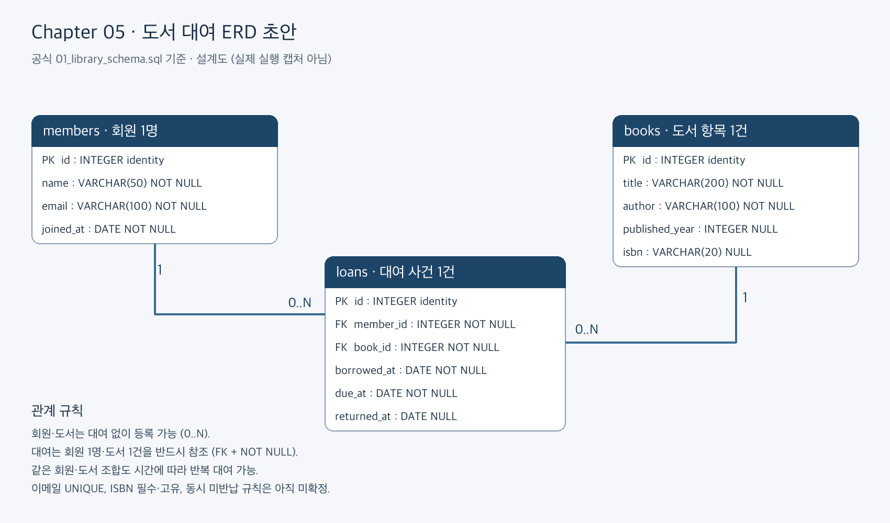

# Chapter 05 확장 실습 답안 — 제출 전 초안

> **과제:** 요구사항에서 데이터 모델과 ERD 만들기  
> **사용 방법:** 이 파일을 내려받아 본인의 GitHub 저장소에 `chapter05_answer.md`라는 이름으로 저장한 뒤 실습하면서 바로 작성합니다.  
> **제출 방법:** LMS에는 파일을 직접 업로드하지 않고, **본인 GitHub 저장소의 `chapter05_answer.md` 파일 URL**을 제출합니다.

> **작성 상태:** 설명은 AI가 작성한 초안입니다. `[직접 기록]`은 본인의 실제 결과로 채우고, 개인 서비스·AI 판단·성찰은 직접 확인·작성해야 합니다. 아직 SQL 실행이나 LMS 제출을 완료한 답안이 아닙니다.

---

## 제출 전 주의

이 파일과 캡처 화면에는 실제 비밀번호, 전체 DB 접속 URL, API Key, 개인정보를 기록하지 않습니다.

```text
GitHub 계정 또는 별칭: ssossocoder
과제 작성일: 2026-10-07
사용한 AI 도구: ChatGPT (Codex) — 공식 템플릿 정리·설명·SQL 실행 안내 작성
```

---

# 1. Chapter 05 핵심 개념 복습

본문을 보지 않고 본인이 먼저 설명해야 하는 항목입니다. 아래 AI 초안을 읽기 전에 본인 설명을 적고, 차이를 비교하세요.

```text
요구사항에서 바로 테이블부터 만들면 위험한 이유: 대상과 사건, 확정 정책을 구분하지 않으면 서로 다른 사실을 한 행에 섞거나 근거 없는 제약조건을 만들 수 있다.

한 행의 의미를 먼저 정해야 하는 이유: 한 행이 회원 한 명인지 대여 사건 한 건인지에 따라 키·속성·반복 허용 범위가 달라진다.

확정 요구사항과 미확정 정책을 구분해야 하는 이유: 확인되지 않은 이메일 고유성이나 복본 정책을 강제하면 정상 업무를 막을 수 있다.

PK와 업무상 고유값 후보의 차이: PK는 행을 식별하는 키이고, 이메일·ISBN 같은 업무값의 고유성은 정책으로 따로 확인한다. 내부 id가 있다고 업무 중복까지 차단되는 것은 아니다.

N:M 관계를 그대로 두지 않고 연결 테이블을 검토하는 이유: FK 하나로 양쪽의 여러 연결을 표현할 수 없으며, 대여 날짜처럼 각 연결 사건의 속성도 저장해야 한다.
```

---

# 2. 도서 대여 요구사항 R-01~R-07 다시 분해

| 요구사항 | 관리 대상 / 사건 | 속성 후보 | 관계 / 규칙 후보 | 미확정 질문 |
| --- | --- | --- | --- | --- |
| R-01 | 회원 | 내부 id | 회원을 독립 관리 | 탈퇴 회원 기록 보관 정책은? |
| R-02 | 회원 | name, email, joined_at | 회원의 기본 정보 | 같은 이메일을 여러 회원이 쓸 수 있는가? |
| R-03 | 도서 | title, author, published_year, isbn | 제목·저자 관리; 연도·ISBN 선택 | 도서가 판본인가 실물인가? ISBN 없는 도서는? |
| R-04 | 회원·대여 사건 | member_id, book_id | 회원 1 : 대여 N | 최대 동시 대여 수는? |
| R-05 | 도서·반복 대여 사건 | loan id, book_id | 도서 1 : 대여 N; 회원-도서 쌍 반복 | 동일 도서의 동시 미반납을 허용하는가? |
| R-06 | 대여 사건 | borrowed_at, due_at, returned_at | 날짜는 대여 사건에 속함 | 당일 반납·연장·날짜 선후 정책은? |
| R-07 | 대여의 반납 상태 | returned_at | 미반납이면 NULL 허용 | 분실·취소를 반납과 어떻게 구분하는가? |

### 본문과 비교한 뒤 수정한 내용

```text
처음에 놓친 부분: [직접 기록: 본인 최초 분해와 비교]

처음에 잘못 분류한 부분: [직접 기록]

수정한 이유: [직접 기록 — AI 초안과 비교한 실제 차이]
```

---

# 3. 확정 규칙과 미확정 정책 구분

## 3-1. 확정된 규칙

```text
1. 회원의 이름·이메일·가입일을 관리한다.
2. 도서 제목·저자를 관리하고 출판연도·ISBN은 선택 정보로 둔다.
3. 회원 한 명은 여러 대여 사건을 가질 수 있다.
4. 도서 한 건은 시간에 따라 여러 대여 사건을 가질 수 있다.
5. 대여일·반납예정일·실제반납일을 저장하며 미반납이면 실제반납일은 NULL이다.
```

## 3-2. 미확정 질문

최소 5개를 작성합니다.

```text
Q1. 이메일은 회원마다 고유해야 하는가?
Q2. ISBN이 없는 도서도 등록하는가?
Q3. 같은 ISBN의 실물 복본을 어떻게 구분하는가?
Q4. 한 도서의 저자가 여러 명이면 어떻게 관리하는가?
Q5. 같은 도서의 동시 미반납 대여를 허용하는가?
Q6. 회원 탈퇴나 도서 폐기 때 대여 이력을 어떻게 보관하는가?
Q7. 대여일과 반납일이 같은 날이어도 되는가?
```

### 미확정 정책을 바로 `UNIQUE`, `CHECK`, 삭제 규칙으로 구현하면 위험한 이유

```text
확인되지 않은 정책을 DB 규칙으로 고정하면 합법적인 데이터가 거절되고, 이후 정책 변경 때 구조·데이터를 함께 바꿔야 할 수 있다.
```

---

# 4. 엔터티·속성·사건 후보 구분

| 후보 | 대상 엔터티 / 사건 엔터티 / 속성 | 판단 근거 | 독립 식별 필요? |
| --- | --- | --- | --- |
| 회원 | 대상 엔터티 | 대여가 없어도 독립 관리하는 사람 | 예 |
| 도서 | 대상 엔터티 | 대여 대상이며 독립 속성을 가진다 | 예 |
| 대여 기록 | 사건 엔터티 | 같은 회원·도서 조합이 여러 번 발생하고 날짜가 다르다 | 예 |
| 이메일 | 회원 속성 | 이 요구사항에서 회원 연락값이며 독립 관리 대상은 아니다 | 아니오 |
| ISBN | 도서 속성 | 식별 후보지만 필수·고유·복본 정책이 미확정이다 | 현재는 아니오 |
| 반납예정일 | 대여 사건 속성 | 개별 대여 건의 예정일이다 | 아니오 |

### “명사가 보이면 무조건 테이블”이 아닌 이유

```text
이메일·날짜는 다른 대상의 속성일 수 있다. 독립 식별·생명주기·반복 사건이 필요한지 보고 테이블을 정한다.
```

---

# 5. 테이블별 한 행의 의미와 키 후보

| 테이블 | 한 행의 의미 | PK 후보 | 업무상 고유값 후보 | FK 후보 |
| --- | --- | --- | --- | --- |
| `members` | 회원 한 명 | id | email (고유성 미확정) | 없음 |
| `books` | 간소화된 대여 대상 도서 항목 한 건 | id | isbn (필수·고유·복본 미확정) | 없음 |
| `loans` | 특정 회원이 특정 도서를 대여한 사건 한 건 | id | member_id+book_id는 반복 가능하여 고유키 아님 | member_id, book_id |

### `members.email`을 지금 바로 UNIQUE라고 확정하지 않는 이유

```text
R-02는 이메일 보유만 말하고 회원 간 중복 금지는 말하지 않는다. NOT NULL과 UNIQUE는 서로 다른 규칙이다.
```

### `books.isbn`을 지금 바로 NOT NULL + UNIQUE라고 확정하지 않는 이유

```text
R-03은 ISBN을 저장할 수 있다고 말한다. ISBN 없는 자료와 같은 ISBN 복본의 취급이 미확정이다.
```

---

# 6. 관계를 양방향 문장으로 작성

## 6-1. `members ↔ loans`

```text
회원 한 명은 대여 기록을 0건 이상 가질 수 있다.

대여 기록 한 건은 반드시 회원 한 명을 참조한다.

카디널리티: members 1 : loans N
선택성에서 확인할 점: 회원은 대여 없이 등록 가능; 대여의 회원 참조는 NOT NULL FK로 필수.
```

## 6-2. `books ↔ loans`

```text
도서 한 건은 시간에 따라 대여 기록을 0건 이상 가질 수 있다.

대여 기록 한 건은 반드시 도서 한 건을 참조한다.

카디널리티: books 1 : loans N
선택성에서 확인할 점: 도서는 미대여 상태로 등록 가능; 대여의 도서 참조는 NOT NULL FK로 필수.
```

## 6-3. `members ↔ books`를 직접 N:M으로 저장하지 않고 `loans`를 두는 이유

```text
회원은 여러 도서를 빌리고 도서도 여러 회원에게 반복 대여된다. loans로 두 개의 1:N 관계를 만들면 연결과 개별 대여 날짜를 함께 저장할 수 있다.
```

### `loans`가 단순 연결표가 아니라 사건 엔터티라고 볼 수 있는 이유

```text
같은 회원·도서 조합도 날짜가 다르면 다른 대여다. 독립 id와 날짜·반납 상태를 가진 반복 사건이다.
```

---

# 7. 도서 대여 ERD 초안

아래 항목이 보이도록 ERD를 작성합니다.

```text
members
books
loans
PK
FK
주요 속성
1:N 관계
```

권장 이미지 경로:

```text
assignments/chapter05/images/step07_library_erd.png
```

Markdown 예시:

```markdown

```


이 이미지는 공식 Chapter 05 DDL을 옮긴 설계도이며 실제 DB 실행 캡처는 아니다.

### ERD를 그린 뒤 수정한 부분

```text
[직접 기록: 초기 그림과 비교한 실제 변경. 예시를 본인 활동으로 꾸며 쓰지 않는다.]
```

---

# 8. PostgreSQL로 도서 대여 모델 구현 확인

## 8-1. 현재 환경 확인

```sql
SELECT current_database();
SELECT current_user;
SELECT current_schema();
SHOW search_path;
SHOW transaction_read_only;
```

```text
현재 DB: [직접 기록]
현재 사용자: [직접 기록]
현재 스키마: [직접 기록]
search_path: [직접 기록]
읽기 전용 여부: [직접 기록]
```

- [ ] 현재 DB가 `ai_database_book`이다.
- [ ] 실행 범위를 확인했다.
- [ ] Auto-commit 상태를 확인했다.

## 8-2. 스키마 생성 SQL 실행

사용 파일:

```text
code/chapter05/01_library_schema.sql
```

실행 전 예상:

```text
생성될 테이블 수: 3
생성 순서: members → books → loans
각 테이블 예상 행 수: 모두 0
```

실행 후 실제:

```text
members 존재: [직접 기록]
books 존재: [직접 기록]
loans 존재: [직접 기록]
각 테이블 행 수: [직접 기록]
```

### `loans`를 마지막에 만드는 이유

```text
loans의 FK가 members와 books의 PK를 참조하므로 부모 테이블이 먼저 있어야 한다.
```

---

# 9. 샘플 데이터 입력과 관계 관찰

사용 파일:

```text
code/chapter05/02_library_seed.sql
```

## 9-1. 실행 전 예상

```text
members 예상 행 수: 3
books 예상 행 수: 3
loans 예상 행 수: 4
미반납 예상 건수: 3
회원 101 대여 예상 건수: 2
도서 201 대여 예상 건수: 2
```

## 9-2. 실제 결과

```text
members 실제 행 수: [직접 기록]
books 실제 행 수: [직접 기록]
loans 실제 행 수: [직접 기록]
미반납 실제 건수: [직접 기록]
회원 101 대여 실제 건수: [직접 기록]
도서 201 대여 실제 건수: [직접 기록]
```

### 샘플 데이터에서 확인한 1:N 관계

```text
[직접 실행 후 확인] 회원 101의 대여 1001·1002, 도서 201의 대여 1001·1003이 각각 같은 부모를 참조한다. 도서 201은 4월 2일 반납 후 4월 3일 다시 대여된다.
```

### `returned_at = NULL`이 의미하는 것

```text
미반납 상태여서 실제 반납일이 아직 기록되지 않았다는 뜻이다. SQL 검색은 returned_at = NULL이 아니라 returned_at IS NULL을 사용한다.
```

### 증거 화면

권장 경로:

```text
assignments/chapter05/images/step09_seed_result.png
```

[캡처 대기: step09_seed_result.png]

저장 후 이 문장을 ``로 교체한다.

---

# 10. 검증 SQL 실행

사용 파일:

```text
code/chapter05/03_library_validation.sql
```

## 10-1. 결과 기록

```text
members = [직접 기록; 예상 3]
books = [직접 기록; 예상 3]
loans = [직접 기록; 예상 4]
미반납 건수 = [직접 기록; 예상 3]
회원 101 대여 이력 = [직접 기록; 예상 2]
도서 201 대여 이력 = [직접 기록; 예상 2]
회원 참조 고아 행 = [직접 기록; 예상 0]
도서 참조 고아 행 = [직접 기록; 예상 0]
loans FK 개수 = [직접 기록; 예상 2]
검증 최종 메시지 = [직접 기록; 예상 Chapter 05 library model validation passed]
```

### 단순히 테이블 3개가 생성되었다고 설계 검증이 끝난 것이 아닌 이유

```text
행 수·FK 참조·반복 대여·선택 속성·샘플의 시간 순서를 확인해야 모델이 업무 사례를 표현하는지 알 수 있다.
```

### 증거 화면

권장 경로:

```text
assignments/chapter05/images/step10_validation.png
```

[캡처 대기: step10_validation.png]

저장 후 ``로 교체한다.

---

# 11. 작은 시나리오로 모델 검증

아래 시나리오를 현재 모델이 표현할 수 있는지 판단합니다.

| 시나리오 | 표현 가능? | 이유 | 추가 확인할 정책 |
| --- | --- | --- | --- |
| 회원 A가 서로 다른 책 2권을 대여 | 가능 | 같은 member_id의 대여 2행 | 동시 대여 상한 |
| 같은 책을 시간 차를 두고 다시 대여 | 가능 | book_id가 같은 별도 사건 행 | 이전 대여 반납 확인 정책 |
| 아직 반납하지 않은 대여 | 가능 | returned_at NULL | 분실·취소 상태 |
| 회원은 있지만 대여 기록이 없음 | 가능 | members의 존재는 loans를 요구하지 않음 | 탈퇴 처리 |
| ISBN이 없는 도서 | 가능 | Chapter 05 isbn은 nullable | ISBN 필수 정책 |
| 같은 ISBN의 실물 복본 2권 | 동일 ISBN 2행 저장은 가능하나 의미 불명확 | 실물 식별자와 판본 분리가 없다 | 도서의 한 행 의미·복본 모델 |
| 한 도서에 저자 2명 | 독립 관계로 표현 불충분 | author는 문자열 한 열 | authors 연결 테이블 필요 여부 |
| 같은 도서를 두 명이 동시에 대여 | 저장되지만 적절성 미확정 | Chapter 05는 동시 활성 대여를 차단하지 않음 | 도서당 미반납 상한 |

### 현재 Chapter 05 모델의 한계 3가지

```text
1. 도서의 판본과 실물 복본이 분리되지 않았다.
2. 여러 저자를 각각 독립 관리하는 관계가 없다.
3. 날짜 선후·동시 미반납 같은 정책이 제약조건으로 구현되지 않았다.
```

---

# 12. Chapter 01~04 개인 서비스 요구사항 작성

> [작성 대기] 본인 개인 서비스 주제 확인 후 이 항목을 작성한다. 공통 도서 대여 실습과 별도 요구사항이다.

지금까지 선택한 개인 서비스 아이디어를 사용합니다.

```text
서비스 이름:
서비스 목적:
```

## 12-1. 요구사항

최소 8개를 작성합니다.

```text
P05-R01.
P05-R02.
P05-R03.
P05-R04.
P05-R05.
P05-R06.
P05-R07.
P05-R08.
```

> 화면 기능보다 **저장해야 할 사실, 반복 사건, 상태와 관계**를 중심으로 작성합니다.

## 12-2. 미확정 질문

최소 3개를 작성합니다.

```text
P05-Q01.
P05-Q02.
P05-Q03.
```

---

# 13. 개인 서비스 모델 초안

## 13-1. 엔터티·사건 후보표

| 후보 | 대상 / 사건 | 한 행의 의미 | 주요 속성 | PK 후보 | 업무 식별자 후보 |
| --- | --- | --- | --- | --- | --- |
|  |  |  |  |  |  |
|  |  |  |  |  |  |
|  |  |  |  |  |  |
|  |  |  |  |  |  |

## 13-2. 관계 문장

최소 3쌍을 양방향으로 작성합니다.

```text
관계 1:
A 한 건은 ...
B 한 건은 ...

관계 2:

관계 3:
```

## 13-3. N:M 관계 검토

```text
N:M 관계 후보:
연결 테이블 후보:
연결 테이블 한 행의 의미:
연결 테이블 자체에 필요한 사건 속성:
```

---

# 14. 개인 서비스 ERD 초안

ERD에 최소 다음을 표시합니다.

```text
테이블 3개 이상
각 테이블 PK
주요 속성
필요한 FK
관계선
카디널리티
```

권장 이미지 경로:

```text
assignments/chapter05/images/step14_my_erd.png
```

`여기에 개인 서비스 ERD 이미지를 삽입하세요.`

### ERD의 각 테이블이 어떤 요구사항에서 나왔는지 설명

| 테이블 | 근거 요구사항 ID | 한 행의 의미 |
| --- | --- | --- |
|  |  |  |
|  |  |  |
|  |  |  |

---

# 15. 요구사항 추적표

| 요구사항 ID | 데이터 모델 반영 위치 | 검증 방법 | 상태 |
| --- | --- | --- | --- |
| P05-R01 |  |  | 반영/미반영/확인필요 |
| P05-R02 |  |  |  |
| P05-R03 |  |  |  |
| P05-R04 |  |  |  |
| P05-R05 |  |  |  |
| P05-R06 |  |  |  |
| P05-R07 |  |  |  |
| P05-R08 |  |  |  |

### ERD 그림만으로 요구사항 누락을 발견하기 어려운 이유

```text
그림에는 원래 요구사항과 정책 근거가 모두 적히지 않는다. 요구사항 ID별 반영 위치와 검증 방법을 추적해야 누락을 찾을 수 있다.
```

---

# 16. 개인 서비스 작은 데이터 시나리오 검증

가상 데이터만 사용합니다.

```text
사용자/대상 A:
사용자/대상 B:
대상 X:
대상 Y:
사건 1:
사건 2:
사건 3:
사건 4:
```

### 이 시나리오를 현재 ERD로 저장할 수 있는가?

```text

```

### 저장하기 어려운 상황 또는 모호한 부분

```text

```

### 시나리오 검증 후 수정한 ERD 내용

```text

```

---

# 17. AI를 설계자가 아니라 리뷰어로 활용

## 17-1. AI에게 전달한 핵심 자료

```text
요구사항:

미확정 질문:

테이블별 한 행 의미:

관계 문장:

ERD 설명:
```

## 17-2. AI 검토 요청

실제로 사용한 프롬프트 또는 핵심 내용을 기록합니다.

```text

```

## 17-3. AI 제안 검토

| AI 제안 또는 질문 | 수용 / 수정 / 보류 / 거절 | 실제 근거 요구사항 | 나의 판단 이유 |
| --- | --- | --- | --- |
|  |  |  |  |
|  |  |  |  |
|  |  |  |  |
|  |  |  |  |
|  |  |  |  |

### AI가 요구사항에 없는 정책을 임의로 확정한 부분이 있었나요?

```text

```

### AI 검토를 받고도 채택하지 않은 제안 하나와 그 이유

```text

```

---

# 18. 선택 — PostgreSQL DDL 초안

> 이 단계는 완성된 구현이 아니라 **현재 데이터 모델을 SQL 구조로 옮겨 보는 연습**입니다. Chapter 06에서 정규화와 제약조건을 더 엄격하게 검토합니다.

```sql
-- 개인 서비스 DDL 초안

```

### 아직 구현하지 않은 미확정 정책

```text
1.
2.
3.
```

---

# 19. 최종 성찰

아래 문장은 반드시 본인의 말로 작성합니다.

```text
1. 요구사항에서 바로 테이블을 만들지 않고 중간 설계 과정을 거쳐야 하는 이유는
   ____________________________________________________________ 이다.

2. 테이블의 한 행 의미가 중요한 이유는
   ____________________________________________________________ 이다.

3. 미확정 정책을 그대로 남겨 두는 것이 좋은 설계 활동일 수 있는 이유는
   ____________________________________________________________ 이다.

4. N:M 관계에서 연결 엔터티가 필요한 이유는
   ____________________________________________________________ 이다.

5. AI가 ERD를 만들어 주더라도 사람이 반드시 확인해야 하는 것은
   ____________________________________________________________ 이다.
```

---

# 20. 제출 체크리스트

- [x] `chapter05_answer.md`를 본인 저장소에 만들었다.
- [ ] R-01~R-07을 직접 재분해했다.
- [ ] 확정 규칙과 미확정 질문을 구분했다.
- [ ] `members/books/loans`의 한 행 의미를 설명했다.
- [ ] 관계를 양방향 문장으로 작성했다.
- [ ] 도서 대여 ERD를 작성했다.
- [ ] `01_library_schema.sql`을 실행했다.
- [ ] `02_library_seed.sql`을 실행했다.
- [ ] `03_library_validation.sql` 결과를 확인했다.
- [ ] 작은 시나리오로 모델의 한계를 확인했다.
- [ ] 개인 서비스 요구사항을 8개 이상 작성했다.
- [ ] 개인 서비스 미확정 질문을 3개 이상 작성했다.
- [ ] 개인 서비스 ERD를 작성했다.
- [ ] 요구사항 추적표를 작성했다.
- [ ] 개인 서비스 작은 데이터 시나리오를 검증했다.
- [ ] AI 제안을 수용/수정/보류/거절로 판단했다.
- [ ] 핵심 캡처 또는 ERD 이미지 3~4장 이내로 정리했다.
- [ ] 이미지가 GitHub 웹 화면에서 실제로 보인다.
- [ ] 답안 파일을 commit/push했다.

---

# 21. LMS 제출 URL

아래 형식의 **본인 GitHub 파일 URL**을 LMS에 제출합니다.

```text
https://github.com/<본인-GitHub-ID>/<본인-저장소>/blob/main/assignments/chapter05/chapter05_answer.md
```

내 제출 URL (직접 실행·보완 후 제출):

```text
https://github.com/ssossocoder/ai-database-study/blob/main/assignments/chapter05/chapter05_answer.md
```

> 저장소 메인 URL, 교수자 템플릿 URL, Raw URL이 아니라 **작성 완료된 본인 `chapter05_answer.md` 파일 화면 URL**을 제출합니다.
