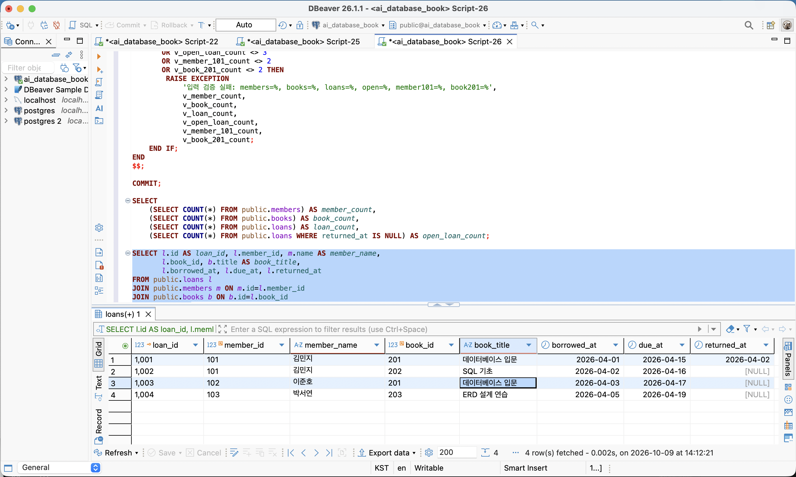
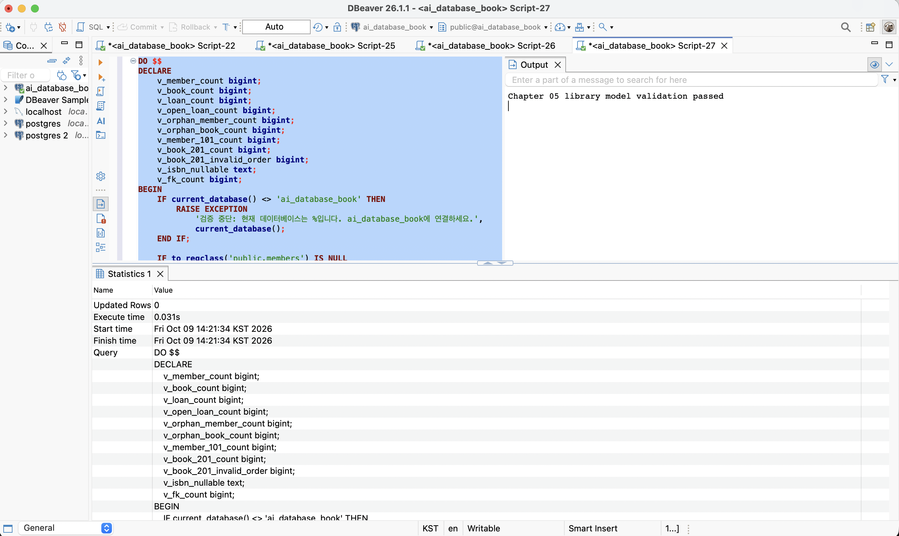
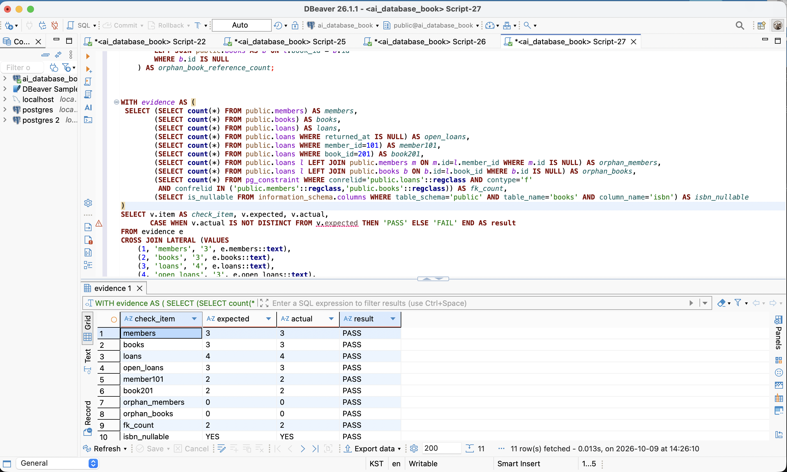
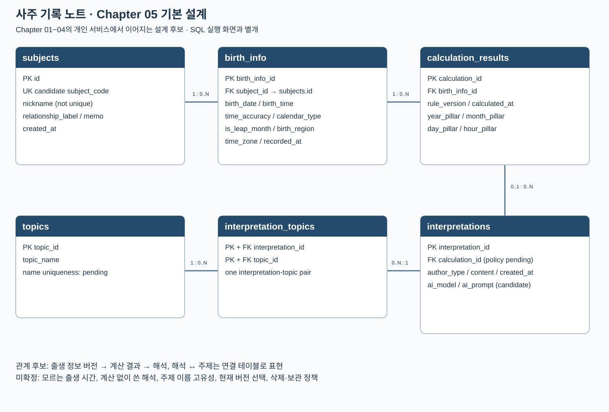

# Chapter 05 확장 실습 답안 — 제출 전 초안

> **과제:** 요구사항에서 데이터 모델과 ERD 만들기  
> **사용 방법:** 이 파일을 내려받아 본인의 GitHub 저장소에 `chapter05_answer.md`라는 이름으로 저장한 뒤 실습하면서 바로 작성합니다.  
> **제출 방법:** LMS에는 파일을 직접 업로드하지 않고, **본인 GitHub 저장소의 `chapter05_answer.md` 파일 URL**을 제출합니다.

> **작성 상태:** 설명은 AI가 작성한 초안입니다. `[직접 기록]`은 본인의 실제 결과로 채우고, 개인 서비스는 Chapter 01~04의 사주 기록 노트에 근거했으며, AI 판단·성찰은 직접 확인·작성해야 합니다. 아직 SQL 실행이나 LMS 제출을 완료한 답안이 아닙니다.

---

## 제출 전 주의

이 파일과 캡처 화면에는 실제 비밀번호, 전체 DB 접속 URL, API Key, 개인정보를 기록하지 않습니다.

```text
GitHub 계정 또는 별칭: ssossocoder
과제 작성일: 2026-10-07
사용한 AI 도구: ChatGPT (Codex) 
```

---

# 1. Chapter 05 핵심 개념 복습

본문을 보지 않고 본인이 먼저 설명해야 하는 항목입니다. 아래 AI 초안을 읽기 전에 본인 설명을 적고, 차이를 비교하세요.

```text
요구사항에서 바로 테이블부터 만들면 위험한 이유: 대상과 사건, 확정 정책을 구분하지 않으면 서로 다른 사실을 한 행에 섞거나 근거 없는 제약조건을 만들 수 있다.

한 행의 의미를 먼저 정해야 하는 이유: 한 행이 회원 한 명인지 대여 사건 한 건인지에 따라 키·속성·반복 허용 범위가 달라진다.

확정 요구사항과 미확정 정책을 구분해야 하는 이유: 확인되지 않은 이메일 고유성이나 복본 정책을 강제하면 정상 업무를 막을 수 있다.

PK와 업무상 고유값 후보의 차이: PK는 행을 식별하는 키이고, 이메일·ISBN 같은 업무값의 고유성은 정책으로 따로 확인한다. 내부 id가 있다고 업무 중복까지 차단되는 것은 아니다.

N:M 관계를 그대로 두지 않고 연결 테이블을 검토하는 이유: FK 하나로 양쪽의 여러 연결을 표현할 수 없으며, 대여 날짜처럼 각 연결 사건의 속성도 저장해야 한다.
```

---

# 2. 도서 대여 요구사항 R-01~R-07 다시 분해

| 요구사항 | 관리 대상 / 사건 | 속성 후보 | 관계 / 규칙 후보 | 미확정 질문 |
| --- | --- | --- | --- | --- |
| R-01 | 회원 | 내부 id | 회원을 독립 관리 | 탈퇴 회원 기록 보관 정책은? |
| R-02 | 회원 | name, email, joined_at | 회원의 기본 정보 | 같은 이메일을 여러 회원이 쓸 수 있는가? |
| R-03 | 도서 | title, author, published_year, isbn | 제목·저자 관리; 연도·ISBN 선택 | 도서가 판본인가 실물인가? ISBN 없는 도서는? |
| R-04 | 회원·대여 사건 | member_id, book_id | 회원 1 : 대여 N | 최대 동시 대여 수는? |
| R-05 | 도서·반복 대여 사건 | loan id, book_id | 도서 1 : 대여 N; 회원-도서 쌍 반복 | 동일 도서의 동시 미반납을 허용하는가? |
| R-06 | 대여 사건 | borrowed_at, due_at, returned_at | 날짜는 대여 사건에 속함 | 당일 반납·연장·날짜 선후 정책은? |
| R-07 | 대여의 반납 상태 | returned_at | 미반납이면 NULL 허용 | 분실·취소를 반납과 어떻게 구분하는가? |

### 본문과 비교한 뒤 수정한 내용

아래는 AI와 함께 의도적으로 구성한 잘못된 초안을 원문 R-01~R-07과 대조한 연습 사례다. 자연스럽게 발생한 본인의 최초 실수 기록과 구분한다. 위 요구사항 분해표에는 바로잡은 분류를 반영했다.

```text
처음에 놓친 부분 — 연습용 오류 초안:
R-07의 미반납 상태를 놓치고 모든 대여 기록의 실제반납일이 반드시 입력되어야 한다고 설정했다.
또한 R-05의 반복 대여를 놓치고 같은 회원과 같은 도서의 조합은 한 번만 저장할 수 있다고 설정했다.

처음에 잘못 분류한 부분 — 연습용 오류 초안:
R-06의 반납예정일을 대여 사건의 속성이 아니라 books 테이블의 속성으로 분류했다.
도서 한 권에 반납예정일 하나를 두면 충분하다고 가정한 것이다.

수정한 내용과 이유:
1. returned_at은 NULL을 허용하도록 바로잡았다. R-07은 아직 반납되지 않은 대여 기록의 실제반납일이 비어 있을 수 있다고 명시한다. 이를 필수로 설정하면 미반납 대여를 저장할 수 없다.
2. (member_id, book_id)를 고유키로 확정하는 설정을 제거하고 대여 사건마다 별도의 id로 구분하도록 바로잡았다. R-05는 같은 도서가 시간에 따라 여러 번 대여될 수 있다고 명시한다. 회원-도서 조합을 고유하게 만들면 같은 회원의 같은 도서 재대여를 저장하지 못한다.
3. due_at을 books가 아니라 loans의 속성으로 바로잡았다. R-06의 날짜는 개별 대여 기록에 속한다. 같은 도서라도 대여 시점마다 반납예정일이 달라질 수 있으므로 도서의 고정 속성으로 저장하면 이전 대여의 예정일을 덮어쓸 수 있다.
```

---

# 3. 확정 규칙과 미확정 정책 구분

## 3-1. 확정된 규칙

```text
1. 회원의 이름·이메일·가입일을 관리한다.
2. 도서 제목·저자를 관리하고 출판연도·ISBN은 선택 정보로 둔다.
3. 회원 한 명은 여러 대여 사건을 가질 수 있다.
4. 도서 한 건은 시간에 따라 여러 대여 사건을 가질 수 있다.
5. 대여일·반납예정일·실제반납일을 저장하며 미반납이면 실제반납일은 NULL이다.
```

## 3-2. 미확정 질문

최소 5개를 작성합니다.

```text
Q1. 이메일은 회원마다 고유해야 하는가?
Q2. ISBN이 없는 도서도 등록하는가?
Q3. 같은 ISBN의 실물 복본을 어떻게 구분하는가?
Q4. 한 도서의 저자가 여러 명이면 어떻게 관리하는가?
Q5. 같은 도서의 동시 미반납 대여를 허용하는가?
Q6. 회원 탈퇴나 도서 폐기 때 대여 이력을 어떻게 보관하는가?
Q7. 대여일과 반납일이 같은 날이어도 되는가?
```

### 미확정 정책을 바로 `UNIQUE`, `CHECK`, 삭제 규칙으로 구현하면 위험한 이유

```text
확인되지 않은 정책을 DB 규칙으로 고정하면 합법적인 데이터가 거절되고, 이후 정책 변경 때 구조·데이터를 함께 바꿔야 할 수 있다.
```

---

# 4. 엔터티·속성·사건 후보 구분

| 후보 | 대상 엔터티 / 사건 엔터티 / 속성 | 판단 근거 | 독립 식별 필요? |
| --- | --- | --- | --- |
| 회원 | 대상 엔터티 | 대여가 없어도 독립 관리하는 사람 | 예 |
| 도서 | 대상 엔터티 | 대여 대상이며 독립 속성을 가진다 | 예 |
| 대여 기록 | 사건 엔터티 | 같은 회원·도서 조합이 여러 번 발생하고 날짜가 다르다 | 예 |
| 이메일 | 회원 속성 | 이 요구사항에서 회원 연락값이며 독립 관리 대상은 아니다 | 아니오 |
| ISBN | 도서 속성 | 식별 후보지만 필수·고유·복본 정책이 미확정이다 | 현재는 아니오 |
| 반납예정일 | 대여 사건 속성 | 개별 대여 건의 예정일이다 | 아니오 |

### “명사가 보이면 무조건 테이블”이 아닌 이유

```text
이메일·날짜는 다른 대상의 속성일 수 있다. 독립 식별·생명주기·반복 사건이 필요한지 보고 테이블을 정한다.
```

---

# 5. 테이블별 한 행의 의미와 키 후보

| 테이블 | 한 행의 의미 | PK 후보 | 업무상 고유값 후보 | FK 후보 |
| --- | --- | --- | --- | --- |
| `members` | 회원 한 명 | id | email (고유성 미확정) | 없음 |
| `books` | 간소화된 대여 대상 도서 항목 한 건 | id | isbn (필수·고유·복본 미확정) | 없음 |
| `loans` | 특정 회원이 특정 도서를 대여한 사건 한 건 | id | member_id+book_id는 반복 가능하여 고유키 아님 | member_id, book_id |

### `members.email`을 지금 바로 UNIQUE라고 확정하지 않는 이유

```text
R-02는 이메일 보유만 말하고 회원 간 중복 금지는 말하지 않는다. NOT NULL과 UNIQUE는 서로 다른 규칙이다.
```

### `books.isbn`을 지금 바로 NOT NULL + UNIQUE라고 확정하지 않는 이유

```text
R-03은 ISBN을 저장할 수 있다고 말한다. ISBN 없는 자료와 같은 ISBN 복본의 취급이 미확정이다.
```

---

# 6. 관계를 양방향 문장으로 작성

## 6-1. `members ↔ loans`

```text
회원 한 명은 대여 기록을 0건 이상 가질 수 있다.

대여 기록 한 건은 반드시 회원 한 명을 참조한다.

카디널리티: members 1 : loans N
선택성에서 확인할 점: 회원은 대여 없이 등록 가능; 대여의 회원 참조는 NOT NULL FK로 필수.
```

## 6-2. `books ↔ loans`

```text
도서 한 건은 시간에 따라 대여 기록을 0건 이상 가질 수 있다.

대여 기록 한 건은 반드시 도서 한 건을 참조한다.

카디널리티: books 1 : loans N
선택성에서 확인할 점: 도서는 미대여 상태로 등록 가능; 대여의 도서 참조는 NOT NULL FK로 필수.
```

## 6-3. `members ↔ books`를 직접 N:M으로 저장하지 않고 `loans`를 두는 이유

```text
회원은 여러 도서를 빌리고 도서도 여러 회원에게 반복 대여된다. loans로 두 개의 1:N 관계를 만들면 연결과 개별 대여 날짜를 함께 저장할 수 있다.
```

### `loans`가 단순 연결표가 아니라 사건 엔터티라고 볼 수 있는 이유

```text
같은 회원·도서 조합도 날짜가 다르면 다른 대여다. 독립 id와 날짜·반납 상태를 가진 반복 사건이다.
```

---

# 7. 도서 대여 ERD 초안

아래 항목이 보이도록 ERD를 작성합니다.

```text
members
books
loans
PK
FK
주요 속성
1:N 관계
```

권장 이미지 경로:

```text
assignments/chapter05/images/step07_library_erd.png
```

Markdown 예시:


members는 회원 한 명, books는 도서 항목 한 건,
loans는 특정 회원이 특정 도서를 대여한 사건 한 건을 나타낸다.

각 테이블의 id를 PK로 사용한다.
loans.member_id는 members.id를,
loans.book_id는 books.id를 참조하는 FK다.

회원과 도서는 각각 대여 기록을 0건 이상 가질 수 있으므로
members–loans와 books–loans는 각각 1:N 관계다.
대여 기록 한 건은 반드시 회원 한 명과 도서 한 건을 참조한다.

미반납 대여를 표현하기 위해 returned_at은 NULL을 허용한다.
ISBN의 필수·고유 여부는 미확정이므로 해당 규칙을 강제하지 않았다.


### ERD를 그린 뒤 수정한 부분

```text
AI가 제공한 ERD의 PK, FK 참조 대상, 1:N 관계와 NULL 허용 여부를 확인했다.
요구사항과 일치하여 기존 그림을 유지했으며, 별도의 구조 수정은 하지 않았다.
```


# 8. PostgreSQL로 도서 대여 모델 구현 확인

## 8-1. 현재 환경 확인

```sql
SELECT current_database();
SELECT current_user;
SELECT current_schema();
SHOW search_path;
SHOW transaction_read_only;
```

```text
현재 DB: ai_database_book
현재 사용자: postgres
현재 스키마: public
search_path: "$user", public
읽기 전용 여부: off
```

- [x] 현재 DB가 `ai_database_book`이다.
- [x] 실행 범위를 확인했다.
- [x] Auto-commit 상태를 확인했다.

## 8-2. 스키마 생성 SQL 실행

사용 파일:

```text
code/chapter05/01_library_schema.sql
```

실행 전 예상:

```text
생성될 테이블 수: 3
생성 순서: members → books → loans
각 테이블 예상 행 수: 모두 0
```

실행 후 실제:

```text
members 존재: members (public.members)
books 존재: books (public.books)
loans 존재: loans (public.loans)
각 테이블 행 수: members 0행, books 0행, loans 0행

```

### `loans`를 마지막에 만드는 이유

```text
loans의 FK가 members와 books의 PK를 참조하므로 부모 테이블이 먼저 있어야 한다.
```

---

# 9. 샘플 데이터 입력과 관계 관찰

사용 파일:

```text
code/chapter05/02_library_seed.sql
```

## 9-1. 실행 전 예상

```text
members 예상 행 수: 3
books 예상 행 수: 3
loans 예상 행 수: 4
미반납 예상 건수: 3
회원 101 대여 예상 건수: 2
도서 201 대여 예상 건수: 2
```

## 9-2. 실제 결과

```text
members 실제 행 수: [직접 기록]
books 실제 행 수: [직접 기록]
loans 실제 행 수: [직접 기록]
미반납 실제 건수: [직접 기록]
회원 101 대여 실제 건수: [직접 기록]
도서 201 대여 실제 건수: [직접 기록]
```

### 샘플 데이터에서 확인한 1:N 관계

```text
[직접 실행 후 확인] 회원 101의 대여 1001·1002, 도서 201의 대여 1001·1003이 각각 같은 부모를 참조한다. 도서 201은 4월 2일 반납 후 4월 3일 다시 대여된다.
```

### `returned_at = NULL`이 의미하는 것

```text
미반납 상태여서 실제 반납일이 아직 기록되지 않았다는 뜻이다. SQL 검색은 returned_at = NULL이 아니라 returned_at IS NULL을 사용한다.
```

### 증거 화면

권장 경로:

```text
assignments/chapter05/images/step09_seed_result.png
```

[캡처 대기: step09_seed_result.png]



---

# 10. 검증 SQL 실행

사용 파일:

```text
code/chapter05/03_library_validation.sql
```

## 10-1. 결과 기록

```text
members = 3
books = 3
loans = 4
미반납 건수 = 3
회원 101 대여 이력 = 2
도서 201 대여 이력 = 2
회원 참조 고아 행 = 0
도서 참조 고아 행 = 0
loans FK 개수 = 2
검증 최종 메시지 = Chapter 05 library model validation passed
추가 확인: ISBN은 NULL 허용이며, 검증 요약 11행 모두 PASS였다.
```

### 단순히 테이블 3개가 생성되었다고 설계 검증이 끝난 것이 아닌 이유

```text
행 수·FK 참조·반복 대여·선택 속성·샘플의 시간 순서를 확인해야 모델이 업무 사례를 표현하는지 알 수 있다.
```

### 증거 화면

권장 경로:

```text
assignments/chapter05/images/step10_validation.png
```

[캡처 대기: step10_validation.png]





---

# 11. 작은 시나리오로 모델 검증

아래 시나리오를 현재 모델이 표현할 수 있는지 판단합니다.

| 시나리오 | 표현 가능? | 이유 | 추가 확인할 정책 |
| --- | --- | --- | --- |
| 회원 A가 서로 다른 책 2권을 대여 | 가능 | 같은 member_id의 대여 2행 | 동시 대여 상한 |
| 같은 책을 시간 차를 두고 다시 대여 | 가능 | book_id가 같은 별도 사건 행 | 이전 대여 반납 확인 정책 |
| 아직 반납하지 않은 대여 | 가능 | returned_at NULL | 분실·취소 상태 |
| 회원은 있지만 대여 기록이 없음 | 가능 | members의 존재는 loans를 요구하지 않음 | 탈퇴 처리 |
| ISBN이 없는 도서 | 가능 | Chapter 05 isbn은 nullable | ISBN 필수 정책 |
| 같은 ISBN의 실물 복본 2권 | 동일 ISBN 2행 저장은 가능하나 의미 불명확 | 실물 식별자와 판본 분리가 없다 | 도서의 한 행 의미·복본 모델 |
| 한 도서에 저자 2명 | 독립 관계로 표현 불충분 | author는 문자열 한 열 | authors 연결 테이블 필요 여부 |
| 같은 도서를 두 명이 동시에 대여 | 저장되지만 적절성 미확정 | Chapter 05는 동시 활성 대여를 차단하지 않음 | 도서당 미반납 상한 |

### 현재 Chapter 05 모델의 한계 3가지

```text
1. 도서의 판본과 실물 복본이 분리되지 않았다.
2. 여러 저자를 각각 독립 관리하는 관계가 없다.
3. 날짜 선후·동시 미반납 같은 정책이 제약조건으로 구현되지 않았다.
```

---

# 12. Chapter 01~04 개인 서비스 요구사항 작성

서비스 이름: **사주 기록 노트**

대상자의 출생 정보와 사주 계산 결과, 사람 또는 AI가 작성한 해석을 저장하고 나중에 다시 조회하는 개인 기록 서비스다. Chapter 01의 서비스 정의, Chapter 02의 테이블·FK 후보, Chapter 03의 한 행 의미, Chapter 04의 `subjects` 설계를 이어 사용한다.

기준 자료: [Chapter 01 6~8절](../chapter01/chapter01_answer.md), [Chapter 02 8~9절](../chapter02/chapter02_answer.md), [Chapter 03 9절](../chapter03/chapter03_answer.md), [Chapter 04 12절](../chapter04/chapter04_answer.md). 아래 P05 번호는 기존 내용을 추적하기 위한 요구사항 ID다. 새 속성의 구체적 타입·필수 여부는 설계 후보이며 개인 서비스 전체를 DB에 구현했다는 뜻은 아니다.

## 12-1. 요구사항

| ID | 요구사항 | 기존 답안 근거 |
| --- | --- | --- |
| P05-R01 | 대상자를 내부 ID와 대상자 코드로 구분하고 별칭·관계 메모·자유 메모·등록 시각을 관리한다. | Ch04 12절 |
| P05-R02 | 대상자 기본 정보와 출생 정보를 분리하여 저장한다. | Ch01 6절, Ch02 9-4 |
| P05-R03 | 출생 정보는 수정 이력을 표현할 수 있도록 대상자별 버전 한 건을 한 행으로 구분한다. | Ch02 8-3~8-5, Ch03 9절 |
| P05-R04 | 출생일과 함께 출생 시간의 정확도, 양력·음력·윤달 여부, 출생 지역과 시간대를 계산 조건으로 기록한다. | Ch01 7-2, Ch02 8-6 |
| P05-R05 | 계산 결과는 어떤 출생 정보로 계산했는지 FK로 연결한다. | Ch02 8-4 |
| P05-R06 | 계산 결과의 계산 규칙 버전과 계산 시각을 기록하여 서로 다른 기준으로 만든 결과를 구분한다. | Ch01 8절, Ch02 8-5·9-2 |
| P05-R07 | 한 계산 결과에 여러 해석을 연결하고 해석 내용과 작성 시각을 기록한다. | Ch02 8-3~8-5 |
| P05-R08 | 사람이 작성한 해석과 AI가 생성한 해석을 구분한다. AI 모델·프롬프트 같은 생성 근거는 별도로 검토한다. | Ch01 7-2, Ch02 9-2~9-4 |
| P05-R09 | 관심 주제를 별도 관리하고 해석 한 건에 여러 주제를 연결할 수 있게 한다. | Ch01 6-4, Ch02 8-3 |
| P05-R10 | 한 주제가 여러 해석에 연결될 수 있게 하며 해석-주제 N:M 관계를 연결 테이블로 표현한다. | Ch02 8-5·9-4 |
| P05-R11 | 출생 정보나 계산 기준이 바뀌었을 때 이전 결과의 근거를 추적할 수 있는 구조를 둔다. 보관 기간과 삭제 방법은 별도 정책으로 확인한다. | Ch01 6-5·8절, Ch02 8-6 |
| P05-R12 | 별칭은 중복을 허용하고 대상자 코드의 고유성을 검토한다. 이름이나 별칭을 내부 PK로 사용하지 않는다. | Ch04 12절 |

## 12-2. 미확정 질문

1. 출생 시간이 없거나 모호하면 NULL·정확도·시간 범위를 어떻게 표현하며, 어떤 계산을 허용할 것인가?
2. 양력·음력·윤달·시간대를 어떤 계산 규칙과 라이브러리로 처리할 것인가?
3. 출생 정보 수정 이력과 과거 계산·AI 해석을 얼마나 보관하며 삭제 요청을 어떻게 처리할 것인가?
4. 계산 결과 없이 작성하는 해석도 허용할 것인가? 허용 여부에 따라 `interpretations.calculation_id`의 NULL 규칙이 달라진다.
5. 같은 주제 이름을 허용할 것인가? 최신 해석이나 현재 출생 정보는 어떤 기준으로 선택할 것인가?

---

# 13. 개인 서비스 모델 초안

## 13-1. 엔터티·사건 후보표

| 테이블 | 한 행의 의미 | PK / FK 후보 | 주요 속성과 근거 |
| --- | --- | --- | --- |
| `subjects` | 사주 기록 대상자 한 명 | PK `id`; 업무키 후보 `subject_code` | `nickname`, `relationship_label`, `memo`, `created_at`. Chapter 04의 열 이름과 설계를 유지한다. |
| `birth_info` | 한 대상자의 출생 정보 버전 한 건 | PK `birth_info_id`; FK `subject_id → subjects.id` | `birth_date`, `birth_time`, `time_accuracy`, `calendar_type`, `is_leap_month`, `birth_region`, `time_zone`, `recorded_at` 후보. 변경 가능한 계산 입력을 별도로 관리한다. |
| `calculation_results` | 특정 출생 정보와 계산 기준으로 만든 결과 한 건 | PK `calculation_id`; FK `birth_info_id` | `rule_version`, `calculated_at`, 연·월·일·시주 결과 열 후보. 출생 시간이 불확실할 때 시주 저장·계산 여부는 미확정이다. |
| `interpretations` | 특정 계산 결과를 근거로 작성한 해석 한 건 | PK `interpretation_id`; FK `calculation_id` 후보 | `author_type`, `content`, `created_at`; `ai_model`, `ai_prompt`는 AI 해석에서만 사용하는 임시 속성 후보. 생성 메타데이터의 별도 분리는 Chapter 06에서 검토한다. |
| `topics` | 관심 주제 한 개 | PK `topic_id`; 업무키 후보 `topic_name` | 주제 이름. 같은 이름의 고유성 정책은 미확정이다. |
| `interpretation_topics` | 해석 한 건과 주제 한 개의 연결 | 복합 PK/FK `(interpretation_id, topic_id)` | 해석 본문과 주제 이름은 부모 테이블에 두고 연결에는 두 참조값을 저장한다. |

Chapter 02의 `subjects.subject_id`는 내부 ID 후보였고 Chapter 04의 구체적 초안에서는 `subjects.id`로 정리됐다. 이번 ERD는 최신 초안의 `id`를 사용하고 `birth_info.subject_id`가 이를 참조하도록 맞췄다. `rule_version`은 결과의 PK가 아니라 계산 조건이다.

## 13-2. 관계 문장

1. 대상자 한 명은 출생 정보 버전 0건 이상을 가질 수 있다. 출생 정보 한 건은 대상자 한 명을 참조한다. `subjects 1 : birth_info N`이다.
2. 출생 정보 한 건은 서로 다른 계산 기준으로 만든 결과 0건 이상을 가질 수 있다. 계산 결과 한 건은 출생 정보 한 건을 참조한다. `birth_info 1 : calculation_results N`이다.
3. 계산 결과 한 건은 해석 0건 이상을 가질 수 있다. 기본 시나리오의 해석은 계산 결과 한 건을 참조한다. 계산 없이 작성하는 해석의 허용 여부는 미확정이므로 FK의 필수 여부를 별도로 확인한다.
4. 해석 한 건은 주제 연결 0건 이상을 가질 수 있다. 연결 한 건은 해석 한 건을 참조한다. `interpretations 1 : interpretation_topics N`이다.
5. 주제 한 개는 여러 해석의 주제 연결 0건 이상에서 참조될 수 있다. 연결 한 건은 주제 한 개를 참조한다. `topics 1 : interpretation_topics N`이다.

등록 직후 계산·해석이 아직 없는 상태를 표현하기 위해 부모 쪽의 자식 수는 0건 이상으로 둔다. 대상자별 출생 정보 버전의 보관 기간과 ‘현재 버전’ 지정 규칙은 확정하지 않았다.

## 13-3. N:M 관계 검토

```text
N:M 후보: interpretations ↔ topics
연결 테이블: interpretation_topics
한 행 의미: 해석 한 건에 주제 한 개가 연결된 관계
PK 후보: (interpretation_id, topic_id)
FK 후보: interpretation_id → interpretations.interpretation_id
         topic_id → topics.topic_id
필요한 이유: 해석 하나에 여러 주제를 연결하고, 같은 주제를 여러 해석에 사용할 수 있다.
같은 해석-주제 쌍의 중복은 복합 PK로 막되, 다른 해석에서 같은 topic_id가 반복되는 것은 허용한다.
```

---

# 14. 개인 서비스 ERD 초안



[ERD 원본 Mermaid](./images/step14_my_erd.mmd)

기존 Chapter 02의 6개 테이블 후보를 기준으로 Chapter 04의 대상자 열·키를 반영한 설계도다. AI 생성 메타데이터의 별도 테이블은 기존 검토 후보이며 Chapter 06에서 분리안을 비교한다. 이 이미지는 개인 서비스의 DB 실행 화면이 아니다. 해석의 계산 결과 참조는 미확정 정책에 따라 선택 관계로 표시한다.

### ERD의 각 테이블이 어떤 요구사항에서 나왔는지 설명

| 테이블 | 근거 요구사항 ID | 필요한 이유 |
| --- | --- | --- |
| subjects | P05-R01, R12 | 별칭과 내부 식별자를 구분하고 대상자를 독립 관리 |
| birth_info | P05-R02~R04, R11 | 변경 가능한 출생 조건과 버전의 근거 보존 |
| calculation_results | P05-R05, R06, R11 | 출생 입력과 계산 기준에 연결된 파생 결과 관리 |
| interpretations | P05-R07, R08 | 사람·AI가 작성한 해석을 계산 결과와 구분 |
| topics | P05-R09, R10 | 여러 해석이 참조하는 주제 관리 |
| interpretation_topics | P05-R09, R10 | 해석과 주제의 N:M 연결 표현 |

---

# 15. 요구사항 추적표

| 요구사항 ID | 데이터 모델 반영 위치 | 검증 방법 | 상태 |
| --- | --- | --- | --- |
| P05-R01 | subjects | Chapter 04의 id·코드·별칭·메모 열 대응 확인 | 설계 반영 |
| P05-R02 | subjects, birth_info | 대상자 기본 정보와 출생 조건의 저장 위치 비교 | 설계 반영 |
| P05-R03 | birth_info | 동일 subject_id를 가진 서로 다른 버전 2행 시나리오 | 문서상 검토 / DB 실행 전 |
| P05-R04 | birth_info | 모르는 시간, 윤달, 시간대의 값 표현과 계산 정책 확인 | 상세 정책 확인 필요 |
| P05-R05 | calculation_results | 결과에서 출생 정보·대상자로 FK 경로 추적 | 설계 반영 |
| P05-R06 | calculation_results | 같은 출생 정보의 서로 다른 rule_version 결과 연결 | 문서상 검토 / DB 실행 전 |
| P05-R07 | interpretations | 계산 결과 하나에 해석 2행 연결 | 문서상 검토 / DB 실행 전 |
| P05-R08 | interpretations | author_type 구분과 AI 속성 분리 필요성 확인 | 설계 후보 / Ch06 검토 |
| P05-R09 | topics, interpretation_topics | 해석 하나에 주제 2개 연결 | 문서상 검토 / DB 실행 전 |
| P05-R10 | interpretation_topics | 같은 주제를 해석 2개에 연결; 동일 연결쌍 중복 검사 계획 | 설계 반영 / DB 실행 전 |
| P05-R11 | birth_info, calculation_results | 새 버전의 계산과 과거 결과의 참조 근거 비교 | 구조 반영 / 보관 정책 미확정 |
| P05-R12 | subjects | 별칭 중복 허용·대상자 코드 중복 거절 후보 확인 | Ch04 초안 계승 / 전체 서비스 실행 전 |

### ERD 그림만으로 요구사항 누락을 발견하기 어려운 이유

관계선만으로 모르는 출생 시간의 표현, 달력·시간대 계산 기준, 결과 보관 기간을 확인할 수 없다. 요구사항을 저장 위치와 검증 방법에 연결해야 구조와 정책을 함께 점검할 수 있다.

---

# 16. 개인 서비스 작은 데이터 시나리오 검증

가상 대상자와 식별자로 관계를 검토한다. 실제 개인정보나 사주 계산 결과를 사용한 DB 실험은 아니다.

```text
대상자 A: subjects.id=1, subject_code='SUB-A', nickname='가상A'
대상자 B: subjects.id=2, subject_code='SUB-B', nickname='가상B'
주제 X: topics.topic_id=10, topic_name='진로'
주제 Y: topics.topic_id=20, topic_name='관계'

사건 1: A의 출생 정보 B-1과 B의 출생 정보 B-2를 별도 행으로 저장한다.
사건 2: A의 B-1을 계산 기준 v1과 v2로 계산하여 C-1·C-2 결과를 만든다.
사건 3: C-1에 사람 해석 I-1과 AI 해석 I-2를 연결한다.
사건 4: I-1에 X·Y, I-2에 X를 연결하여 interpretation_topics 3행을 만든다.
추가 상황: A의 출생 정보가 수정되면 B-3을 새 버전 후보로 두고,
           C-1·C-2가 참조하는 B-1을 즉시 덮어쓰지 않는 보관 방안을 검토한다.
```

### 이 시나리오를 현재 ERD로 저장할 수 있는가?

대상자 2행, 출생 정보 2행, A의 계산 결과 2행, C-1의 해석 2행, 주제 연결 3행으로 관계를 표현할 수 있다. X가 두 해석에서 반복되는 것은 N:M 연결의 정상적인 참조다. 수정된 출생 정보 B-3의 현재 여부와 과거 버전 보관은 정책 확인이 필요하다.

### 저장하기 어려운 상황 또는 모호한 부분

출생 시간을 모를 때 허용하는 계산, 계산 없이 작성한 해석, AI 메타데이터의 필수 범위, 최신 해석 선택과 삭제·보관 기간은 아직 확정하지 않았다.

### 시나리오 검증 후 수정한 ERD 내용

대상자와 출생 정보, 계산 결과와 해석을 분리한 기존 구조를 유지했다. Chapter 04에 맞춰 대상자 PK를 `id`로 통일하고, 주제 연결의 복합키와 해석 참조의 미확정 선택성을 표시했다. 문서상 검토이며 개인 서비스 데이터 입력을 완료한 것은 아니다.

---

# 17. AI를 설계자가 아니라 리뷰어로 활용

## 17-1. AI에게 전달한 핵심 자료

Chapter 01~04에 작성한 사주 기록 노트의 목적, 테이블·FK 후보, 미확정 정책과 `subjects` DDL 초안을 검토 자료로 사용했다. 기준 데이터인 출생 정보, 계산으로 만든 결과, AI 해석이 섞이지 않는지와 주제의 N:M 관계를 확인했다.

## 17-2. AI 검토 요청

기존 Chapter 01~04에서 선택한 사주 서비스를 읽고 Chapter 05와 06도 같은 서비스로 맞춰 달라고 AI에 요청했다. 기존에 정한 테이블 역할은 이어 쓰고, 출생 시간과 계산 기준, 이전 결과 보관처럼 아직 정하지 않은 정책은 임의로 확정하지 않도록 검토했다.

## 17-3. AI 제안 검토

| AI 검토 의견 | 처리 | 근거 | 판단 이유 |
| --- | --- | --- | --- |
| 대상자와 출생 정보를 분리 | 기존 구조 유지 | P05-R02, R03 | 대상자 식별과 수정 가능한 계산 입력은 다른 사실이다. |
| 계산 결과에 출생 정보 FK와 rule_version 기록 | 기존 구조 유지 | P05-R05, R06 | 계산 근거와 버전을 추적해야 한다. |
| subjects PK 명칭을 Chapter 04의 id로 통일 | 수정 반영 | P05-R01, R12 | 이전 장의 후보와 구체적 초안 사이 이름 차이를 정리했다. |
| 해석-주제를 연결 테이블로 표현 | 기존 구조 유지 | P05-R09, R10 | 여러 해석과 주제의 연결을 독립 행으로 표현한다. |
| AI 메타데이터 별도 분리 | Ch06에서 검토 | P05-R08, Ch02 9-4 | 사람 해석에는 AI 모델·프롬프트가 필요하지 않다. |
| 출생 시간·주제 이름·삭제 규칙을 일괄 필수/고유로 확정 | 보류 | 미확정 질문 1~5 | 기존 자료만으로 정상 데이터의 허용 범위를 정할 수 없다. |

### AI가 요구사항에 없는 정책을 임의로 확정한 부분이 있었나요?

출생 시간 NOT NULL, 주제 이름 UNIQUE, 과거 결과 영구 보관과 일괄 CASCADE를 확정하지 않았다. 기존 답안에서 확인이 필요하다고 남긴 정책을 그대로 구분했다.

### AI 검토를 받고도 채택하지 않은 제안 하나와 그 이유

Chapter 02 9-3에서 모든 출생 정보와 결과를 항상 보관하자는 방향은 보류했다. 결과의 근거를 남기는 것은 필요하지만 보관 기간과 개인정보 삭제 정책은 아직 정하지 않았기 때문이다. 이 판단을 이번 설계에도 이어 적용했다.

---

# 18. 선택 — PostgreSQL DDL 초안

전체 서비스 생성 DDL은 이번 단계에서 확정하지 않았다. 아래는 Chapter 04 12절의 대상자 테이블 초안을 그대로 옮긴 것으로 새 실행 기록이 아니다. 이미 같은 테이블을 생성했다면 중복 실행하지 않는다.

```sql
CREATE SCHEMA IF NOT EXISTS saju_note;

CREATE TABLE saju_note.subjects (
    id BIGINT GENERATED ALWAYS AS IDENTITY PRIMARY KEY,
    subject_code TEXT NOT NULL UNIQUE,
    nickname TEXT NOT NULL,
    relationship_label TEXT,
    memo TEXT,
    created_at TIMESTAMPTZ NOT NULL DEFAULT CURRENT_TIMESTAMP
);
```

`subject_code`의 고유성은 Chapter 04 초안에 반영된 업무키 후보이고, 코드 형식은 아직 미확정이다. 별칭에는 UNIQUE를 두지 않았다. 나머지 테이블의 타입·NULL·삭제 정책은 추가 확인 후 DDL로 옮긴다.

### 아직 구현하지 않은 미확정 정책

1. 출생 시간의 누락·정확도·범위와 계산 허용 조건.
2. 달력·윤달·시간대 변환 규칙과 계산 라이브러리.
3. 현재 버전 선택, 과거 계산·해석 보관 기간과 삭제 동작.
4. 계산 없는 해석의 허용 여부와 주제 이름 고유성.

---

# 19. 최종 성찰

아래 문장은 반드시 본인의 말로 작성합니다.

```text
1. 요구사항에서 바로 테이블을 만들지 않고 중간 설계 과정을 거쳐야 하는 이유는 관리 대상과 사건을 구분하고, 각 속성과 관계의 근거를 확인하여 잘못된 구조나 근거 없는 제약조건을 방지하기 위해서이다.

2. 테이블의 한 행 의미가 중요한 이유는 행의 식별 기준과 속성의 소속, 반복 저장의 허용 범위를 결정하기 때문이다. 대여를 사건 한 건으로 정의하면 같은 회원이 같은 도서를 다시 빌린 기록도 구분할 수 있다.

3. 미확정 정책을 그대로 남겨 두는 것이 좋은 설계 활동일 수 있는 이유는 충분한 근거 없이 고유성이나 삭제 규칙을 강제하면 정상적인 업무와 데이터 보존을 방해할 수 있기 때문이다.

4. N:M 관계에서 연결 엔터티가 필요한 이유는 두 대상 사이의 여러 연결을 개별 행으로 표현하기 위해서이다. 사주 기록 노트에서는 해석 하나에 여러 주제를 붙이고, 같은 주제를 여러 해석에 사용할 수 있으므로 interpretation_topics로 각 연결을 구분한다.

5. AI가 ERD를 만들어 주더라도 사람이 반드시 확인해야 하는 것은 요구사항과 설계의 일치 여부이다. 특히 한 행의 의미, PK/FK 참조, 양방향 카디널리티, NULL 허용 여부와 반복 사건의 저장 가능성을 확인해야 한다.
```

---

# 20. 제출 체크리스트

- [x] `chapter05_answer.md`를 본인 저장소에 만들었다.
- [x] R-01~R-07을 직접 재분해했다.
- [x] 확정 규칙과 미확정 질문을 구분했다.
- [x] `members/books/loans`의 한 행 의미를 설명했다.
- [x] 관계를 양방향 문장으로 작성했다.
- [x] 도서 대여 ERD를 작성했다.
- [x] `01_library_schema.sql`을 실행했다.
- [x] `02_library_seed.sql`을 실행했다.
- [x] `03_library_validation.sql` 결과를 확인했다.
- [x] 작은 시나리오로 모델의 한계를 확인했다.
- [x] 개인 서비스 요구사항을 8개 이상 작성했다.
- [x] 개인 서비스 미확정 질문을 3개 이상 작성했다.
- [x] 개인 서비스 ERD를 작성했다.
- [x] 요구사항 추적표를 작성했다.
- [x] 개인 서비스 작은 데이터 시나리오를 검증했다.
- [x] AI 제안을 수용/수정/보류/거절로 판단했다.
- [x] 핵심 캡처 또는 ERD 이미지 3~4장 이내로 정리했다.
- [x] 이미지가 GitHub 웹 화면에서 실제로 보인다.
- [x] 답안 파일을 commit/push했다.

---

# 21. LMS 제출 URL

아래 형식의 **본인 GitHub 파일 URL**을 LMS에 제출합니다.

```text
https://github.com/<본인-GitHub-ID>/<본인-저장소>/blob/main/assignments/chapter05/chapter05_answer.md
```

내 제출 URL (직접 실행·보완 후 제출):

```text

https://github.com/ssossocoder/ai-database-study/blob/main/assignments/chapter05/chapter05_answer.md
```

> 저장소 메인 URL, 교수자 템플릿 URL, Raw URL이 아니라 **작성 완료된 본인 `chapter05_answer.md` 파일 화면 URL**을 제출합니다.
