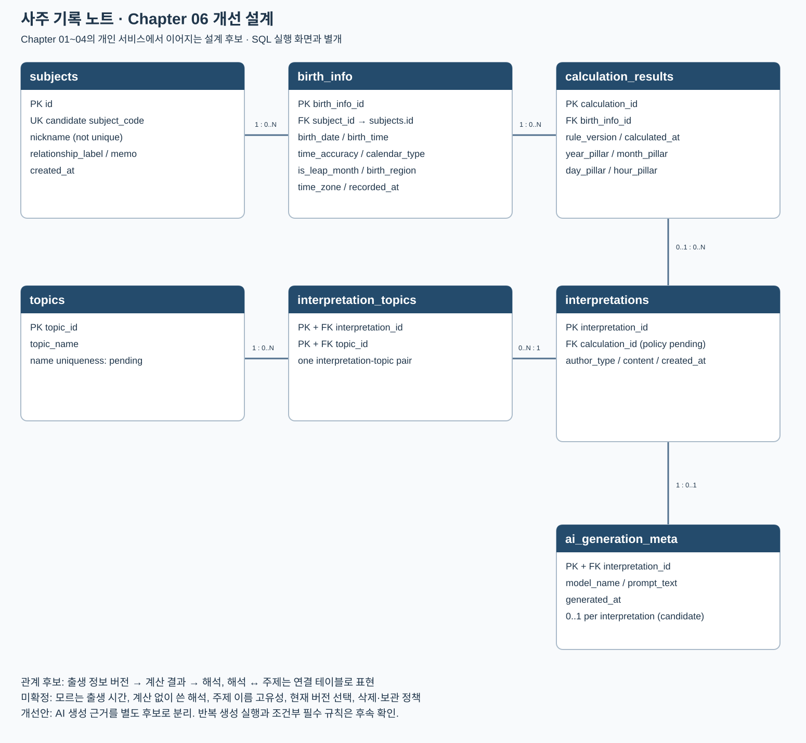

# Chapter 06 확장 실습 답안 — 제출 전 초안

> **과제:** 정규화와 데이터 무결성으로 좋은 테이블 만들기  
> **사용 방법:** 이 파일을 내려받아 본인의 GitHub 저장소에 `chapter06_answer.md`라는 이름으로 저장한 뒤 실습하면서 바로 작성합니다.  
> **제출 방법:** LMS에는 파일을 직접 업로드하지 않고, **본인 GitHub 저장소의 `chapter06_answer.md` 파일 URL**을 제출합니다.

> **작성 상태:** 설명은 AI가 작성한 초안입니다. `[직접 기록]`은 본인의 실제 결과로 채우고, 개인 서비스는 Chapter 01~04의 사주 기록 노트에 근거했으며, AI 판단·성찰은 직접 확인·작성해야 합니다. 아직 SQL 실행이나 LMS 제출을 완료한 답안이 아닙니다.

---

## 제출 전 주의

이 파일과 캡처 화면에는 실제 비밀번호, 전체 DB 접속 URL, API Key, 개인정보를 기록하지 않습니다.

```text
GitHub 계정 또는 별칭: ssossocoder
과제 작성일: 2026-10-07
사용한 AI 도구: ChatGPT (Codex) — 공식 템플릿 정리·설명·SQL 실행 안내 작성
```

---

# 1. 실습 환경과 시작 상태 확인

다음을 실행합니다.

```sql
SELECT current_database();
SELECT current_user;
SELECT current_schema();
SHOW search_path;
SHOW transaction_read_only;
```

| 확인 항목 | 실제 결과 | 의미 |
| --- | --- | --- |
| `current_database()` | [직접 기록] | 실제 연결 데이터베이스 |
| `current_user` | [직접 기록] | SQL 권한을 판단할 역할 |
| `current_schema()` | [직접 기록] | 기본 우선 스키마 |
| `search_path` | [직접 기록] | 스키마 생략 시 탐색 순서 |
| `transaction_read_only` | [직접 기록] | off이면 쓰기 허용 |

- [ ] 현재 DB가 `ai_database_book`이다.
- [ ] 변경 가능한 연결인지 확인했다.
- [ ] Auto-commit 상태를 확인했다.
- [ ] Chapter 06 번호형 SQL 파일을 사용한다.

---

# 2. 정규화 전 큰 테이블의 문제 찾기

본문의 `library_records_raw` 구조를 기준으로 생각합니다.

```text
library_records_raw 한 행
→ 대여 사건 한 건이지만 회원·도서의 현재 사실까지 함께 저장된 구조
```

## 2-1. 위험한 중복과 의미 있는 반복 구분

| 반복되는 값/상황 | 위험한 중복 / 의미 있는 반복 | 판단 이유 |
| --- | --- | --- |
| 회원 이메일이 여러 대여 행에 반복 | 위험한 중복 | 회원의 현재 이메일 변경 시 여러 대여 행을 함께 수정해야 한다 |
| 도서 제목이 여러 대여 행에 반복 | 위험한 중복 | 도서의 현재 제목을 여러 사건 행에 복사하면 서로 다른 값으로 어긋날 수 있다 |
| `loans_nf.member_id = 101` 반복 | 의미 있는 반복 | 서로 다른 대여 사건이 동일 회원을 참조한다 |
| 사건 당시 가격 같은 이력값 반복 | 의미 있는 반복 | 사건 시점에 확정된 가격이면 현재 가격과 별개의 사실이다 |

## 2-2. 이상 현상 설명

### 삽입 이상

```text
아직 한 번도 대여되지 않은 새 도서를 등록하려 할 때 생기는 문제: 큰 테이블의 한 행은 대여 사건이므로 새 도서의 정보만 저장하려면 실제로 없는 대여를 만들거나 대여 열을 비워야 한다.
```

### 수정 이상

```text
회원 이메일이 변경될 때 생기는 문제: 같은 회원의 여러 대여 행을 모두 바꿔야 하며 일부만 바꾸면 현재 이메일이 서로 다르게 남는다.
```

### 삭제 이상

```text
마지막 대여 기록을 삭제할 때 생길 수 있는 문제: 대여 행에만 저장했던 회원·도서 정보까지 함께 사라질 수 있다.
```

### 왜 이것이 SQL 문법 문제가 아니라 구조 문제인가요?

```text
정상 SQL도 서로 다른 사실을 섞은 구조에 저장하면 중복과 정보 손실을 피하지 못한다. 쿼리 문법 수정만으로 한 행의 잘못된 의미가 해결되지는 않는다.
```

---

# 3. 1NF·2NF·3NF 핵심 질문 복습

정규형 이름만 외우지 말고 **왜 분리하는지** 설명합니다.

## 3-1. 제1정규형(1NF)

```text
한 셀에 쉼표로 여러 독립 값을 넣거나 book1/book2/book3처럼 반복 열을 만들면 왜 문제가 되는가: 각 값을 독립 검색·참조·검증하기 어렵고 book4가 필요할 때 구조를 바꿔야 한다. 의미상 여러 연결이면 연결 테이블의 여러 행으로 표현한다.
```

내 서비스에서 비슷한 위험이 있는 예:

```text
사주 기록 노트에서 해석의 관심 주제를 쉼표 문자열이나 topic1/topic2 반복 열로 저장하면 주제별 검색과 FK 검증이 어렵다. topics와 interpretation_topics의 개별 행으로 표현하면 해석 하나의 여러 주제와 같은 주제를 참조하는 여러 해석을 구분할 수 있다. 이 문자열 구조를 실제로 사용했다는 뜻은 아니다.
```

## 3-2. 제2정규형(2NF)

다음 관계를 설명합니다.

```text
(student_id, course_id) → grade
student_id → student_name
course_id → course_name
```

```text
복합키 전체가 아니라 일부에만 의존하는 열을 분리해야 하는 이유: grade는 수강 조합 전체에 속하지만 학생 이름은 학생, 과목 이름은 과목에 속한다. 수강 행마다 이름을 복사하면 수정 이상이 생긴다. 대리 id를 추가해도 업무 후보키에 대한 부분 함수 종속 검토는 남는다.
```

## 3-3. 제3정규형(3NF)

```text
member_id → zip_code
zip_code → city
```

```text
일반 열이 다른 일반 열을 결정하는 구조를 검토해야 하는 이유: zip_code가 city를 결정한다는 업무 규칙이 성립하면 member_id → zip_code → city의 이행 종속 때문에 같은 우편번호의 도시가 중복된다. 현실에서 그 함수 종속이 맞는지는 먼저 확인해야 한다.
```

### 정규화는 값이 반복되기만 하면 무조건 분리하는 것인가요?

```text
아니다. 같은 회원 FK의 반복은 서로 다른 사건의 정당한 연결이다. 같은 현재 사실을 여러 곳에서 관리하는지, 후보키에 대한 함수 종속이 무엇인지 판단해야 한다.
```

---

# 4. 각 열의 '사실의 주인' 찾기

| 열 | 어떤 사실을 설명하는가 | 주인 테이블 | 이유 |
| --- | --- | --- | --- |
| `member_name` | 회원 현재 이름 | members_nf | 회원 id가 결정하는 사실 |
| `member_email` | 회원 현재 이메일 | members_nf | 대여별로 달라지는 사실이 아님 |
| `book_title` | 도서 현재 제목 | books_nf | 도서 id에 속함 |
| `author` | 도서 저자 표시 | books_nf | 현재 간소화 모델의 도서 속성; 다중 저자는 후속 정책 |
| `borrowed_at` | 사건 대여일 | loans_nf | 개별 대여 id가 결정 |
| `due_at` | 사건 반납예정일 | loans_nf | 개별 대여 조건 |
| `returned_at` | 사건 실제반납일 | loans_nf | 사건 상태이며 NULL 가능 |
| `member_id` | 사건의 대여 회원 | loans_nf | 회원 현재 정보의 주인은 members_nf, 참조 사실은 loans_nf |
| `book_id` | 사건의 대여 도서 | loans_nf | 도서 현재 정보의 주인은 books_nf, 참조 사실은 loans_nf |

정규화 후 한 행의 의미:

```text
members_nf 한 행 = 회원 한 명
books_nf 한 행 = 간소화된 대여 대상 도서 항목 한 건
loans_nf 한 행 = 특정 회원이 특정 도서를 빌린 사건 한 건
```

### 현재 사실과 사건 당시 이력을 구분하는 기준

```text
현재값을 조회해야 하는 정보인지, 사건 발생 시점의 값이 유지되어야 하는 정보인지 구분한다. 과거 영수증의 가격은 현재 상품 가격으로 덮어쓰지 않는다.
```

---

# 5. PostgreSQL로 정규화 전·후 구조 재현

Public 저장소의 다음 파일을 순서대로 사용합니다.

```text
code/chapter06/01_normalization_schema.sql
code/chapter06/02_normalization_seed.sql
code/chapter06/03_normalization_compare.sql
```

## 5-1. `01_normalization_schema.sql`

실행 전 예상:

```text
생성될 테이블 수: 4 (library_records_raw, members_nf, books_nf, loans_nf)
각 테이블 예상 행 수: 모두 0
```

실행 후:

```text
실제로 생성된 테이블: [직접 기록]
각 테이블 실제 행 수: [직접 기록]
```

## 5-2. `02_normalization_seed.sql`

실행 전 예상 기준:

```text
raw = 3
members = 2
books = 2
loans = 3
미반납 = 2
회원 101 대여 = 2
도서 201 대여 = 2
```

실제 결과:

```text
raw: [직접 기록; 예상 3]
members: [직접 기록; 예상 2]
books: [직접 기록; 예상 2]
loans: [직접 기록; 예상 3]
미반납: [직접 기록; 예상 2]
회원 101 대여: [직접 기록; 예상 2]
도서 201 대여: [직접 기록; 예상 2]
```

예상과 다른 값이 있다면 이유:

```text
[직접 기록: 일치하면 일치라고 쓰고, 불일치하면 실제 차이와 확인 과정 기록]
```

## 5-3. `03_normalization_compare.sql`

```text
검증 메시지: [직접 기록; 예상 Chapter 06 normalization comparison passed]
PASS / FAIL: [직접 기록]
```

다음 항목을 확인합니다.

```text
회원 고아 참조: [직접 기록; 예상 0]
도서 고아 참조: [직접 기록; 예상 0]
날짜 순서 오류: [직접 기록; 예상 0]
활성 대여 중복: [직접 기록; 예상 0]
```

### 정규화 후에도 JOIN으로 원래 업무 정보를 다시 볼 수 있는 이유

```text
각 대여 행의 member_id·book_id로 부모 행을 연결하여 현재 회원·도서 정보를 재구성한다. 원시 테이블과 같은 세 사건이 보이는지 확인한다.
```

### 증거 화면

권장 경로:

```text
assignments/chapter06/images/step05_normalization.png
```

[캡처 대기: step05_normalization.png]

저장 후 ``로 교체한다.

---

# 6. Chapter 06에서 확정한 C-01~C-08 정책 해석

| ID | 확정 규칙 | 구현 방법 | 왜 필요한가 | Chapter 05에서는 왜 미확정이었나 |
| --- | --- | --- | --- | --- |
| C-01 | 이메일 문자열 중복 금지 | `UNIQUE` | 서로 다른 회원의 같은 이메일 문자열을 거절 | Chapter 05는 이메일 보유만 명시 |
| C-02 | ISBN 필수·중복 금지 | `NOT NULL + UNIQUE` | 현재 실습의 식별 정책 | ISBN 없는 도서·복본 정책 미확정 |
| C-03 | 이름·제목 공백 금지 | `CHECK` | NOT NULL만으로 공백 문자열을 막지 못함 | 공백 판단 정책이 명시되지 않음 |
| C-04 | `due_at >= borrowed_at` | `CHECK` | 예정일이 대여일보다 빠른 행 차단 | 날짜 선후·같은 날 허용 여부 미확정 |
| C-05 | `returned_at`은 NULL 또는 대여일 이상 | `CHECK` | 미반납 허용과 날짜 유효성 함께 보장 | NULL 허용은 이미 R-07에서 확정; 날짜 선후가 새 확정 |
| C-06 | 존재하는 회원·도서만 참조 | `FOREIGN KEY` | 고아 대여 차단 | Chapter 05도 이미 FK로 구현; 06의 기본 구조에는 04에서 추가 |
| C-07 | 대여 이력이 있는 부모 삭제 금지 | `ON DELETE RESTRICT` | 이력 참조를 삭제로 훼손하지 않음 | 05의 기본 FK도 부모 삭제를 막지만 RESTRICT 정책은 명시되지 않음 |
| C-08 | 도서당 미반납 대여 최대 한 건 | 부분 고유 인덱스 | 반납 이력의 반복은 허용하고 현재 활성 중복만 차단 | 동시 대여 정책 미확정 |

### 확정되지 않은 정책을 제약조건으로 먼저 만들면 위험한 이유

```text
미확정 정책을 강제하면 업무상 허용할 데이터를 차단할 수 있다. 이메일 고유·복본·삭제 정책은 요구사항 근거가 필요하다.
```

---

# 7. 기존 데이터 검사 후 무결성 규칙 적용

실행 파일:

```text
code/chapter06/04_add_integrity_rules.sql
```

## 7-1. 규칙을 추가하기 전에 기존 데이터를 먼저 검사해야 하는 이유

```text
기존 NULL·중복·날짜 오류가 있으면 규칙 추가가 실패한다. 데이터를 임의 삭제하지 않고 검사 결과와 정제 정책부터 확인한다.
```

## 7-2. 실행 결과

```text
명명된 제약조건 개수: [직접 기록; 예상 8, PK 제외]
NOT NULL 적용 열 개수: [직접 기록; 예상 10, id 제외]
부분 고유 인덱스 존재 여부: [직접 기록; 예상 uq_loans_nf_active_book]
COMMIT 성공 여부: [직접 기록 — 공식 04 전체 실행 결과 확인]
```

### 메타데이터를 확인하는 이유

```text
성공 메시지뿐 아니라 올바른 테이블에 올바른 이름·종류·조건의 규칙이 실제 등록되었는지 확인한다. 부분 인덱스는 pg_constraint의 개수와 별도로 확인한다.
```

### 증거 화면

권장 경로:

```text
assignments/chapter06/images/step07_constraints.png
```

[캡처 대기: step07_constraints.png]

저장 후 ``로 교체한다.

---

# 8. 정상·경계·실패 테스트

실행 파일:

```text
code/chapter06/05_integrity_tests.sql
```

> **중요:** 오류 테스트는 한 번에 하나씩 실행하고, 각 테스트가 끝난 뒤 기준 데이터가 유지되는지 확인합니다.

## 8-1. 허용되어야 하는 경계값

최소 3개를 실행·관찰합니다.

| 테스트 | 예상 | 실제 | 왜 허용되어야 하는가 |
| --- | --- | --- | --- |
| `due_at = borrowed_at` | 성공 | [직접 기록] | C-04의 >= 경계라서 같은 날도 허용 |
| `returned_at = borrowed_at` | 성공 | [직접 기록] | C-05의 >= 경계라서 같은 날도 허용 |
| `returned_at = NULL` | 성공 | [직접 기록] | 미반납 상태 허용 |
| `published_year = NULL` | 성공 | [직접 기록] | 선택 정보이며 NOT NULL 대상이 아님 |
| 공백이 아닌 한 글자 이름 | 성공 | [직접 기록] | 공백 금지 규칙이며 최소 두 글자 규칙은 없음 |

## 8-2. 실패해야 하는 오류값

최소 6개를 실행합니다.

| 오류 테스트 | 기대 규칙 | 실제 결과 | 오류 메시지 핵심 | 실패해야 하는 이유 |
| --- | --- | --- | --- | --- |
| 필수값 NULL | `NOT NULL` | [직접 기록] | [실제 오류 기록; 예상 단서: name] | name 필수 위반을 거절해야 함 |
| ISBN NULL | `NOT NULL` | [직접 기록] | [실제 오류 기록; 예상 단서: isbn] | isbn 필수 위반을 거절해야 함 |
| 이메일 중복 | `UNIQUE` | [직접 기록] | [실제 오류 기록; 예상 단서: uq_members_nf_email] | C-01 위반을 거절해야 함 |
| ISBN 중복 | `UNIQUE` | [직접 기록] | [실제 오류 기록; 예상 단서: uq_books_nf_isbn] | C-02 위반을 거절해야 함 |
| 공백 이름/제목 | `CHECK` | [직접 기록] | [실제 오류 기록; 예상 단서: chk_members_nf_name_not_blank / chk_books_nf_title_not_blank] | C-03 위반을 거절해야 함 |
| 존재하지 않는 회원 | `FOREIGN KEY` | [직접 기록] | [실제 오류 기록; 예상 단서: fk_loans_nf_member] | C-06 위반을 거절해야 함 |
| 존재하지 않는 도서 | `FOREIGN KEY` | [직접 기록] | [실제 오류 기록; 예상 단서: fk_loans_nf_book] | C-06 위반을 거절해야 함 |
| 날짜 순서 위반 | `CHECK` | [직접 기록] | [실제 오류 기록; 예상 단서: chk_loans_nf_due_date / chk_loans_nf_returned_date] | C-04 / C-05 위반을 거절해야 함 |
| 두 번째 미반납 대여 | 부분 고유 인덱스 | [직접 기록] | [실제 오류 기록; 예상 단서: uq_loans_nf_active_book] | C-08 위반을 거절해야 함 |
| 참조 중 부모 삭제 | `RESTRICT/FK` | [직접 기록] | [실제 오류 기록; 예상 단서: fk_loans_nf_member] | C-07 위반을 거절해야 함 |

## 8-3. 테스트 후 기준 상태 재검증

```text
raw: [직접 기록; 예상 3]
members: [직접 기록; 예상 2]
books: [직접 기록; 예상 2]
loans: [직접 기록; 예상 3]
미반납: [직접 기록; 예상 2]
회원 고아 참조: [직접 기록; 예상 0]
도서 고아 참조: [직접 기록; 예상 0]
활성 대여 중복: [직접 기록; 예상 0]
```

### 실패 테스트 후 기준 데이터가 유지되어야 하는 이유

```text
테스트가 기존 데이터를 바꾸면 다음 테스트의 조건과 예상값이 달라진다. 실패 문장은 저장되지 않았는지, 경계 테스트의 임시 행은 롤백되었는지 검사한다.
```

### 증거 화면

권장 경로:

```text
assignments/chapter06/images/step08_integrity_error.png
```

[캡처 대기: step08_integrity_error.png]

저장 후 ``로 교체한다.

---

# 9. 정규화와 무결성 제약조건 역할 비교

| 질문 | 나의 설명 |
| --- | --- |
| 정규화가 해결하는 문제 | 사실의 잘못된 배치·현재 정보 복사로 생기는 삽입·수정·삭제 이상 |
| `NOT NULL`이 해결하는 문제 | 필수값 누락; 빈 문자열까지 막지는 않음 |
| `UNIQUE`가 해결하는 문제 | 지정 키 값의 중복; 기본 NULL 취급·대소문자 정책 별도 검토 |
| `CHECK`가 해결하는 문제 | 행 내부의 공백·날짜 선후 조건 위반; UNKNOWN은 허용하므로 필수값에는 NOT NULL 병행 |
| `FOREIGN KEY`가 해결하는 문제 | 없는 부모 참조와 참조 무결성 훼손 |
| 부분 고유 인덱스가 해결하는 문제 | returned_at IS NULL인 행끼리 같은 book_id 중복 |

### 정규화만 잘하면 잘못된 데이터가 모두 차단되나요?

```text
아니다. 분리된 테이블에도 NULL·중복·없는 FK·역전 날짜를 넣을 수 있어 확정 정책의 제약조건이 필요하다.
```

### 제약조건만 많이 넣으면 나쁜 구조가 좋은 구조가 되나요?

```text
아니다. 반복된 현재 사실의 소유권과 행 의미가 틀린 구조는 제약조건을 더해도 삽입·수정·삭제 이상이 남는다.
```

---

# 10. Chapter 05 개인 ERD 개선

개인 서비스는 Chapter 01~05의 **사주 기록 노트**다. 기준 자료는 [Chapter 02 8~9절](../chapter02/chapter02_answer.md), [Chapter 04 12절](../chapter04/chapter04_answer.md), [Chapter 05 12~18절](../chapter05/chapter05_answer.md)이다. 정규화 근거를 재검토하고 Chapter 02에서 이미 제안한 AI 생성 메타데이터 분리 후보를 구체화했다. 개인 서비스의 제약조건 적용과 테스트는 설계 계획이며 실제 실행 결과가 아니다.

## 10-1. 수정 전 점검

| 점검 항목 | Chapter 05 구조 | 판단 |
| --- | --- | --- |
| 같은 현재 사실의 중복 | 대상자 별칭은 subjects, 출생 조건은 birth_info에 분리 | 계산·해석 행에 별칭과 출생 조건을 다시 복사하지 않는다. |
| 한 셀의 여러 독립 값 | 주제를 interpretation_topics 여러 행으로 표현 | 주제 목록 문자열이나 topic1/topic2 반복 열을 쓰지 않는다. |
| 사건과 현재 상태의 혼합 | 출생 정보 버전과 계산 결과가 개별 행 | 과거 결과의 FK를 최신 출생 정보로 바꾸면 당시 계산 근거가 사라진다. |
| 복합키의 부분 종속 | 연결 키는 (interpretation_id, topic_id) | topic_name은 topic_id에만 의존하므로 topics에 둔다. |
| 일반 열 사이의 종속 | 대상자·계산 입력·결과·해석의 소유권을 구분 | rule_version만으로 출생 입력이나 계산 결과가 결정되지는 않는다. |
| 사람·AI 해석 속성의 혼합 | interpretations에 AI 모델·프롬프트 후보 포함 | 사람 해석에 불필요한 생성 메타데이터를 별도 후보로 분리한다. |
| 미확정 규칙의 강제 | 출생 시간·주제 고유성·삭제 정책 미확정 | 확인 없이 NOT NULL·UNIQUE·CASCADE를 추가하지 않는다. |

## 10-2. 수정 전·후 비교

| 항목 | Chapter 05 | Chapter 06 개선안 | 이유 | 요구사항 |
| --- | --- | --- | --- | --- |
| AI 생성 메타데이터 | interpretations의 ai_model·ai_prompt 임시 후보 | ai_generation_meta에 interpretation_id·model_name·prompt_text·generated_at 후보 분리 | 해석 내용과 생성 실행 근거를 구분하고 사람 해석에 AI 속성을 요구하지 않음 | P05-R08, Ch02 9-4 |
| 해석 본문 | author_type·content·created_at과 AI 후보 속성 | interpretation_id·calculation_id·author_type·content·created_at | 사람·AI 공통 해석 사실을 유지 | P05-R07, R08 |
| 해석-주제 연결 | 복합키 후보와 주제 FK | 복합 PK/FK 근거 명시; 주제 이름은 부모에만 저장 | 복합키 일부에 의존하는 주제 이름의 반복 방지 | P05-R09, R10 |
| 출생 정보·계산 근거 | 대상자별 버전과 계산 결과 FK | 구조 유지; 당시 입력을 참조하는 의미 명시 | 수정된 현재 정보로 과거 계산 근거를 덮어쓰지 않음 | P05-R03, R05, R06, R11 |
| 대상자 코드·별칭 | Ch04의 code 고유 후보·별칭 중복 허용 | 구조 유지; 코드와 표시값의 역할 구분 | 같은 별칭을 가진 서로 다른 대상자를 허용 | P05-R01, R12 |

`ai_generation_meta`는 Chapter 02에서 등장한 후보를 확장한 설계안이다. AI 메타데이터 분리는 선택 속성과 책임을 나누는 개선이며, NULL이 있다는 이유만으로 3NF를 위반했다고 판단한 것은 아니다. 출생 정보 수정 이력과 과거 결과의 보관 기간은 계속 미확정이다.

### 사실의 주인과 정규화 기준

- 1NF: 주제 연결을 문자열 목록이 아닌 개별 연결 행으로 표현한다.
- 2NF: interpretation_topics의 복합키 일부인 topic_id가 결정하는 topic_name은 topics에 둔다.
- 3NF: 별칭·출생 조건·해석 본문·주제 이름을 각각의 사실을 결정하는 키가 있는 테이블에 둔다. 서로 다른 결과를 같은 rule_version만으로 합치지 않는다.
- 이력: 계산 결과의 birth_info_id 반복은 입력 참조다. 과거 버전의 출생 값은 당시 계산 근거이며 현재 입력의 불필요한 복사와 구분한다.

## 10-3. 개인 프로젝트 무결성 규칙 후보

‘설계 반영’은 DB 적용 완료가 아니다. 정상·경계·실패 데이터의 검증은 이후 구현 단계에서 수행한다.

| 규칙 ID | 업무 규칙 | 제약조건 후보 | 확정 여부·근거 | 검증 계획 |
| --- | --- | --- | --- | --- |
| P06-C01 | 대상자 행의 내부 식별 | subjects.id PK | Ch04 초안 반영 | 중복 id 거절 |
| P06-C02 | 대상자 코드로 구분, 별칭은 중복 허용 | subject_code NOT NULL·UNIQUE; nickname NOT NULL, UNIQUE 없음 | Ch04 후보 계승; 코드 형식 미확정 | 다른 코드·같은 별칭 성공, 같은 코드 실패 |
| P06-C03 | 출생 정보의 대상자 참조 | birth_info.subject_id FK → subjects.id | P05-R02, R03; 삭제 동작 미확정 | 없는 대상자 참조 실패 |
| P06-C04 | 계산 결과의 출생 입력 추적 | calculation_results.birth_info_id FK | P05-R05; 규칙 버전 표기 방식 별도 확인 | 없는 출생 정보 참조 실패, 같은 입력의 다른 버전 결과 허용 |
| P06-C05 | 해석과 주제의 연결 중복 방지 | interpretation_topics 복합 PK와 양쪽 FK | P05-R09, R10 | 같은 연결쌍 실패, 다른 해석의 같은 주제 성공 |
| P06-C06 | 계산 결과와 해석의 근거 연결 | interpretations.calculation_id FK 후보 | P05-R07; 계산 없는 해석 허용/NULL 정책 미확정 | 없는 계산 결과 참조 실패; NULL 허용 여부 확인 후 경계 테스트 |
| P06-C07 | 생성 근거를 해석에 연결 | ai_generation_meta.interpretation_id PK/FK 후보 | P05-R08; 이번 개선안은 해석당 메타데이터 최대 1행, 재시도 다중 실행 미확정 | 없는 해석 참조 실패; 같은 해석의 두 메타데이터 행 실패 |
| P06-C08 | 사람 해석과 AI 생성 근거 구분 | author_type 값 규칙 및 AI 메타데이터 존재 조건 검토 | 허용 코드·AI 근거 필수 범위 미확정 | 사람 해석에 AI 정보 강제하지 않음; 유형과 메타데이터 일치 검사 계획 |

P06-C08처럼 다른 테이블 행의 존재까지 확인해야 하는 조건은 일반 행 CHECK 하나로 검증할 수 없다. 트랜잭션을 사용하는 저장 로직 또는 별도 DB 검증 방식은 정책 확정 후 정한다. 모르는 출생 시간의 NOT NULL, topic_name UNIQUE, 모든 결과의 일괄 CASCADE는 확정하지 않는다.

## 10-4. 수정한 ERD



[개선 ERD 원본 Mermaid](./images/step10_my_erd_after.mmd)

Chapter 05의 6개 테이블에서 AI 전용 속성을 분리한 `ai_generation_meta` 후보를 추가해 7개 테이블로 표시했다. 해석 1건에 메타데이터는 0~1건인 설계 후보이며 생성 재시도마다 별도 행을 남길지는 미확정이다. 해석의 계산 결과 참조 선택성 역시 정책 확인이 필요하다. 생성·제약조건 적용·실패 테스트를 완료한 실행 화면이 아니다.

---

# 11. AI를 정규화·무결성 리뷰어로 활용

## 11-1. 내가 먼저 작성한 구조와 규칙

Chapter 01~04에서 대상자, 출생 정보 버전, 계산 결과, 해석, 주제와 연결 테이블을 후보로 정리했다. Chapter 04의 subjects는 id·subject_code·nickname·관계 메모·자유 메모·등록 시각을 가진다. 출생 시간 처리, 계산 기준, 결과 보관, 계산 없는 해석과 주제 이름 고유성은 미확정으로 남겨 두었다.

## 11-2. AI에게 전달한 핵심 프롬프트

기존 GitHub의 Chapter 01~04 답안을 읽고 개인 서비스를 사주 기록 노트로 맞춰 Chapter 05와 06을 작성해 달라고 요청했다. 이번 검토에서는 기존 후보의 역할을 이어 쓰고, 사실의 주인과 AI 생성 근거의 분리 이유를 확인했다.

## 11-3. AI 제안 검토

| AI 검토 의견 | 처리 | 요구사항 근거 | 검증 방법 | 판단 이유 |
| --- | --- | --- | --- | --- |
| subjects와 birth_info 분리 유지 | 유지 | P05-R02, R03 | 같은 대상자의 출생 정보 버전 2행 검토 | 대상자 식별과 계산 입력의 의미가 다름 |
| 계산 결과의 birth_info_id·rule_version 유지 | 유지 | P05-R05, R06 | 입력과 버전별 결과의 참조 추적 | 결과의 계산 근거를 남겨야 함 |
| 주제 이름을 연결 행에 복사하지 않음 | 유지 | P05-R09, R10 | 주제명 변경이 topics 1행에서 관리되는지 확인 계획 | 주제 이름은 topic_id의 사실 |
| AI 생성 메타데이터 분리 | 설계 개선안 반영 | P05-R08, Ch02 9-4 | 사람 해석의 메타데이터 0행과 AI 해석 연결 계획 | 해석과 AI 생성 근거의 역할을 구분 |
| 모든 과거 결과 영구 보관 | 보류 | P05-R11, Ch02 9-3 | 보관 기간과 개인정보 삭제 정책 확인 | 기존 판단을 유지하며 무제한 보관을 확정하지 않음 |
| 시간 NOT NULL·주제명 UNIQUE·일괄 CASCADE | 보류 | Ch02 8-6·9-3, Ch04 12절 | 누락 시간·동명 주제·삭제 영향 확인 계획 | 미확정 정책으로 정상 데이터를 막을 수 있음 |

표의 개인 서비스 검증 방법은 계획이며 실제 실행 통과 기록은 아니다.

### AI가 단순히 값이 반복된다는 이유만으로 분리를 제안한 부분이 있었나요?

같은 subject_id·birth_info_id·topic_id의 반복은 서로 다른 버전·결과·해석이 부모를 참조하는 정상적인 반복이다. 이를 중복으로 보고 제거하지 않았다. AI 메타데이터 분리는 사람 해석과 AI 해석에서 필요한 사실의 범위가 다르다는 기존 검토에 근거한다.

### AI가 미확정 정책을 확정 규칙처럼 만든 부분이 있었나요?

출생 시간의 필수 여부, 주제 이름의 고유성, 현재 버전 지정과 삭제·보관 규칙은 확정하지 않았다. 개선안의 해석당 AI 메타데이터 0~1 관계도 생성 재시도 정책에 따라 다시 검토할 후보로 표시했다.

---

# 12. 최종 성찰

아래 문장은 본인의 말로 작성합니다.

```text
1. 정규화에서 가장 중요한 질문은
   ____________________________________________________________ 이다.

2. 위험한 중복과 의미 있는 반복의 차이는
   ____________________________________________________________ 이다.

3. 정규화와 제약조건의 역할이 다른 이유는
   ____________________________________________________________ 이다.

4. 실패해야 하는 SQL을 일부러 실행해 보는 이유는
   ____________________________________________________________ 이다.

5. AI가 제안한 UNIQUE/CHECK/FK를 그대로 적용하면 안 되는 이유는
   ____________________________________________________________ 이다.
```

---

# 13. 제출 체크리스트

- [x] `chapter06_answer.md`를 본인 저장소에 만들었다.
- [ ] 위험한 중복과 의미 있는 반복을 구분했다.
- [ ] 삽입·수정·삭제 이상을 설명했다.
- [ ] 1NF·2NF·3NF 핵심 질문을 자신의 말로 설명했다.
- [ ] 열의 사실의 주인을 분류했다.
- [ ] `01_normalization_schema.sql`을 실행했다.
- [ ] `02_normalization_seed.sql` 기준 상태를 확인했다.
- [ ] `03_normalization_compare.sql` 검증 결과를 확인했다.
- [ ] C-01~C-08의 업무 근거를 설명했다.
- [ ] `04_add_integrity_rules.sql`로 규칙을 적용했다.
- [ ] 허용 경계값을 최소 3개 확인했다.
- [ ] 실패 테스트를 최소 6개 한 번에 하나씩 실행했다.
- [ ] 실패 후 기준 데이터가 유지되는지 확인했다.
- [ ] Chapter 05 개인 ERD를 수정했다.
- [ ] 개인 프로젝트 제약조건 후보를 확정/미확정으로 구분했다.
- [ ] AI 제안을 요구사항 근거와 실행 결과로 검토했다.
- [ ] 핵심 화면 3~4장만 첨부했다.
- [ ] 캡처에 비밀번호나 개인정보가 없다.
- [ ] GitHub에서 Markdown 이미지가 정상적으로 보인다.
- [ ] 최종 답안을 commit/push했다.

---

# 14. LMS 제출 URL

아래 형식의 **본인 GitHub 파일 URL**을 LMS에 제출합니다.

```text
https://github.com/<본인-GitHub-ID>/<본인-저장소>/blob/main/assignments/chapter06/chapter06_answer.md
```

내 제출 URL (직접 실행·보완 후 제출):

```text
https://github.com/ssossocoder/ai-database-study/blob/main/assignments/chapter06/chapter06_answer.md
```

> 저장소 메인 URL, 교수자 템플릿 URL, Raw URL이 아니라 **작성 완료된 본인 `chapter06_answer.md` 파일 화면 URL**을 제출합니다.
